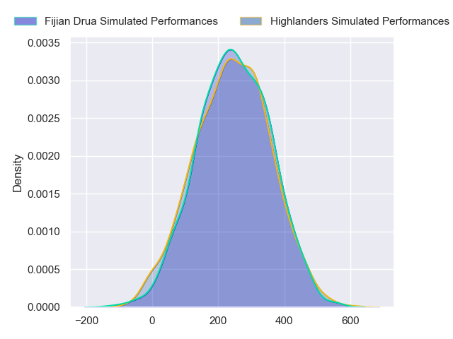
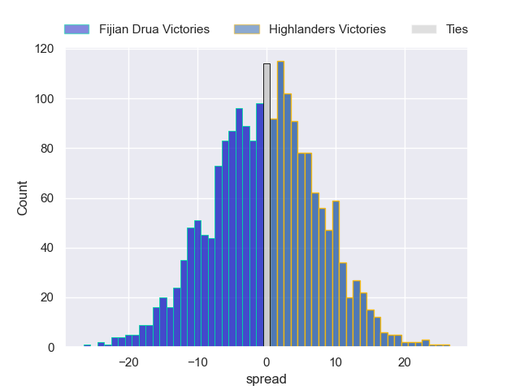

---  
layout: page  
title: Fijian Drua at Highlanders  
date: 2024-05-25 18:00:00 -0500  
categories: "Super Rugby Pacific 2024" match projection  
---
# Fijian Drua at Highlanders

# Club Level Predictions

The first set of predictions treats a club as the smallest object, as the club develops its members, organizes a gameplan, and deploys its players as needed for each match. This club model has a prediction of 0.654, which translates to predicting Highlanders to win by 5.7.

Each club has a rating and a rating deviation (similar to a Glicko rating), and expected performances can be generated. This allows for simulated matches and spreads like the ones below.
## Projected Performances - Club Model

## Projected Spreads - Club Model

## Projected Results - Club Model

# Player Level Predictions

Treating teams instead as an entity made up of the currently active players, I have ratings for each player in an altogether different system. These can be combined to form team ratings once teamsheets are announced, weighting starters a bit higher than the reserves. After the match is played, players can be weighted by their minutes on the field, allowing for an accurate measure of the team's composition. With these compiled team ratings, we can make predictions, measure inaccuracy, and update the individual player ratings.
## Prediction without Player Minutes: Fijian Drua by 0.3

Fijian Drua by 5.0 on a neutral pitch

## Projected Performances - Player Model

## Projected Spreads - Player Model

## Projected Results - Player Model

| Away Player             |   Away Percentile |   Number |   Home Percentile | Home Player                   |
|:------------------------|------------------:|---------:|------------------:|:------------------------------|
| Jone Koroiduadua        |             62.72 |        1 |             61.01 | Ethan de Groot                |
| Tevita Ikanivere        |             90.16 |        2 |             26.39 | Henry Bell                    |
| Mesake Doge             |             42.66 |        3 |             72.35 | Jermaine Ainsley              |
| Mesake Vocevoce         |             73.53 |        4 |             88.74 | Mitchell Dunshea              |
| Isoa Nasilasila         |             77.18 |        5 |             75.15 | Fabian Holland                |
| Etonia Waqa             |             82.38 |        6 |             64.17 | Oliver Haig                   |
| Kitione Salawa          |             10.73 |        7 |             13.98 | Sean Withy                    |
| Elia Canakaivata        |             74.9  |        8 |             70.5  | Billy Harmon                  |
| Simione Kuruvoli        |             25.13 |        9 |             66.32 | Folau Fakatava                |
| Isaiah Armstrong-Ravula |             43.31 |       10 |             22.72 | Ajay Faleafaga                |
| Epeli Momo              |             32.69 |       11 |             81.44 | Jona Nareki                   |
| Kemu Valetini           |             49.37 |       12 |             13.84 | Sam Gilbert                   |
| Iosefo Masi             |             82.49 |       13 |             20.86 | Jake Te Hiwi                  |
| Selestino Ravutaumada   |             84.62 |       14 |             21.63 | Timoci Tavatavanawai          |
| Ilaisa Droasese         |             68.16 |       15 |             95.94 | Jacob Ratumaitavuki-Kneepkens |
| Zuriel Togiatama        |             36.72 |       16 |             51.64 | Jack Taylor                   |
| Emosi Tuqiri            |            nan    |       17 |             17.13 | Dan Lienert-Brown             |
| Samu Tawake             |            nan    |       18 |             29.04 | Saula Ma'u                    |
| Ratu Rotuisolia         |             46.35 |       19 |             27.48 | Max Hicks                     |
| Vilive Miramira         |             60.73 |       20 |             27.62 | Nikora Broughton              |
| Peni Matawalu           |             58.64 |       21 |              5.58 | James Arscott                 |
| Caleb Muntz             |             66.88 |       22 |             20.55 | Matt Whaanga                  |
| Taniela Rakuro          |             34.62 |       23 |             50.58 | Connor Garden-Bachop          |

