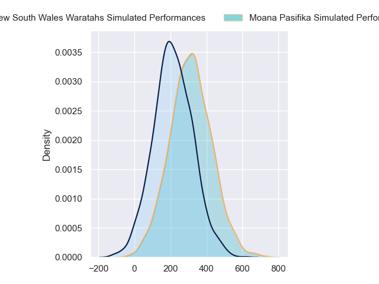
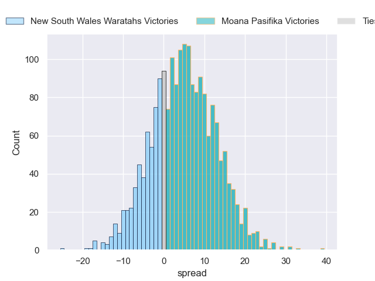
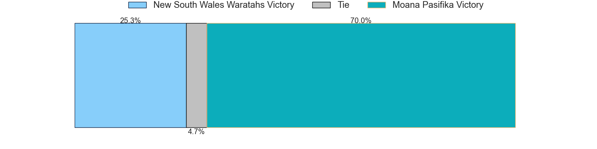

---  
layout: page  
title: New South Wales Waratahs at Moana Pasifika  
date: 2024-05-25 18:00:00 -0500  
categories: "Super Rugby Pacific 2024" match projection  
---
# New South Wales Waratahs at Moana Pasifika

# Club Level Predictions

The first set of predictions treats a club as the smallest object, as the club develops its members, organizes a gameplan, and deploys its players as needed for each match. This club model has a prediction of 0.353, which translates to predicting New South Wales Waratahs to win by 2.1.

Our Over/Under is 52.5 - and combined with the spread above, we have a predicted scoreline of 27 to 25

Each club has a rating and a rating deviation (similar to a Glicko rating), and expected performances can be generated. This allows for simulated matches and spreads like the ones below.
## Projected Performances - Club Model

## Projected Spreads - Club Model

## Projected Results - Club Model

# Player Level Predictions

Treating teams instead as an entity made up of the currently active players, I have ratings for each player in an altogether different system. These can be combined to form team ratings once teamsheets are announced, weighting starters a bit higher than the reserves. After the match is played, players can be weighted by their minutes on the field, allowing for an accurate measure of the team's composition. With these compiled team ratings, we can make predictions, measure inaccuracy, and update the individual player ratings.
## Prediction without Player Minutes: Moana Pasifika by 5.2

Moana Pasifika by 2.9 on a neutral pitch

## Projected Performances - Player Model

## Projected Spreads - Player Model

## Projected Results - Player Model

| Away Player         |   Away Percentile |   Number |   Home Percentile | Home Player           |
|:--------------------|------------------:|---------:|------------------:|:----------------------|
| Harry Lloyd         |            nan    |        1 |              8.81 | Abraham Pole          |
| Jay Fonokalafi      |             45.74 |        2 |              3.44 | Samiuela Moli         |
| Bradley Amituanai   |            nan    |        3 |             36.87 | Sione Mafileo         |
| Jed Holloway        |             19.04 |        4 |             89.76 | Tom Savage            |
| Hugh Sinclair       |             11.66 |        5 |             10.24 | Allan Craig           |
| Ned Hanigan         |             49.16 |        6 |             85.33 | Jacob Norris          |
| Charlie Gamble      |             66.34 |        7 |             79.53 | Sione Havili Talitui  |
| Langi Gleeson       |             64.02 |        8 |              7.32 | Lotu Inisi            |
| Jake Gordon         |             84.99 |        9 |             23.91 | Aisea Halo            |
| Tane Edmed          |             31    |       10 |             21.87 | William Havili        |
| Dylan Pietsch       |             77.12 |       11 |             88.56 | Neria Fomai           |
| Lalakai Foketi      |             71.28 |       12 |             97.59 | Julian Savea          |
| Joey Walton         |             79.14 |       13 |             61.43 | Pepesana Patafilo     |
| Izaia Perese        |             31.66 |       14 |              4.62 | Fine Inisi            |
| Mark Nawaqanitawase |             17.95 |       15 |              5.56 | Danny Toala           |
| Ben Sugars          |            nan    |       16 |            nan    | Thomas Maka           |
| Lewis Ponini        |             31    |       17 |             38.91 | Tevita Langi          |
| Michael Scott       |            nan    |       18 |             85.73 | Sekope Kepu           |
| Miles Amatosero     |              3.35 |       19 |             34.89 | Ola Tauelangi         |
| Fergus Lee-Warner   |             17.44 |       20 |             31.4  | Alamanda Motuga       |
| Jack Grant          |            nan    |       21 |             49.04 | Siaosi Nginingini     |
| Jack Bowen          |            nan    |       22 |             76.65 | Christian Leali'ifano |
| Vuate Karawalevu    |            nan    |       23 |             18.97 | Henry Taefu           |

