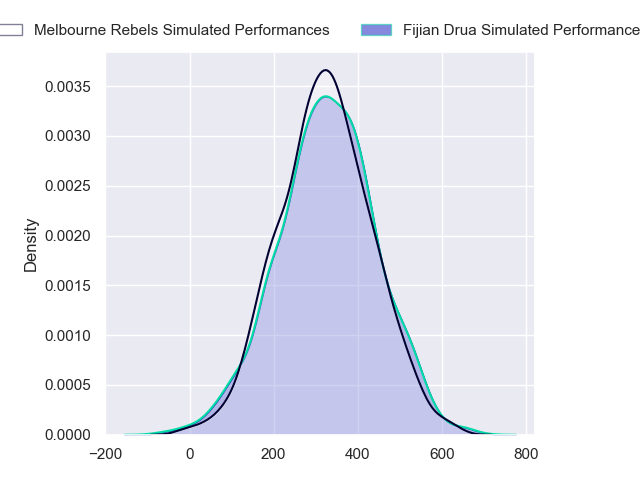
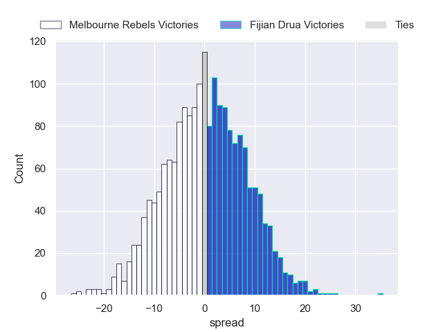

---  
layout: page  
title: Melbourne Rebels at Fijian Drua  
date: 2024-05-31 18:00:00 -0500  
categories: "Super Rugby Pacific 2024" match projection  
---
# Melbourne Rebels at Fijian Drua

# Club Level Predictions

The first set of predictions treats a club as the smallest object, as the club develops its members, organizes a gameplan, and deploys its players as needed for each match. This club model has a prediction of 0.555, which translates to predicting Fijian Drua to win by 1.9.

Each club has a rating and a rating deviation (similar to a Glicko rating), and expected performances can be generated. This allows for simulated matches and spreads like the ones below.
## Projected Performances - Club Model

## Projected Spreads - Club Model

## Projected Results - Club Model

# Player Level Predictions

Treating teams instead as an entity made up of the currently active players, I have ratings for each player in an altogether different system. These can be combined to form team ratings once teamsheets are announced, weighting starters a bit higher than the reserves. After the match is played, players can be weighted by their minutes on the field, allowing for an accurate measure of the team's composition. With these compiled team ratings, we can make predictions, measure inaccuracy, and update the individual player ratings.
## Prediction without Player Minutes: Fijian Drua by 0.1

Melbourne Rebels by 2.4 on a neutral pitch

## Projected Performances - Player Model

## Projected Spreads - Player Model

## Projected Results - Player Model

| Away Player         |   Away Percentile |   Number |   Home Percentile | Home Player             |
|:--------------------|------------------:|---------:|------------------:|:------------------------|
| Isaac Aedo Kailea   |             41.3  |        1 |             93.68 | Haereiti Hetet          |
| Jordan Uelese       |             45.26 |        2 |             86.52 | Tevita Ikanivere        |
| Taniela Tupou       |             96.36 |        3 |             24.7  | Mesake Doge             |
| Angelo Smith        |             43.1  |        4 |             65.74 | Mesake Vocevoce         |
| Josh Canham         |             60.97 |        5 |             46.77 | Ratu Rotuisolia         |
| Josh Kemeny         |             17.13 |        6 |             77.15 | Etonia Waqa             |
| Brad Wilkin         |             36.59 |        7 |              6.1  | Kitione Salawa          |
| Rob Leota           |              3.68 |        8 |             30.43 | Meli Derenalagi         |
| Ryan Louwrens       |             96.21 |        9 |             70.52 | Frank Lomani            |
| Carter Gordon       |             70.31 |       10 |             23.09 | Isaiah Armstrong-Ravula |
| Darby Lancaster     |             60.02 |       11 |            nan    | Waqa Nalaga             |
| David Feliuai       |             57.63 |       12 |             29.58 | Kemu Valetini           |
| Filipo Daugunu      |             95.6  |       13 |             77.18 | Iosefo Masi             |
| Andrew Kellaway     |             68.97 |       14 |             77.21 | Selestino Ravutaumada   |
| Mason Gordon        |            nan    |       15 |             56.6  | Ilaisa Droasese         |
| Ethan Dobbins       |            nan    |       16 |             38.36 | Zuriel Togiatama        |
| Matt Gibbon         |             88.99 |       17 |             40.97 | Livai Natave            |
| Sam Talakai         |             54.74 |       18 |            nan    | Samu Tawake             |
| Tuaina Taii Tualima |             80.24 |       19 |             66.93 | Isoa Nasilasila         |
| Maciu Nabolakasi    |             54.89 |       20 |            nan    | Motikiai Murray         |
| James Tuttle        |             66.38 |       21 |             64.6  | Elia Canakaivata        |
| David Vaihu         |            nan    |       22 |             13.28 | Simione Kuruvoli        |
| Jake Strachan       |             18.97 |       23 |             67.63 | Caleb Muntz             |

