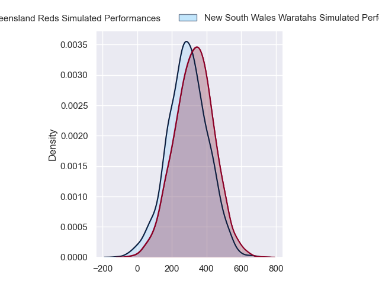
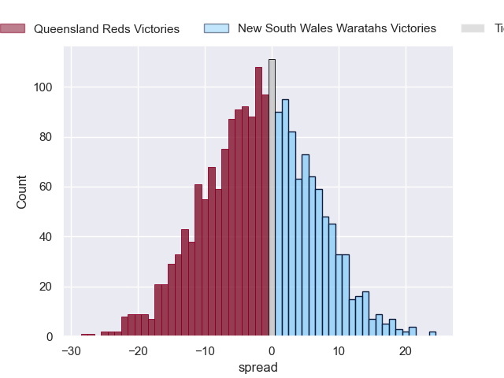
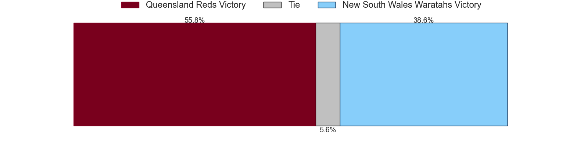

---  
layout: page  
title: Queensland Reds at New South Wales Waratahs  
date: 2024-05-31 18:00:00 -0500  
categories: "Super Rugby Pacific 2024" match projection  
---
# Queensland Reds at New South Wales Waratahs

# Club Level Predictions

The first set of predictions treats a club as the smallest object, as the club develops its members, organizes a gameplan, and deploys its players as needed for each match. This club model has a prediction of 0.283, which translates to predicting Queensland Reds to win by 4.5.

Our Over/Under is 61.5 - and combined with the spread above, we have a predicted scoreline of 33 to 29

Each club has a rating and a rating deviation (similar to a Glicko rating), and expected performances can be generated. This allows for simulated matches and spreads like the ones below.
## Projected Performances - Club Model

## Projected Spreads - Club Model

## Projected Results - Club Model

# Player Level Predictions

Treating teams instead as an entity made up of the currently active players, I have ratings for each player in an altogether different system. These can be combined to form team ratings once teamsheets are announced, weighting starters a bit higher than the reserves. After the match is played, players can be weighted by their minutes on the field, allowing for an accurate measure of the team's composition. With these compiled team ratings, we can make predictions, measure inaccuracy, and update the individual player ratings.
## Prediction without Player Minutes: Queensland Reds by 1.8

Queensland Reds by 6.2 on a neutral pitch

## Projected Performances - Player Model

## Projected Spreads - Player Model

## Projected Results - Player Model

| Away Player          |   Away Percentile |   Number |   Home Percentile | Home Player              |
|:---------------------|------------------:|---------:|------------------:|:-------------------------|
| Alex Hodgman         |             67.37 |        1 |            nan    | Paddy Ryan               |
| Matt Faessler        |             83.31 |        2 |             34.67 | Jay Fonokalafi           |
| Zane Nonggorr        |             77.09 |        3 |             15.87 | Tom Ross                 |
| Connor Vest          |            nan    |        4 |             14.9  | Jed Holloway             |
| Seru Uru             |             73.88 |        5 |              3.28 | Miles Amatosero          |
| Liam Wright          |             97.97 |        6 |             10.36 | Lachlan Swinton          |
| Fraser McReight      |             95.16 |        7 |             61.37 | Charlie Gamble           |
| Joe Brial            |            nan    |        8 |             57.97 | Langi Gleeson            |
| Tate McDermott       |             82.07 |        9 |             82.76 | Jake Gordon              |
| Lawson Creighton     |             14.64 |       10 |            nan    | Jack Bowen               |
| Mac Grealy           |             90.03 |       11 |             74.74 | Dylan Pietsch            |
| Hunter Paisami       |             81.17 |       12 |             67.96 | Lalakai Foketi           |
| Josh Flook           |             55.58 |       13 |             75.74 | Joey Walton              |
| Tim Ryan             |             65.81 |       14 |             50.81 | Triston Reilly           |
| Jock Campbell        |             72.12 |       15 |             13.63 | Mark Nawaqanitawase      |
| Josh Nasser          |            nan    |       16 |            nan    | Ben Sugars               |
| Peni Ravai Kovekalou |             53.28 |       17 |             91.9  | Hayden Thompson-Stringer |
| Jeff Toomaga-Allen   |             94.74 |       18 |            nan    | Bradley Amituanai        |
| Ryan Smith           |             48.36 |       19 |              9.83 | Hugh Sinclair            |
| John Bryant          |             53.62 |       20 |             17.28 | Fergus Lee-Warner        |
| Kalani Thomas        |             67.41 |       21 |            nan    | Jack Grant               |
| Tom Lynagh           |             84.74 |       22 |             20.62 | Tane Edmed               |
| Taj Annan            |            nan    |       23 |             20.8  | Izaia Perese             |

