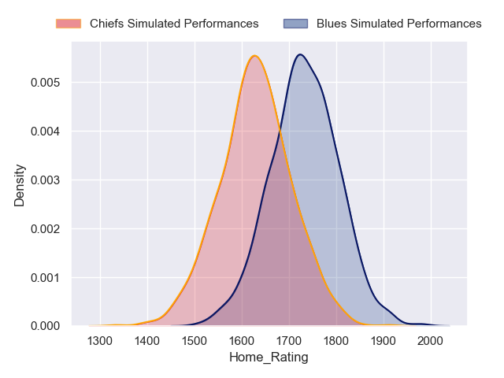
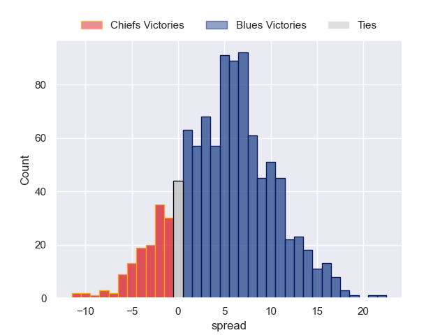
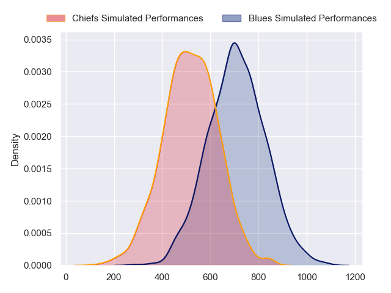
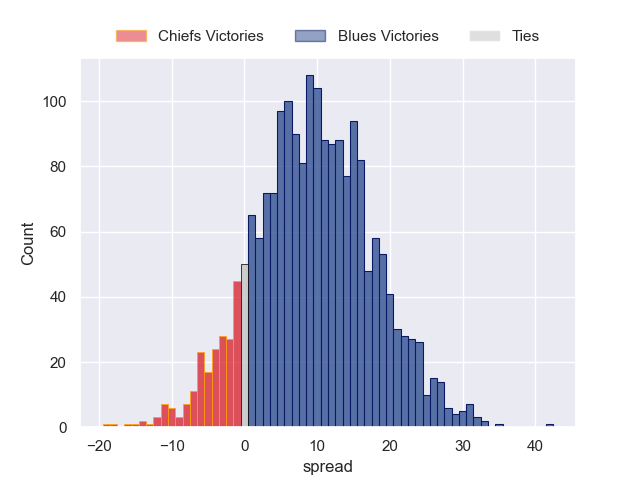

---  
layout: page  
title: Chiefs at Blues  
date: 2024-06-22 18:00:00 -0500  
categories: "Super Rugby Pacific 2024" match projection  
---
# Chiefs at Blues

# Club Level Predictions

The first set of predictions treats a club as the smallest object, as the club develops its members, organizes a gameplan, and deploys its players as needed for each match. This club model has a prediction of 0.551, which translates to predicting Blues to win by 5.1.

Our Over/Under is 71.5 - and combined with the spread above, we have a predicted scoreline of 33 to 38

Each club has a rating and a rating deviation (similar to a Glicko rating), and expected performances can be generated. This allows for simulated matches and spreads like the ones below.
## Projected Performances - Club Model

## Projected Spreads - Club Model

## Projected Results - Club Model

# Player Level Predictions

Treating teams instead as an entity made up of the currently active players, I have ratings for each player in an altogether different system. These can be combined to form team ratings once teamsheets are announced, weighting starters a bit higher than the reserves. After the match is played, players can be weighted by their minutes on the field, allowing for an accurate measure of the team's composition. With these compiled team ratings, we can make predictions, measure inaccuracy, and update the individual player ratings.
## Prediction without Player Minutes: Blues by 10.0

Blues by 5.5 on a neutral pitch

## Projected Performances - Player Model

## Projected Spreads - Player Model

## Projected Results - Player Model

| Away Player          |   Away Percentile |   Number |   Home Percentile | Home Player       |
|:---------------------|------------------:|---------:|------------------:|:------------------|
| Aidan Ross           |             99.1  |        1 |             99.27 | Ofa Tu'ungafasi   |
| Tyrone Thompson      |             76.49 |        2 |             90.18 | Ricky Riccitelli  |
| George Dyer          |             90.62 |        3 |             83.93 | Marcel Renata     |
| Jimmy Tupou          |             60.02 |        4 |             95.99 | Patrick Tuipulotu |
| Tupou Vaa'i          |             95.09 |        5 |             47.8  | Sam Darry         |
| Samipeni Finau       |             97.68 |        6 |             98.55 | Akira Ioane       |
| Luke Jacobson        |             96.22 |        7 |             99.61 | Dalton Papalii    |
| Wallace Sititi       |             70.85 |        8 |             95.53 | Hoskins Sotutu    |
| Cortez Ratima        |             83.16 |        9 |             73.96 | Finlay Christie   |
| Damian McKenzie      |             98.56 |       10 |             94.05 | Harry Plummer     |
| Etene Nanai-Seturo   |             78.71 |       11 |             74.04 | Caleb Clarke      |
| Rameka Poihipi       |             85.65 |       12 |             81.99 | AJ Lam            |
| Anton Lienert-Brown  |             96.54 |       13 |             90.05 | Rieko Ioane       |
| Emoni Narawa         |             95.19 |       14 |             82.4  | Mark Tele'a       |
| Shaun Stevenson      |             84.55 |       15 |             98.54 | Stephen Perofeta  |
| Bradley Slater       |             84.22 |       16 |             91.95 | Kurt Eklund       |
| Jared Proffit        |             27.32 |       17 |             48.61 | Josh Fusitu'a     |
| Reuben O'Neill       |             42.74 |       18 |             96.9  | Angus Ta'avao     |
| Manaaki Selby-Rickit |             19.94 |       19 |             84.17 | Josh Beehre       |
| Simon Parker         |             55.86 |       20 |             66.51 | Adrian Choat      |
| Xavier Roe           |             55.56 |       21 |             23.96 | Taufa Funaki      |
| Quinn Tupaea         |             93.51 |       22 |             99.06 | Bryce Heem        |
| Daniel Rona          |             90    |       23 |             77.45 | Cole Forbes       |

