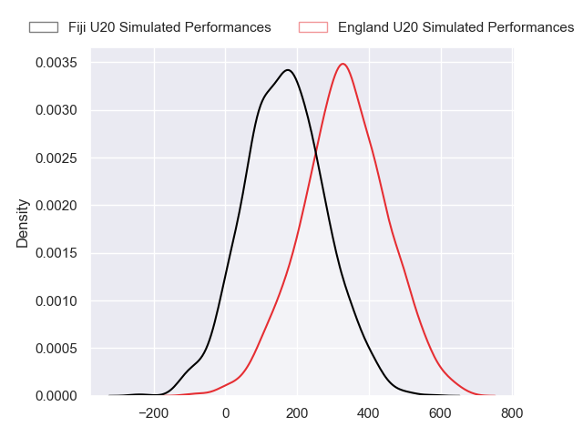
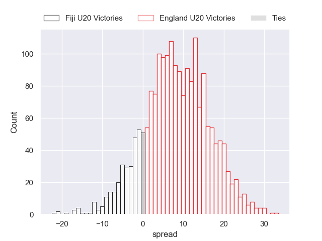
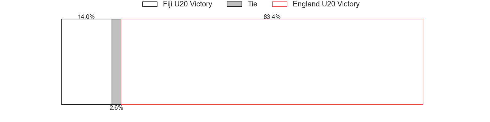

---  
layout: page  
title: Fiji U20 at England U20  
date: 2024-07-04 18:00:00 -0500  
categories: "World Rugby U20 Championship 2024" match projection  
---
# Fiji U20 at England U20

# Club Level Predictions

The first set of predictions treats a club as the smallest object, as the club develops its members, organizes a gameplan, and deploys its players as needed for each match. This club model has a prediction of 0.921, which translates to predicting England U20 to win by 29.3.

Our Over/Under is 71.5 - and combined with the spread above, we have a predicted scoreline of 21 to 50

Each club has a rating and a rating deviation (similar to a Glicko rating), and expected performances can be generated. This allows for simulated matches and spreads like the ones below.
## Projected Performances - Club Model

## Projected Spreads - Club Model

## Projected Results - Club Model

# Player Level Predictions

Treating teams instead as an entity made up of the currently active players, I have ratings for each player in an altogether different system. These can be combined to form team ratings once teamsheets are announced, weighting starters a bit higher than the reserves. After the match is played, players can be weighted by their minutes on the field, allowing for an accurate measure of the team's composition. With these compiled team ratings, we can make predictions, measure inaccuracy, and update the individual player ratings.
## Prediction without Player Minutes: England U20 by 8.1

England U20 by 5.9 on a neutral pitch

## Projected Performances - Player Model

## Projected Spreads - Player Model

## Projected Results - Player Model

| Away Player             |   Away Percentile |   Number |   Home Percentile | Home Player          |
|:------------------------|------------------:|---------:|------------------:|:---------------------|
| Mataiasi Tuisireli      |            nan    |        1 |            nan    | Cameron Miell        |
| Moses Armstrong-Ravula  |             39.46 |        2 |             54.36 | James Isaacs         |
| Elroy Macomber          |            nan    |        3 |            nan    | Jimmy Halliwell      |
| Nalani May              |             40.36 |        4 |            nan    | Harvey Cuckson       |
| Iliesa Erenavula        |             37.69 |        5 |             65.68 | Olamide Sodeke       |
| Ebenezer Tuidraki       |             34.18 |        6 |             86.44 | Finn Carnduff        |
| Ronald Sharma           |             34.18 |        7 |            nan    | Kane James           |
| Simon Koroiyadi         |             32.01 |        8 |            nan    | Arthur Green         |
| Aisea Nawai             |             40.28 |        9 |             45.44 | Ollie Allan          |
| Bogi Kikau              |             37.95 |       10 |            nan    | Ben Coen             |
| Sivaniolo Kalaveti      |             34.23 |       11 |            nan    | Angus Hall           |
| Josefa Ubitau           |            nan    |       12 |             73.03 | Oliver Spencer       |
| Harry Valevatu          |            nan    |       13 |             44.19 | Ben Waghorn          |
| Avakuki Niusalelekitoga |             37.14 |       14 |             84.32 | Toby Cousins         |
| Isikeli Basiyalo        |             34.79 |       15 |             74.58 | Ioan Jones           |
| Iowane Vakadrigi        |            nan    |       16 |             84.94 | Craig Wright         |
| Breyton Legge           |             40.08 |       17 |             85.89 | Asher Opoku-Fordjour |
| Luke Nasau              |            nan    |       18 |            nan    | Afolabi Fasogbon     |
| Ratu Nemani Kurucake    |            nan    |       19 |             82.59 | Junior Kpoku         |
| Malakai Masi            |            nan    |       20 |             81.73 | Henry Pollock        |
| Samuela Ledua           |            nan    |       21 |            nan    | Lucas Friday         |
| Ponipate Tuberi         |            nan    |       22 |             61.65 | Josh Bellamy         |
| Benjiman Naivalu        |            nan    |       23 |             84.61 | Alex Wills           |

