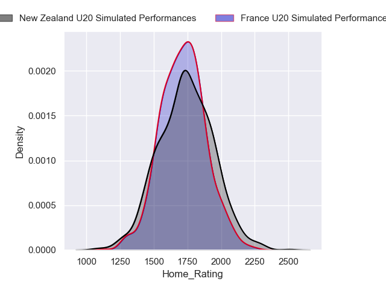
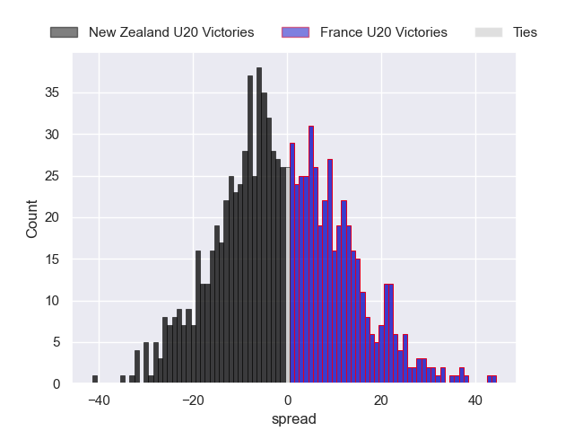
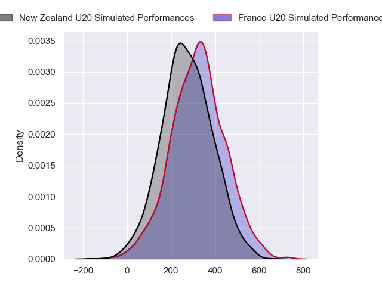
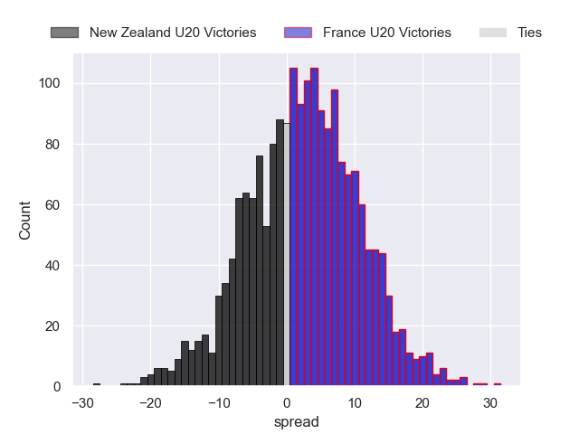
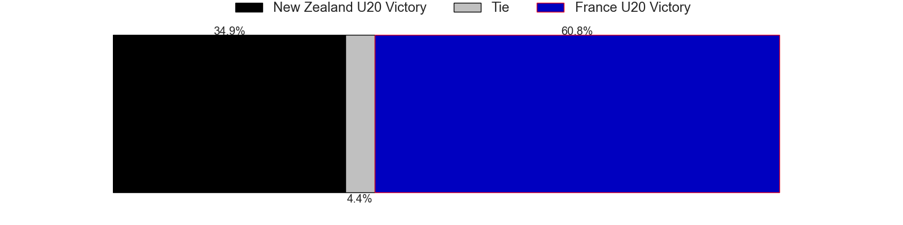

---  
layout: page  
title: New Zealand U20 at France U20  
date: 2024-07-04 18:00:00 -0500  
categories: "World Rugby U20 Championship 2024" match projection  
---
# New Zealand U20 at France U20

# Club Level Predictions

The first set of predictions treats a club as the smallest object, as the club develops its members, organizes a gameplan, and deploys its players as needed for each match. This club model has a prediction of 0.398, which translates to predicting New Zealand U20 to win by 1.1.

Our Over/Under is 53.5 - and combined with the spread above, we have a predicted scoreline of 27 to 26

Each club has a rating and a rating deviation (similar to a Glicko rating), and expected performances can be generated. This allows for simulated matches and spreads like the ones below.
## Projected Performances - Club Model

## Projected Spreads - Club Model

## Projected Results - Club Model

# Player Level Predictions

Treating teams instead as an entity made up of the currently active players, I have ratings for each player in an altogether different system. These can be combined to form team ratings once teamsheets are announced, weighting starters a bit higher than the reserves. After the match is played, players can be weighted by their minutes on the field, allowing for an accurate measure of the team's composition. With these compiled team ratings, we can make predictions, measure inaccuracy, and update the individual player ratings.
## Prediction without Player Minutes: France U20 by 2.8

France U20 by 0.6 on a neutral pitch

## Projected Performances - Player Model

## Projected Spreads - Player Model

## Projected Results - Player Model

| Away Player        |   Away Percentile |   Number |   Home Percentile | Home Player             |
|:-------------------|------------------:|---------:|------------------:|:------------------------|
| Will Martin        |             73.83 |        1 |             34.89 | Lino Julien             |
| Vernon Bason       |             74.48 |        2 |             39.94 | Barnabé Massa           |
| Logan Wallace      |            nan    |        3 |             63.57 | Zinédine Aouad          |
| Tom Allen          |             68.68 |        4 |             60.36 | Corentin Mézou          |
| Liam Jack          |             73.64 |        5 |             62.24 | Charles Kanté-Samba     |
| Andrew Smith       |             50.48 |        6 |             72.12 | Joé Quere-Karaba        |
| Johnny Lee         |             60.25 |        7 |             72.02 | Geoffrey Malaterre      |
| Mosese Bason       |            nan    |        8 |             72.98 | Mathis Castro           |
| Dylan Pledger      |             71.72 |        9 |             56.72 | Léo Carbonneau          |
| Rico Simpson       |             68.35 |       10 |             60.48 | Hugo Reus               |
| Stanley Solomon    |             62.78 |       11 |             35.12 | Mathis Ferté            |
| Xavi Taele         |             70.72 |       12 |             70.82 | Mathys Belaubre         |
| Aki Tuivailala     |             50.47 |       13 |             72.79 | Fabien Brau-Boirie      |
| Xavier Tito-Harris |            nan    |       14 |             64.11 | Nathan Bollengier       |
| Isaac Hutchinson   |             48.54 |       15 |             65.21 | Xan Mousques            |
| Manumaua Letiu     |            nan    |       16 |            nan    | Thomas Lacombre         |
| Sika Pole          |            nan    |       17 |            nan    | Lorencio Boyer Gallardo |
| Josh Smith         |             47.58 |       18 |            nan    | Thomas Duchêne          |
| Cam Christie       |            nan    |       19 |             51.46 | Brent Liufau            |
| Matt Lowe          |             60.96 |       20 |             50.1  | Sialevailea Tolofua     |
| Ben O'Donovan      |             43.97 |       21 |             73.62 | Thomas Souverbie        |
| Sam Coles          |             64.79 |       22 |             67.37 | Maxence Biasotto        |
| King Maxwell       |             73.78 |       23 |             82.92 | Axel Desperes           |

