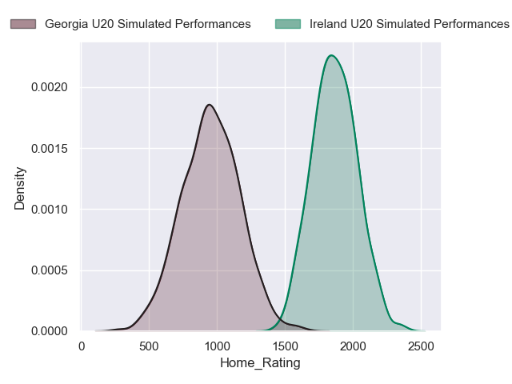
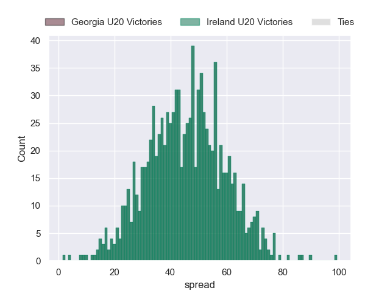
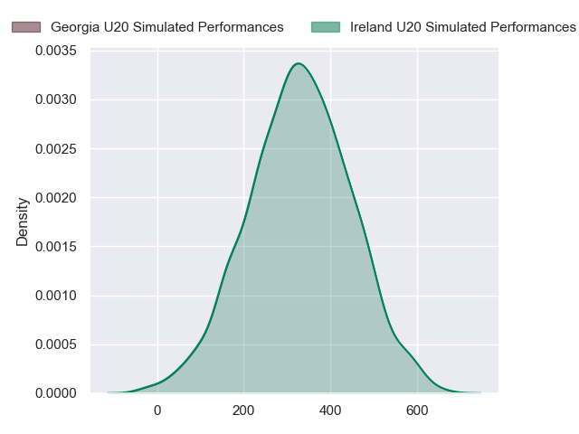
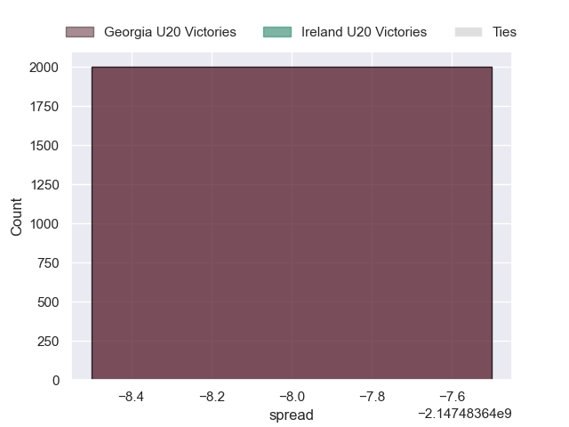

---  
layout: page  
title: Georgia U20 at Ireland U20  
date: 2024-07-04 18:00:00 -0500  
categories: "World Rugby U20 Championship 2024" match projection  
---
# Georgia U20 at Ireland U20

# Club Level Predictions

The first set of predictions treats a club as the smallest object, as the club develops its members, organizes a gameplan, and deploys its players as needed for each match. This club model has a prediction of 0.985, which translates to predicting Ireland U20 to win by 45.6.

Our Over/Under is 59.5 - and combined with the spread above, we have a predicted scoreline of 7 to 52

Each club has a rating and a rating deviation (similar to a Glicko rating), and expected performances can be generated. This allows for simulated matches and spreads like the ones below.
## Projected Performances - Club Model

## Projected Spreads - Club Model

## Projected Results - Club Model

# Player Level Predictions

Treating teams instead as an entity made up of the currently active players, I have ratings for each player in an altogether different system. These can be combined to form team ratings once teamsheets are announced, weighting starters a bit higher than the reserves. After the match is played, players can be weighted by their minutes on the field, allowing for an accurate measure of the team's composition. With these compiled team ratings, we can make predictions, measure inaccuracy, and update the individual player ratings.
## Prediction without Player Minutes: Ireland U20 by 8.4

Ireland U20 by 6.2 on a neutral pitch

## Projected Performances - Player Model

## Projected Spreads - Player Model

## Projected Results - Player Model

| Away Player            |   Away Percentile |   Number |   Home Percentile | Home Player    |
|:-----------------------|------------------:|---------:|------------------:|:---------------|
| Luka Ungiadze          |               nan |        1 |             73.71 | Jacob Boyd     |
| Mikheil Khakhubia      |               nan |        2 |             43.74 | Stephen Smyth  |
| Davit Mchedlidze       |               nan |        3 |             52.9  | Andrew Sparrow |
| Davit Lagvilava        |               nan |        4 |            nan    | James Mckillop |
| Temur Tsulukidze       |               nan |        5 |             84.57 | Evan O'Connell |
| Luka Suluashvili       |               nan |        6 |             57.79 | Seán Edogbo    |
| Andro Dvali            |               nan |        7 |            nan    | Max Flynn      |
| Nika Lomidze           |               nan |        8 |             60.04 | Luke Murphy    |
| Aleksandre Jigauri     |               nan |        9 |             78.66 | Oliver Coffey  |
| Luka Tsirekidze        |               nan |       10 |            nan    | Sean Naughton  |
| Luka Keshelava         |               nan |       11 |            nan    | Ruben Moloney  |
| Giorgi Khaindvrava     |               nan |       12 |             72.41 | Hugh Gavin     |
| Luka Kobauri           |               nan |       13 |             47.72 | Sam Berman     |
| Luka Khorbaladze       |               nan |       14 |             62.05 | Davy Colbert   |
| Otar Metreveli         |               nan |       15 |             78.12 | Ben O'Connor   |
| Shota Kheladze         |               nan |       16 |            nan    | Mikey Yarr     |
| Luka Kotorashvili      |               nan |       17 |             73.55 | Patreece Bell  |
| Davit Kuntelia         |               nan |       18 |            nan    | Alex Mullan    |
| Murtaz Tskhadadze      |               nan |       19 |             66.07 | Alan Spicer    |
| Tornike Ghaniashvili   |               nan |       20 |             51.26 | Brian Gleeson  |
| Mikheil Kavchalashvili |               nan |       21 |            nan    | Tadhg Brophy   |
| Luka Takaishvili       |               nan |       22 |             62.25 | Jack Murphy    |
| Tariel Burtikashvili   |               nan |       23 |             78.94 | Finn Treacy    |

