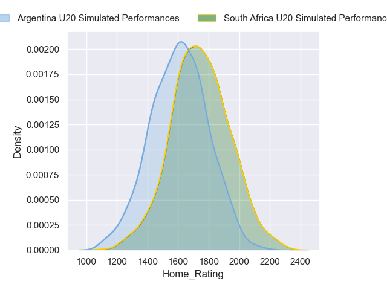
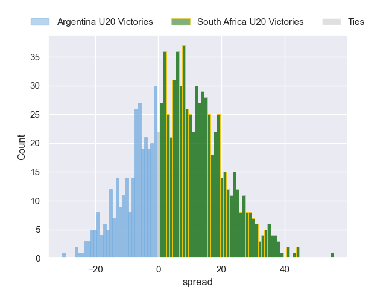
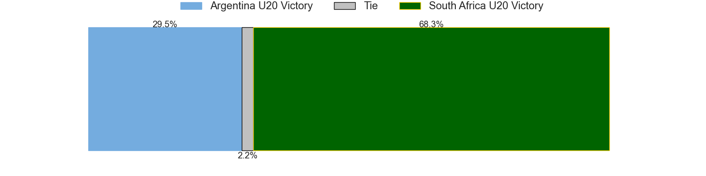
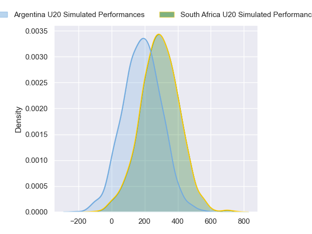
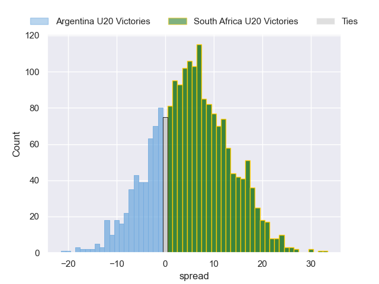
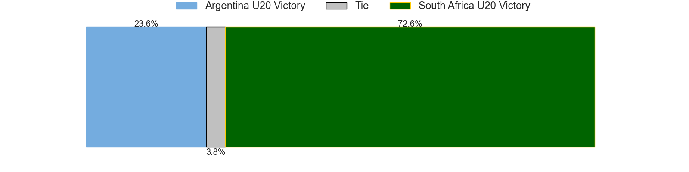

---  
layout: page  
title: Argentina U20 at South Africa U20  
date: 2024-07-04 18:00:00 -0500  
categories: "World Rugby U20 Championship 2024" match projection  
---
# Argentina U20 at South Africa U20

# Club Level Predictions

The first set of predictions treats a club as the smallest object, as the club develops its members, organizes a gameplan, and deploys its players as needed for each match. This club model has a prediction of 0.589, which translates to predicting South Africa U20 to win by 6.9.

Our Over/Under is 53.5 - and combined with the spread above, we have a predicted scoreline of 23 to 30

Each club has a rating and a rating deviation (similar to a Glicko rating), and expected performances can be generated. This allows for simulated matches and spreads like the ones below.
## Projected Performances - Club Model

## Projected Spreads - Club Model

## Projected Results - Club Model

# Player Level Predictions

Treating teams instead as an entity made up of the currently active players, I have ratings for each player in an altogether different system. These can be combined to form team ratings once teamsheets are announced, weighting starters a bit higher than the reserves. After the match is played, players can be weighted by their minutes on the field, allowing for an accurate measure of the team's composition. With these compiled team ratings, we can make predictions, measure inaccuracy, and update the individual player ratings.
## Prediction without Player Minutes: South Africa U20 by 5.7

South Africa U20 by 3.5 on a neutral pitch

## Projected Performances - Player Model

## Projected Spreads - Player Model

## Projected Results - Player Model

| Away Player                  |   Away Percentile |   Number |   Home Percentile | Home Player               |
|:-----------------------------|------------------:|---------:|------------------:|:--------------------------|
| Diego Correa                 |             45.24 |        1 |             69.44 | Ruan Swart                |
| Juan Ignacio Greising Revol  |             45.01 |        2 |             63.23 | Luca Bakkes               |
| Tomás Rapetti                |             48.87 |        3 |             69.27 | Zachary Porthen           |
| Efraín Elías                 |             26.9  |        4 |            nan    | Jaco Grobbelaar           |
| Felipe Bruno                 |            nan    |        5 |             54.8  | JF van Heerden            |
| Juan Penoucos                |             54.23 |        6 |             65.87 | Thabang Mphafi            |
| Santos Fernández De Oliveira |             61.35 |        7 |             63.9  | Batho Hlekani             |
| Juan Pedro Bernasconi        |             40.38 |        8 |             64.02 | Tiaan Jacobs              |
| Tomás Di Biase               |             50.95 |        9 |             67.13 | Asad Moos                 |
| Santino Di Lucca             |             51    |       10 |             57.23 | Liam Koen                 |
| Franco Rossetto              |             61.76 |       11 |             67.69 | Litelihle Bester          |
| Tomás Medina                 |             26.66 |       12 |             42.17 | Philip-Albert Van Niekerk |
| Faustino Sánchez Valarolo    |             54.77 |       13 |             62.55 | Jurenzo Julius            |
| Timoteo Silva                |             24.95 |       14 |             66.35 | Joel Leotlela             |
| Benjamín Elizalde            |             43.33 |       15 |             44.17 | Bruce Sherwood            |
| Juan Manuel Vivas            |             42.16 |       16 |             46.28 | Ethan Bester              |
| Joaquín Yakiche              |            nan    |       17 |            nan    | Liyema Ntshanga           |
| Gael Galván                  |             41.53 |       18 |            nan    | Casper Badenhorst         |
| Álvaro García Iandolino      |             57.57 |       19 |             50.25 | Thomas Dyer               |
| Agustín Sarelli              |             23.85 |       20 |             40.96 | Keanu Coetsee             |
| Jerónimo Llorens             |            nan    |       21 |             67.88 | Sibabalwe Mahashe         |
| Facundo Rodríguez            |             37.55 |       22 |             44.58 | Tylor Sefoor              |
| Felipe Ledesma               |            nan    |       23 |             61.31 | Joshua Boulle             |

