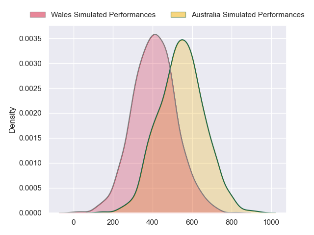
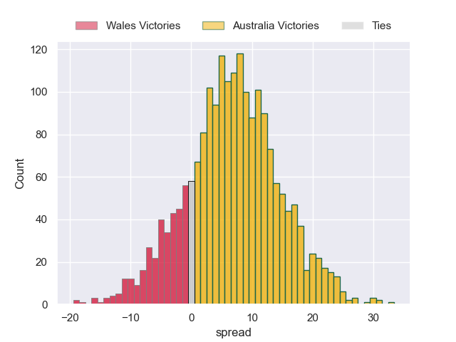
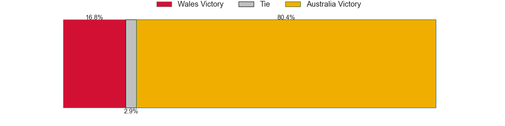

---  
layout: page  
title: Wales at Australia  
date: 2024-07-06 18:00:00 -0500  
categories: "International Test Match 2024" match projection  
---
# Wales at Australia

# Club Level Predictions

The first set of predictions treats a club as the smallest object, as the club develops its members, organizes a gameplan, and deploys its players as needed for each match. This club model has a prediction of 0.518, which translates to predicting Australia to win by 4.3.

Our Over/Under is 49.5 - and combined with the spread above, we have a predicted scoreline of 23 to 27

Each club has a rating and a rating deviation (similar to a Glicko rating), and expected performances can be generated. This allows for simulated matches and spreads like the ones below.
## Projected Performances - Club Model

## Projected Spreads - Club Model

## Projected Results - Club Model

# Player Level Predictions

Treating teams instead as an entity made up of the currently active players, I have ratings for each player in an altogether different system. These can be combined to form team ratings once teamsheets are announced, weighting starters a bit higher than the reserves. After the match is played, players can be weighted by their minutes on the field, allowing for an accurate measure of the team's composition. With these compiled team ratings, we can make predictions, measure inaccuracy, and update the individual player ratings.
## Prediction without Player Minutes: Australia by 6.7

Australia by 2.8 on a neutral pitch

## Projected Performances - Player Model

## Projected Spreads - Player Model

## Projected Results - Player Model

| Away Player      |   Away Percentile |   Number |   Home Percentile | Home Player          |
|:-----------------|------------------:|---------:|------------------:|:---------------------|
| Gareth Thomas    |             66.45 |        1 |             94.52 | James Slipper        |
| Dewi Lake        |             63.07 |        2 |             82.41 | Matt Faessler        |
| Archie Griffin   |            nan    |        3 |             95.24 | Taniela Tupou        |
| Christ Tshiunza  |             48.94 |        4 |             16.92 | Jeremy Williams      |
| Dafydd Jenkins   |             93.57 |        5 |             14.94 | Lukhan Salakaia-Loto |
| Taine Plumtree   |             77.69 |        6 |             97.21 | Liam Wright          |
| Tommy Reffell    |             87.21 |        7 |             94.62 | Fraser McReight      |
| Aaron Wainwright |             88.08 |        8 |             97.6  | Rob Valetini         |
| Ellis Bevan      |             62.82 |        9 |             81.24 | Jake Gordon          |
| Ben Thomas       |             65.87 |       10 |             88.55 | Noah Lolesio         |
| Rio Dyer         |             25.62 |       11 |             94.71 | Filipo Daugunu       |
| Mason Grady      |             81.12 |       12 |             79.25 | Hunter Paisami       |
| Owen Watkin      |             99.17 |       13 |             51.14 | Josh Flook           |
| Josh Hathaway    |             51.25 |       14 |             56.67 | Andrew Kellaway      |
| Liam Williams    |             99.04 |       15 |             83.96 | Tom Wright           |
| Evan Lloyd       |             38.51 |       16 |             83.52 | Billy Pollard        |
| Kemsley Mathias  |             75.56 |       17 |             24.6  | Isaac Aedo Kailea    |
| Harri O'Connor   |             10.4  |       18 |             97.26 | Allan Alaalatoa      |
| Cory Hill        |            nan    |       19 |             92.78 | Angus Blyth          |
| James Botham     |             81.83 |       20 |             57.53 | Charlie Cale         |
| Kieran Hardy     |             67.64 |       21 |             80.55 | Tate McDermott       |
| Sam Costelow     |             58.84 |       22 |             83.94 | Tom Lynagh           |
| Nick Tompkins    |             98.55 |       23 |             70.08 | Dylan Pietsch        |

