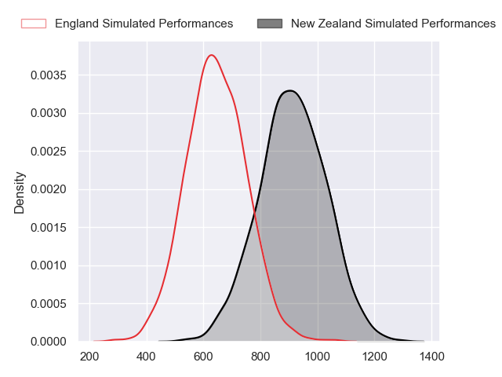
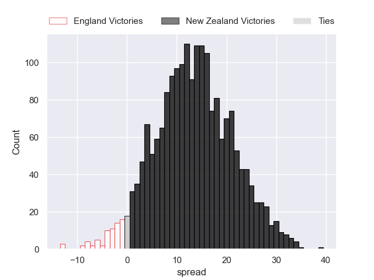

---  
layout: page  
title: England at New Zealand  
date: 2024-07-06 18:00:00 -0500  
categories: "International Test Match 2024" match projection  
---
# England at New Zealand

# Club Level Predictions

The first set of predictions treats a club as the smallest object, as the club develops its members, organizes a gameplan, and deploys its players as needed for each match. This club model has a prediction of 0.696, which translates to predicting New Zealand to win by 10.6.

Our Over/Under is 54.5 - and combined with the spread above, we have a predicted scoreline of 22 to 32

Each club has a rating and a rating deviation (similar to a Glicko rating), and expected performances can be generated. This allows for simulated matches and spreads like the ones below.
## Projected Performances - Club Model

## Projected Spreads - Club Model

## Projected Results - Club Model

# Player Level Predictions

Treating teams instead as an entity made up of the currently active players, I have ratings for each player in an altogether different system. These can be combined to form team ratings once teamsheets are announced, weighting starters a bit higher than the reserves. After the match is played, players can be weighted by their minutes on the field, allowing for an accurate measure of the team's composition. With these compiled team ratings, we can make predictions, measure inaccuracy, and update the individual player ratings.
## Prediction without Player Minutes: New Zealand by 13.5

New Zealand by 10.0 on a neutral pitch

## Projected Performances - Player Model

## Projected Spreads - Player Model

## Projected Results - Player Model

| Away Player               |   Away Percentile |   Number |   Home Percentile | Home Player         |
|:--------------------------|------------------:|---------:|------------------:|:--------------------|
| Joe Marler                |             97.74 |        1 |             72.42 | Ethan de Groot      |
| Jamie George              |             98.89 |        2 |             99.52 | Codie Taylor        |
| Will Stuart               |             34.35 |        3 |             93.95 | Tyrel Lomax         |
| Maro Itoje                |             95.85 |        4 |             94.96 | Scott Barrett       |
| George Martin             |             93.87 |        5 |             96.54 | Patrick Tuipulotu   |
| Chandler Cunningham-South |             74.23 |        6 |             96.54 | Samipeni Finau      |
| Sam Underhill             |             94.71 |        7 |             99.62 | Dalton Papalii      |
| Ben Earl                  |             95.61 |        8 |            100    | Ardie Savea         |
| Alex Mitchell             |             96.04 |        9 |             97.59 | TJ Perenara         |
| Marcus Smith              |             83.13 |       10 |             98.59 | Damian McKenzie     |
| Tommy Freeman             |             98.18 |       11 |             86.62 | Mark Tele'a         |
| Ollie Lawrence            |             89.32 |       12 |             96.99 | Jordie Barrett      |
| Henry Slade               |             98.34 |       13 |             92.95 | Rieko Ioane         |
| Immanuel Feyi-Waboso      |             89.96 |       14 |             85.09 | Sevu Reece          |
| George Furbank            |             97.71 |       15 |             99.58 | Stephen Perofeta    |
| Theo Dan                  |             50.24 |       16 |             94.45 | Asafo Aumua         |
| Fin Baxter                |             22.18 |       17 |             99.52 | Ofa Tu'ungafasi     |
| Dan Cole                  |             55    |       18 |              1.45 | Fletcher Newell     |
| Alex Coles                |             26.11 |       19 |             94.36 | Tupou Vaa'i         |
| Tom Curry                 |             83.56 |       20 |             95.48 | Luke Jacobson       |
| Ben Spencer               |             86.06 |       21 |             79.35 | Finlay Christie     |
| Fin Smith                 |             86.35 |       22 |             96.16 | Anton Lienert-Brown |
| Ollie Sleightholme        |             95.98 |       23 |            100    | Beauden Barrett     |

