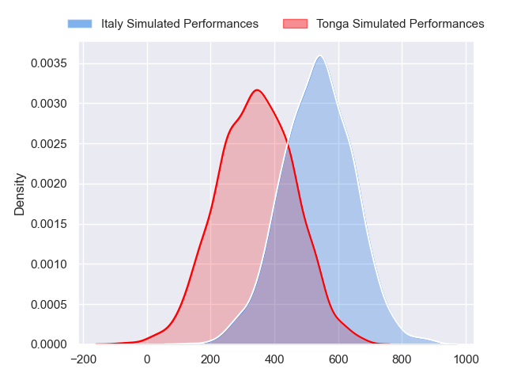
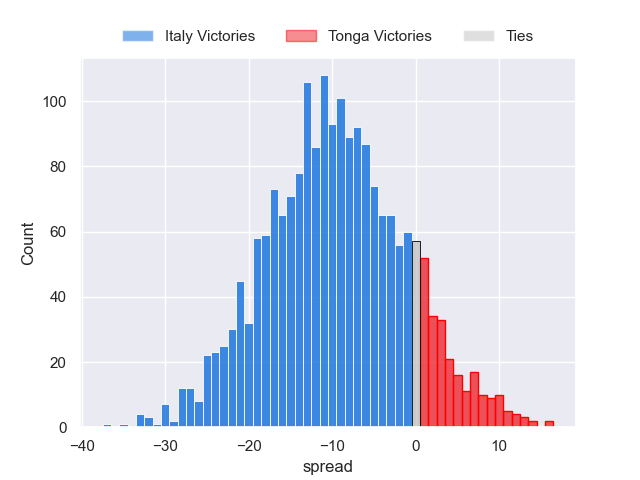
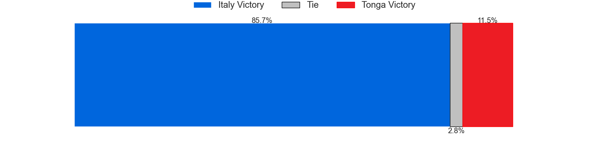

---  
layout: page  
title: Italy at Tonga  
date: 2024-07-11 18:00:00 -0500  
categories: "International Test Match 2024" match projection  
---
# Italy at Tonga

# Club Level Predictions

The first set of predictions treats a club as the smallest object, as the club develops its members, organizes a gameplan, and deploys its players as needed for each match. This club model has a prediction of 0.45, which translates to predicting Italy to win by 1.6.

Each club has a rating and a rating deviation (similar to a Glicko rating), and expected performances can be generated. This allows for simulated matches and spreads like the ones below.
## Projected Performances - Club Model

## Projected Spreads - Club Model

## Projected Results - Club Model

# Player Level Predictions

Treating teams instead as an entity made up of the currently active players, I have ratings for each player in an altogether different system. These can be combined to form team ratings once teamsheets are announced, weighting starters a bit higher than the reserves. After the match is played, players can be weighted by their minutes on the field, allowing for an accurate measure of the team's composition. With these compiled team ratings, we can make predictions, measure inaccuracy, and update the individual player ratings.
## Prediction without Player Minutes: Italy by 9.8

Italy by 12.2 on a neutral pitch

## Projected Performances - Player Model

## Projected Spreads - Player Model

## Projected Results - Player Model

| Away Player        |   Away Percentile |   Number |   Home Percentile | Home Player           |
|:-------------------|------------------:|---------:|------------------:|:----------------------|
| Danilo Fischetti   |            nan    |        1 |            nan    | Isikeli Fukofuka      |
| Giacomo Nicotera   |             98.78 |        2 |            nan    | Sekope Lopeti-Moli    |
| Marco Riccioni     |             57.52 |        3 |             97.69 | Ben Tameifuna         |
| Edoardo Iachizzi   |             77.74 |        4 |             99.05 | Adam Coleman          |
| Federico Ruzza     |            nan    |        5 |            nan    | Harrison Mataele      |
| Manuel Zuliani     |             72.54 |        6 |             81.54 | Josh Kaifa            |
| Michele Lamaro     |            nan    |        7 |            nan    | Fotu Lokotui          |
| Lorenzo Cannone    |             92.57 |        8 |            nan    | Viliami Taulani       |
| Martin Page-Relo   |             79.27 |        9 |             38.47 | Aisea Halo            |
| Paolo Garbisi      |            nan    |       10 |            nan    | James Faiva           |
| Monty Ioane        |            nan    |       11 |            nan    | Hosea Saumaki         |
| Tommaso Menoncello |            nan    |       12 |             82.35 | Malakai Fekitoa       |
| Juan Ignacio Brex  |            nan    |       13 |             70.61 | Fetuli Paea           |
| Jacopo Trulla      |              2.02 |       14 |              5.38 | Fine Inisi            |
| Ange Capuozzo      |             94.96 |       15 |             70.26 | Taniela Filimone      |
| Gianmarco Lucchesi |            nan    |       16 |            nan    | Sosefo Sakalia        |
| Mirco Spagnolo     |             78.03 |       17 |             81.11 | Tau Koloamatangi      |
| Simone Ferrari     |            nan    |       18 |            nan    | Jethro Felemi         |
| Niccolo Cannone    |            nan    |       19 |            nan    | Kelemete Finau        |
| Andrea Zambonin    |             21.31 |       20 |            nan    | Hapakuki Moala-Liavaa |
| Alessandro Garbisi |             72.47 |       21 |            nan    | Manu Paea             |
| Leonardo Marin     |             67.24 |       22 |            nan    | Semisi Maasi          |
| Ross Vintcent      |            nan    |       23 |            nan    | Nikolai Foliaki       |

