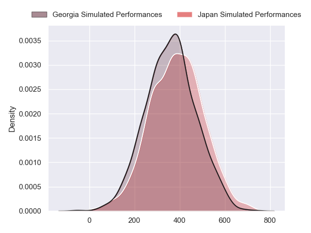
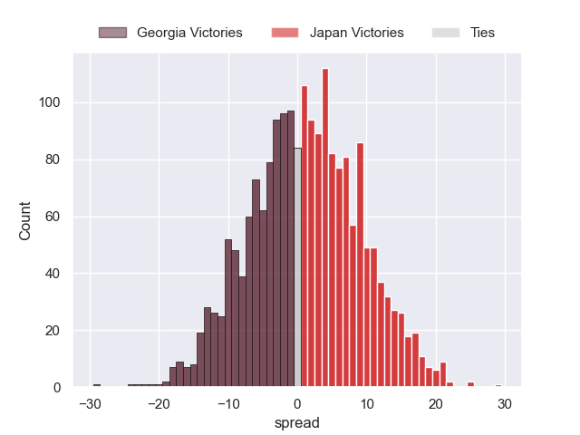

---  
layout: page  
title: Georgia at Japan  
date: 2024-07-13 18:00:00 -0500  
categories: "International Test Match 2024" match projection  
---
# Georgia at Japan

# Club Level Predictions

The first set of predictions treats a club as the smallest object, as the club develops its members, organizes a gameplan, and deploys its players as needed for each match. This club model has a prediction of 0.379, which translates to predicting Georgia to win by 1.2.

Our Over/Under is 47.5 - and combined with the spread above, we have a predicted scoreline of 24 to 23

Each club has a rating and a rating deviation (similar to a Glicko rating), and expected performances can be generated. This allows for simulated matches and spreads like the ones below.
## Projected Performances - Club Model

## Projected Spreads - Club Model

## Projected Results - Club Model

# Player Level Predictions

Treating teams instead as an entity made up of the currently active players, I have ratings for each player in an altogether different system. These can be combined to form team ratings once teamsheets are announced, weighting starters a bit higher than the reserves. After the match is played, players can be weighted by their minutes on the field, allowing for an accurate measure of the team's composition. With these compiled team ratings, we can make predictions, measure inaccuracy, and update the individual player ratings.
## Prediction without Player Minutes: Japan by 1.5

Georgia by 1.4 on a neutral pitch

## Projected Performances - Player Model

## Projected Spreads - Player Model

## Projected Results - Player Model

| Away Player          |   Away Percentile |   Number |   Home Percentile | Home Player      |
|:---------------------|------------------:|---------:|------------------:|:-----------------|
| Giorgi Akhaladze     |             29.7  |        1 |             35.46 | Takayoshi Mohara |
| Vano Karkadze        |             78.57 |        2 |             56.38 | Mamoru Harada    |
| Irakli Aptsiauri     |             24.56 |        3 |             38.14 | Shuhei Takeuchi  |
| Mikheil Babunashvili |             28.38 |        4 |             97.78 | Michael Leitch   |
| Giorgi Javakhia      |             29.61 |        5 |             93.66 | Warner Dearns    |
| Ilia Spanderashvili  |             32.87 |        6 |             90.82 | Faulua Makisi    |
| Luka Ivanishvili     |             74.52 |        7 |             81.81 | Kanji Shimokawa  |
| Beka Gorgadze        |             75.05 |        8 |             89.02 | Tevita Tatafu    |
| Vasil Lobzhanidze    |             11.07 |        9 |             14.88 | Naoto Saito      |
| Tedo Abzhandadze     |             60.73 |       10 |              6.13 | Seungsin Lee     |
| Davit Niniashvili    |             85.82 |       11 |             76.52 | Tomoki Osada     |
| Giorgi Kveseladze    |             93.41 |       12 |             52.35 | Samisoni Tua     |
| Demur Tapladze       |             82.42 |       13 |             98.9  | Dylan Riley      |
| Aka Tabutsadze       |             87.91 |       14 |             73.73 | Jone Naikabula   |
| Luka Matkava         |             81.73 |       15 |             51.81 | Yoshitaka Yazaki |
| Luka Petriashvili    |            nan    |       16 |             92.25 | Atsushi Sakate   |
| Giorgi Mamaiashvili  |            nan    |       17 |            nan    | Takato Okabe     |
| Aleksandre Kuntelia  |            nan    |       18 |            nan    | Keijiro Tamefusa |
| Lado Chachanidze     |             32.73 |       19 |            nan    | Sanaila Waqa     |
| Beka Saghinadze      |             84.21 |       20 |             33.15 | Tiennan Costley  |
| Tornike Jalagonia    |             34.73 |       21 |            nan    | Taiki Koyama     |
| Gela Aprasidze       |             58.51 |       22 |             95.58 | Takuya Yamasawa  |
| Sandro Todua         |             92.09 |       23 |             53.73 | Koga Nezuka      |

