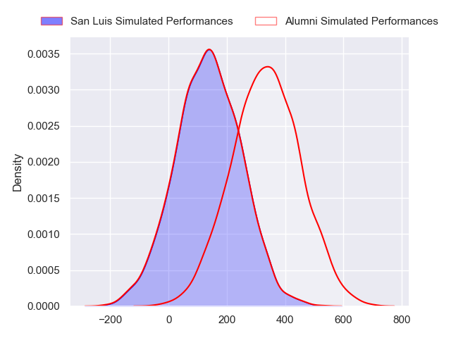
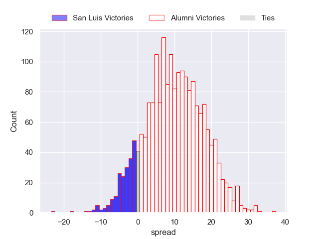
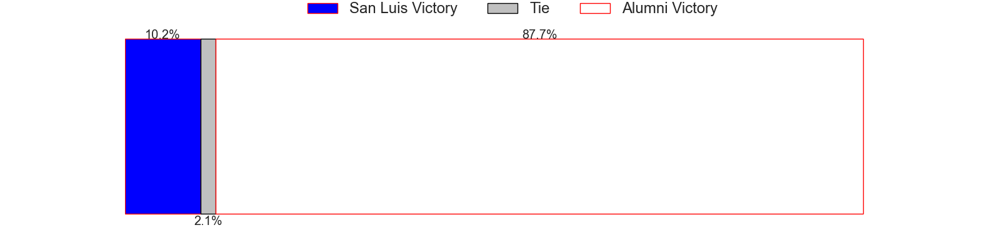

---  
layout: page  
title: San Luis at Alumni  
date: 2024-07-14 18:00:00 -0500  
categories: "URBA Top 12 2024" match projection  
---
# San Luis at Alumni

# Club Level Predictions

The first set of predictions treats a club as the smallest object, as the club develops its members, organizes a gameplan, and deploys its players as needed for each match. This club model has a prediction of 0.589, which translates to predicting Alumni to win by 6.6.

Our Over/Under is 51.5 - and combined with the spread above, we have a predicted scoreline of 23 to 29

Each club has a rating and a rating deviation (similar to a Glicko rating), and expected performances can be generated. This allows for simulated matches and spreads like the ones below.
## Projected Performances - Club Model

## Projected Spreads - Club Model

## Projected Results - Club Model

# Player Level Predictions

Treating teams instead as an entity made up of the currently active players, I have ratings for each player in an altogether different system. These can be combined to form team ratings once teamsheets are announced, weighting starters a bit higher than the reserves. After the match is played, players can be weighted by their minutes on the field, allowing for an accurate measure of the team's composition. With these compiled team ratings, we can make predictions, measure inaccuracy, and update the individual player ratings.
## Prediction without Player Minutes: Alumni by 10.1

Alumni by 5.9 on a neutral pitch

## Projected Performances - Player Model

## Projected Spreads - Player Model

## Projected Results - Player Model

| Away Player                |   Away Percentile |   Number |   Home Percentile | Home Player        |
|:---------------------------|------------------:|---------:|------------------:|:-------------------|
| Santiago Bonavento         |             42.52 |        1 |             67.31 | Federico Lucca     |
| Agustin Fitzsimons Herrera |             38.15 |        2 |             66.72 | Tomas Bivort       |
| Alexis Uvieda              |             77.13 |        3 |             80.58 | Bautista Vidal     |
| Ramiro Bruni               |             48.82 |        4 |             66.41 | Manuel Mora        |
| Santiago Canal             |             50.9  |        5 |             67.27 | Santiago Alduncin  |
| Franco Gnecco              |             58.91 |        6 |             63.71 | Ignacio Cubilla    |
| Facundo Alvarez Amado      |             35.09 |        7 |             77.38 | Juan Anderson      |
| Agustin Torello            |             42.51 |        8 |             53.89 | Santiago Montagner |
| Juan Vaca                  |             68.26 |        9 |             63.97 | Tomas Passerotti   |
| Felipe Campodonico         |             54.79 |       10 |             81.61 | Joaquin Luzzi      |
| Wilmer Ramirez             |             53.09 |       11 |             68.36 | Ramon Fuentes      |
| Segundo Fresco             |             60.64 |       12 |             58.84 | Franco Battezzati  |
| Benjamin Marban            |             45.35 |       13 |             59.94 | Alejo Chavez       |
| Eduardo Ruesta             |             36.18 |       14 |             44.36 | Franco Sabato      |
| Valentino Quattrocchi      |             28.51 |       15 |             53.61 | Santiago Pernas    |
| Away Team 16               |            nan    |       16 |            nan    | Home Team 16       |
| Away Team 17               |            nan    |       17 |            nan    | Home Team 17       |
| Away Team 18               |            nan    |       18 |            nan    | Home Team 18       |
| Away Team 19               |            nan    |       19 |            nan    | Home Team 19       |
| Away Team 20               |            nan    |       20 |            nan    | Home Team 20       |
| Away Team 21               |            nan    |       21 |            nan    | Home Team 21       |
| Away Team 22               |            nan    |       22 |            nan    | Home Team 22       |
| Away Team 23               |            nan    |       23 |            nan    | Home Team 23       |

