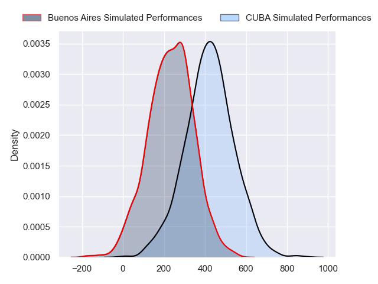
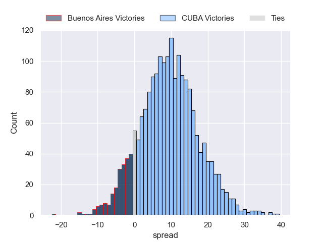
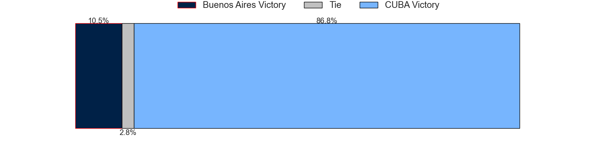

---  
layout: page  
title: Buenos Aires at CUBA  
date: 2024-07-14 18:00:00 -0500  
categories: "URBA Top 12 2024" match projection  
---
# Buenos Aires at CUBA

# Club Level Predictions

The first set of predictions treats a club as the smallest object, as the club develops its members, organizes a gameplan, and deploys its players as needed for each match. This club model has a prediction of 0.59, which translates to predicting CUBA to win by 6.4.

Our Over/Under is 50.5 - and combined with the spread above, we have a predicted scoreline of 22 to 29

Each club has a rating and a rating deviation (similar to a Glicko rating), and expected performances can be generated. This allows for simulated matches and spreads like the ones below.
## Projected Performances - Club Model

## Projected Spreads - Club Model

## Projected Results - Club Model

# Player Level Predictions

Treating teams instead as an entity made up of the currently active players, I have ratings for each player in an altogether different system. These can be combined to form team ratings once teamsheets are announced, weighting starters a bit higher than the reserves. After the match is played, players can be weighted by their minutes on the field, allowing for an accurate measure of the team's composition. With these compiled team ratings, we can make predictions, measure inaccuracy, and update the individual player ratings.
## Prediction without Player Minutes: CUBA by 9.5

CUBA by 5.7 on a neutral pitch

## Projected Performances - Player Model

## Projected Spreads - Player Model

## Projected Results - Player Model

| Away Player            |   Away Percentile |   Number |   Home Percentile | Home Player           |
|:-----------------------|------------------:|---------:|------------------:|:----------------------|
| Pablo Gaston Vaca      |             78.74 |        1 |             86.57 | Facundo Aguirre       |
| Tomas Rosasco          |             52.89 |        2 |             21.28 | Tomas Anderlic        |
| Tomas Gallo            |             39.52 |        3 |             81.66 | Estanislao Carullo    |
| Francisco Jose Sluga   |             49.67 |        4 |             84.86 | Santiago Uriarte      |
| Bautista Duranona      |             45.03 |        5 |             84.67 | Santiago Landau       |
| Jaime McGrech          |            nan    |        6 |             83.19 | Francisco Sied        |
| Matias Espina          |             44.88 |        7 |             81.35 | Segundo Pisani        |
| Jordi Dieguez          |             61.22 |        8 |             80.04 | Benito Ortiz de Rozas |
| Mateo Freire           |             29.26 |        9 |             74.71 | Rafael Iriarte        |
| Tomas Bunge            |             28.16 |       10 |             85.82 | Valentin Mastroizi    |
| Benjamin Handley       |             25    |       11 |             85.27 | Marcos Moroni         |
| Agustin Lamensa Sanudo |             46.15 |       12 |             70.43 | Felipe de la Vega     |
| Ramiro Costa           |             41.16 |       13 |             58.84 | Marcos Elicagaray     |
| Alfonso Latorre        |             67.55 |       14 |             89.27 | Bautista Casaurang    |
| Julian Quetglas Bojar  |             42.97 |       15 |             47.93 | Simon Benitez Cruz    |
| Away Team 16           |            nan    |       16 |            nan    | Home Team 16          |
| Away Team 17           |            nan    |       17 |            nan    | Home Team 17          |
| Away Team 18           |            nan    |       18 |            nan    | Home Team 18          |
| Away Team 19           |            nan    |       19 |            nan    | Home Team 19          |
| Away Team 20           |            nan    |       20 |            nan    | Home Team 20          |
| Away Team 21           |            nan    |       21 |            nan    | Home Team 21          |
| Away Team 22           |            nan    |       22 |            nan    | Home Team 22          |
| Away Team 23           |            nan    |       23 |            nan    | Home Team 23          |

