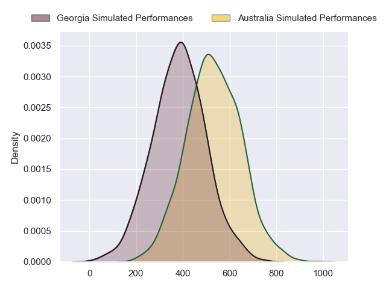
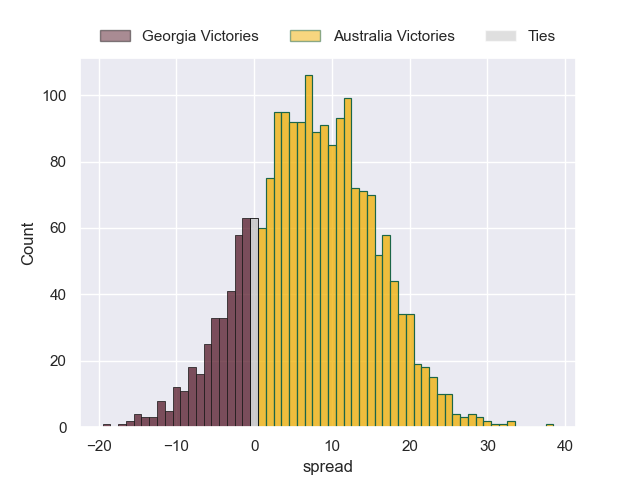
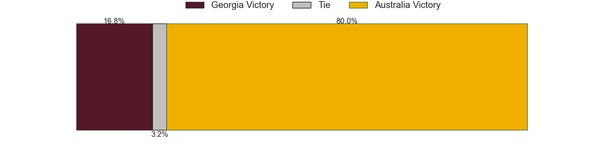

---  
layout: page  
title: Georgia at Australia  
date: 2024-07-19 18:00:00 -0500  
categories: "International Test Match 2024" match projection  
---
# Georgia at Australia

# Club Level Predictions

The first set of predictions treats a club as the smallest object, as the club develops its members, organizes a gameplan, and deploys its players as needed for each match. This club model has a prediction of 0.762, which translates to predicting Australia to win by 10.7.

Each club has a rating and a rating deviation (similar to a Glicko rating), and expected performances can be generated. This allows for simulated matches and spreads like the ones below.
## Projected Performances - Club Model

## Projected Spreads - Club Model

## Projected Results - Club Model

# Player Level Predictions

Treating teams instead as an entity made up of the currently active players, I have ratings for each player in an altogether different system. These can be combined to form team ratings once teamsheets are announced, weighting starters a bit higher than the reserves. After the match is played, players can be weighted by their minutes on the field, allowing for an accurate measure of the team's composition. With these compiled team ratings, we can make predictions, measure inaccuracy, and update the individual player ratings.
## Prediction without Player Minutes: Australia by 7.3

Australia by 3.4 on a neutral pitch

## Projected Performances - Player Model

## Projected Spreads - Player Model

## Projected Results - Player Model

| Away Player          |   Away Percentile |   Number |   Home Percentile | Home Player     |
|:---------------------|------------------:|---------:|------------------:|:----------------|
| Giorgi Mamaiashvili  |            nan    |        1 |            nan    | Isaac Kailea    |
| Vano Karkadze        |             80.48 |        2 |             83.81 | Billy Pollard   |
| Aleksandre Kuntelia  |            nan    |        3 |             97.47 | Allan Alaalatoa |
| Lado Chachanidze     |             29.55 |        4 |             53.94 | Nick Frost      |
| Mikheil Babunashvili |             29.17 |        5 |             93.25 | Angus Blyth     |
| Beka Gorgadze        |             76.98 |        6 |             97.96 | Rob Valetini    |
| Beka Saghinadze      |             81.87 |        7 |             95.47 | Fraser McReight |
| Tornike Jalagonia    |             35.52 |        8 |             72.82 | Harry Wilson    |
| Mikheil Alania       |             48.19 |        9 |             81.25 | Tate McDermott  |
| Luka Matkava         |             84.41 |       10 |             61.98 | Ben Donaldson   |
| Sandro Todua         |             91.63 |       11 |             40.13 | Darby Lancaster |
| Giorgi Kveseladze    |             94.02 |       12 |             82.15 | Hunter Paisami  |
| Demur Tapladze       |             82.45 |       13 |             75.37 | Len Ikitau      |
| Aka Tabutsadze       |             88.63 |       14 |             95.36 | Filipo Daugunu  |
| Davit Niniashvili    |             82.04 |       15 |             86.63 | Tom Wright      |
| Luka Petriashvili    |            nan    |       16 |            nan    | Josh Nasser     |
| Luka Goginava        |            nan    |       17 |             65.06 | Alex Hodgman    |
| Irakli Aptsiauri     |             28.58 |       18 |             80.38 | Zane Nonggorr   |
| Lasha Jaiani         |             86.4  |       19 |             81.8  | Tom Hooper      |
| Luka Ivanishvili     |             74.65 |       20 |             24.77 | Jeremy Williams |
| Giorgi Tsutskiridze  |             82.89 |       21 |             99.18 | Nic White       |
| Vasil Lobzhanidze    |             10.86 |       22 |             90.49 | Noah Lolesio    |
| Tedo Abzhandadze     |             61.03 |       23 |             69.06 | Andrew Kellaway |

