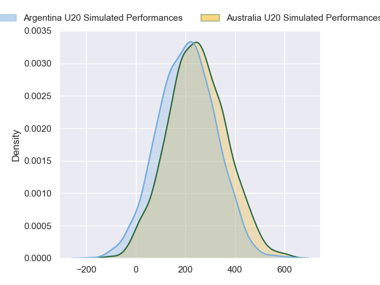
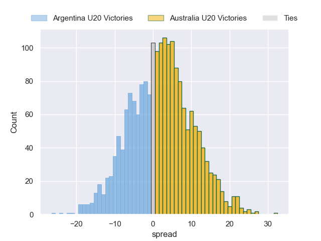
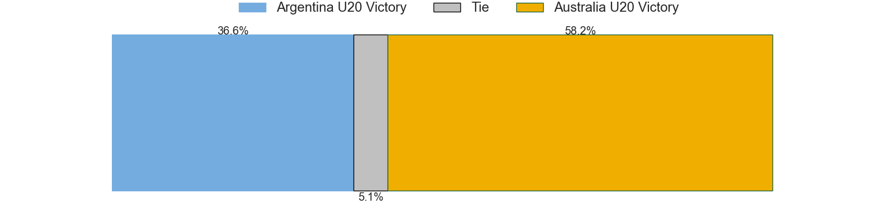

---  
layout: page  
title: Argentina U20 at Australia U20  
date: 2024-07-19 18:00:00 -0500  
categories: "World Rugby U20 Championship 2024" match projection  
---
# Argentina U20 at Australia U20

# Club Level Predictions

The first set of predictions treats a club as the smallest object, as the club develops its members, organizes a gameplan, and deploys its players as needed for each match. This club model has a prediction of 0.134, which translates to predicting Argentina U20 to win by 14.1.

Our Over/Under is 60.5 - and combined with the spread above, we have a predicted scoreline of 37 to 23

Each club has a rating and a rating deviation (similar to a Glicko rating), and expected performances can be generated. This allows for simulated matches and spreads like the ones below.
## Projected Performances - Club Model

## Projected Spreads - Club Model

## Projected Results - Club Model

# Player Level Predictions

Treating teams instead as an entity made up of the currently active players, I have ratings for each player in an altogether different system. These can be combined to form team ratings once teamsheets are announced, weighting starters a bit higher than the reserves. After the match is played, players can be weighted by their minutes on the field, allowing for an accurate measure of the team's composition. With these compiled team ratings, we can make predictions, measure inaccuracy, and update the individual player ratings.
## Prediction without Player Minutes: Australia U20 by 2.4

Australia U20 by 0.1 on a neutral pitch

## Projected Performances - Player Model

## Projected Spreads - Player Model

## Projected Results - Player Model

| Away Player                  |   Away Percentile |   Number |   Home Percentile | Home Player               |
|:-----------------------------|------------------:|---------:|------------------:|:--------------------------|
| Diego Correa                 |             54.48 |        1 |            nan    | Lington Ieli              |
| Marcos Camerlinckx           |            nan    |        2 |             26.63 | Ottavio Tuipulotu         |
| Tomás Rapetti                |             56.48 |        3 |             51.34 | Nick Bloomfield           |
| Efraín Elías                 |             33.77 |        4 |             32.27 | Toby Macpherson           |
| Álvaro García Iandolino      |             62.48 |        5 |             26.36 | Harvey Cordukes           |
| Ignacio Torrado              |             33.73 |        6 |             31.54 | Aden Ekanayake            |
| Santos Fernández De Oliveira |             66.7  |        7 |             60.41 | Dane Sawers               |
| Juan Pedro Bernasconi        |             48.41 |        8 |             29.37 | Jack Harley               |
| Tomás Di Biase               |             51.15 |        9 |             66.61 | Dan Nelson                |
| Santino Di Lucca             |             60.65 |       10 |             65.78 | Harry McLaughlin-Phillips |
| Franco Rossetto              |             67.24 |       11 |             66.79 | Archie Saunders           |
| Faustino Sánchez Valarolo    |             62.11 |       12 |             39.08 | Jarrah Mcleod             |
| Tomás Medina                 |             27.02 |       13 |             56.73 | Kadin Pritchard           |
| Timoteo Silva                |             31.94 |       14 |             68.33 | Ronan Leahy               |
| Benjamín Elizalde            |             52.3  |       15 |             49.1  | Shane Wilcox              |
| Juan Ignacio Greising Revol  |             43.42 |       16 |            nan    | Oniti Finau               |
| Estanislao Rodríguez         |             39.23 |       17 |            nan    | Nate Tiitii               |
| Gael Galván                  |             41.46 |       18 |            nan    | Trevor King               |
| Juan Penoucos                |             62.07 |       19 |            nan    | Eamon Doyle               |
| Agustín Sarelli              |             23.87 |       20 |            nan    | Austin Durbridge          |
| Jerónimo Llorens             |            nan    |       21 |            nan    | Billy Dickens             |
| Facundo Rodríguez            |             38.02 |       22 |            nan    | Boston Fakafanua          |
| Felipe Ledesma               |            nan    |       23 |             20.36 | Angus Staniforth          |

