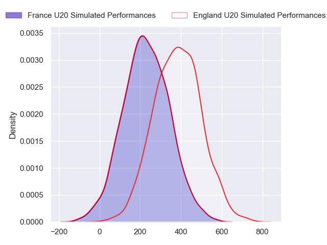
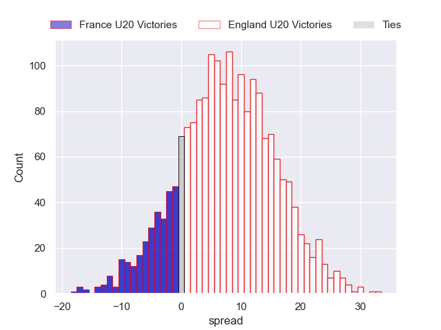
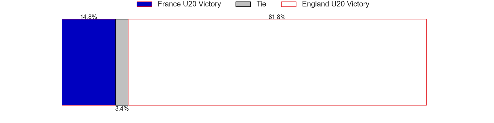

---  
layout: page  
title: France U20 at England U20  
date: 2024-07-19 18:00:00 -0500  
categories: "World Rugby U20 Championship 2024" match projection  
---
# France U20 at England U20

# Club Level Predictions

The first set of predictions treats a club as the smallest object, as the club develops its members, organizes a gameplan, and deploys its players as needed for each match. This club model has a prediction of 0.527, which translates to predicting England U20 to win by 4.1.

Our Over/Under is 63.5 - and combined with the spread above, we have a predicted scoreline of 30 to 34

Each club has a rating and a rating deviation (similar to a Glicko rating), and expected performances can be generated. This allows for simulated matches and spreads like the ones below.
## Projected Performances - Club Model

## Projected Spreads - Club Model

## Projected Results - Club Model

# Player Level Predictions

Treating teams instead as an entity made up of the currently active players, I have ratings for each player in an altogether different system. These can be combined to form team ratings once teamsheets are announced, weighting starters a bit higher than the reserves. After the match is played, players can be weighted by their minutes on the field, allowing for an accurate measure of the team's composition. With these compiled team ratings, we can make predictions, measure inaccuracy, and update the individual player ratings.
## Prediction without Player Minutes: England U20 by 8.0

England U20 by 5.8 on a neutral pitch

## Projected Performances - Player Model

## Projected Spreads - Player Model

## Projected Results - Player Model

| Away Player            |   Away Percentile |   Number |   Home Percentile | Home Player          |
|:-----------------------|------------------:|---------:|------------------:|:---------------------|
| Lino Julien            |             46.51 |        1 |             91.95 | Asher Opoku-Fordjour |
| Barnabé Massa          |             45.69 |        2 |             83.06 | Craig Wright         |
| Thomas Duchêne         |            nan    |        3 |            nan    | Afolabi Fasogbon     |
| Charly Gambini         |             76.74 |        4 |             85.27 | Joe Bailey           |
| Corentin Mézou         |             73.64 |        5 |             80.68 | Junior Kpoku         |
| Joé Quere-Karaba       |             77.52 |        6 |             91.4  | Finn Carnduff        |
| Geoffrey Malaterre     |             76.23 |        7 |             81.68 | Henry Pollock        |
| Mathis Castro          |             84.72 |        8 |            nan    | Kane James           |
| Léo Carbonneau         |             64.47 |        9 |            nan    | Ollie Allan          |
| Hugo Reus              |             82.89 |       10 |            nan    | Ben Coen             |
| Xan Mousques           |             64.87 |       11 |             83.17 | Alex Wills           |
| Robin Taccola          |             66.7  |       12 |             74.48 | Sean Kerr            |
| Fabien Brau-Boirie     |             76.97 |       13 |             45.66 | Ben Waghorn          |
| Maxence Biasotto       |             79.07 |       14 |             90.17 | Ben Redshaw          |
| Mathis Ferté           |             48.3  |       15 |             74.45 | Ioan Jones           |
| Thomas Lacombre        |            nan    |       16 |             53.71 | James Isaacs         |
| Samuel Jean-Christophe |             66.9  |       17 |            nan    | Cameron Miell        |
| Thomas Marceline       |            nan    |       18 |            nan    | Jimmy Halliwell      |
| Charles Kanté-Samba    |            nan    |       19 |             67.07 | Olamide Sodeke       |
| Brent Liufau           |            nan    |       20 |            nan    | Arthur Green         |
| Sialevailea Tolofua    |             50.88 |       21 |            nan    | Lucas Friday         |
| Mathys Belaubre        |             60.12 |       22 |             58.56 | Josh Bellamy         |
| Axel Desperes          |             83.03 |       23 |            nan    | Angus Hall           |

