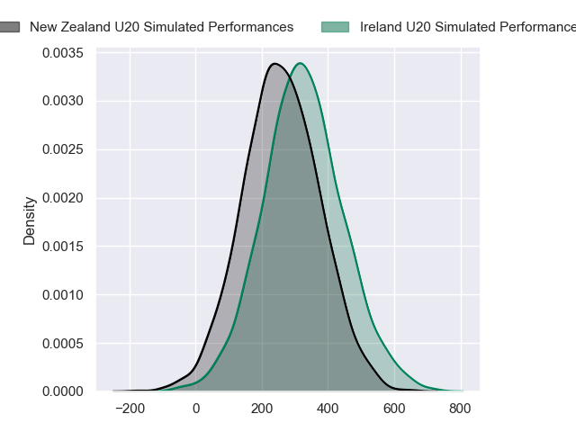
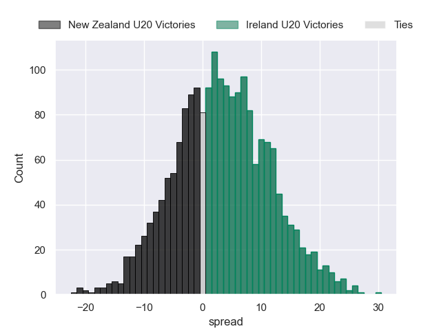
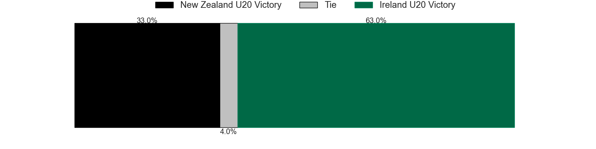

---  
layout: page  
title: New Zealand U20 at Ireland U20  
date: 2024-07-19 18:00:00 -0500  
categories: "World Rugby U20 Championship 2024" match projection  
---
# New Zealand U20 at Ireland U20

# Club Level Predictions

The first set of predictions treats a club as the smallest object, as the club develops its members, organizes a gameplan, and deploys its players as needed for each match. This club model has a prediction of 0.659, which translates to predicting Ireland U20 to win by 9.4.

Our Over/Under is 58.5 - and combined with the spread above, we have a predicted scoreline of 25 to 34

Each club has a rating and a rating deviation (similar to a Glicko rating), and expected performances can be generated. This allows for simulated matches and spreads like the ones below.
## Projected Performances - Club Model

## Projected Spreads - Club Model

## Projected Results - Club Model

# Player Level Predictions

Treating teams instead as an entity made up of the currently active players, I have ratings for each player in an altogether different system. These can be combined to form team ratings once teamsheets are announced, weighting starters a bit higher than the reserves. After the match is played, players can be weighted by their minutes on the field, allowing for an accurate measure of the team's composition. With these compiled team ratings, we can make predictions, measure inaccuracy, and update the individual player ratings.
## Prediction without Player Minutes: Ireland U20 by 3.7

Ireland U20 by 1.5 on a neutral pitch

## Projected Performances - Player Model

## Projected Spreads - Player Model

## Projected Results - Player Model

| Away Player           |   Away Percentile |   Number |   Home Percentile | Home Player     |
|:----------------------|------------------:|---------:|------------------:|:----------------|
| Senio Sanele          |            nan    |        1 |            nan    | Emmett Calvey   |
| Vernon Bason          |             65.66 |        2 |             42.21 | Stephen Smyth   |
| Josh Smith            |             30.04 |        3 |            nan    | Alex Mullan     |
| Tom Allen             |             52.53 |        4 |             60.41 | Alan Spicer     |
| Cam Christie          |            nan    |        5 |             60.91 | Luke Murphy     |
| Andrew Smith          |             38.58 |        6 |            nan    | James Mckillop  |
| Matt Lowe             |             59.11 |        7 |             78.72 | Bryn Ward       |
| Johnny Lee            |             34.69 |        8 |             52.98 | Brian Gleeson   |
| Dylan Pledger         |             50.99 |        9 |             77.3  | Oliver Coffey   |
| Cooper Grant          |             41.63 |       10 |             63.5  | Jack Murphy     |
| Frank Vaenuku         |             57.87 |       11 |             80.71 | Hugo Mclaughlin |
| Xavi Taele            |             48.55 |       12 |             73.08 | Hugh Gavin      |
| Aki Tuivailala        |             23.83 |       13 |             80.62 | Finn Treacy     |
| King Maxwell          |             74.98 |       14 |            nan    | Davy Colbert    |
| Sam Coles             |             49.3  |       15 |             76.05 | Ben O'Connor    |
| A-One Lolofie         |            nan    |       16 |            nan    | Mikey Yarr      |
| Sika Pole             |            nan    |       17 |             62.45 | Ben Howard      |
| Will Martin           |             52.41 |       18 |             52.95 | Andrew Sparrow  |
| Tai Cribb             |            nan    |       19 |            nan    | Billy Corrigan  |
| Jeremiah Avei-Collins |            nan    |       20 |            nan    | Max Flynn       |
| Ben O'Donovan         |             43.75 |       21 |            nan    | Jake O'Riordan  |
| Rico Simpson          |             47.15 |       22 |            nan    | Sean Naughton   |
| Xavier Tito-Harris    |             27.93 |       23 |            nan    | Ethan Graham    |

