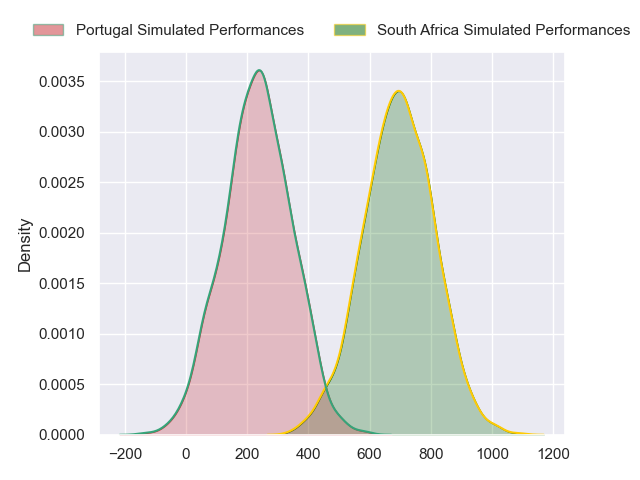
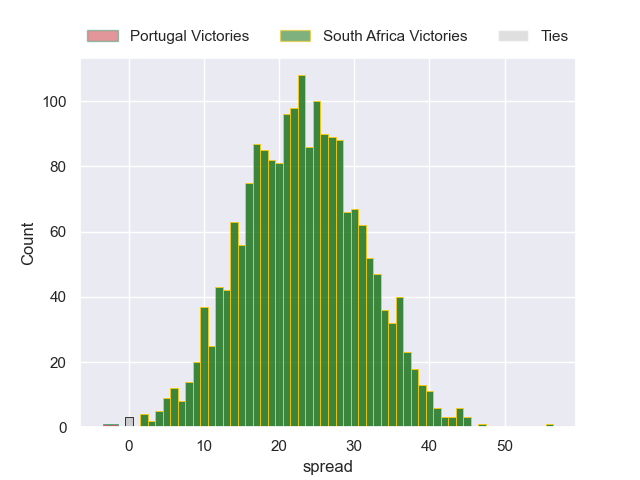
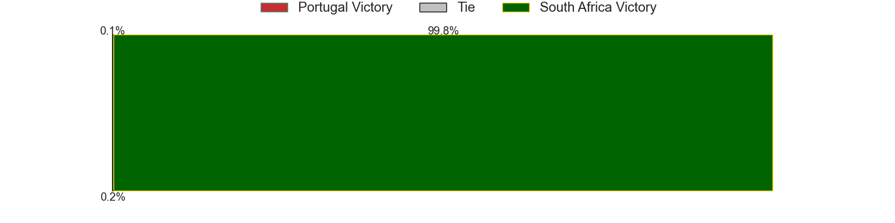

---  
layout: page  
title: Portugal at South Africa  
date: 2024-07-19 18:00:00 -0500  
categories: "International Test Match 2024" match projection  
---
# Portugal at South Africa

# Club Level Predictions

The first set of predictions treats a club as the smallest object, as the club develops its members, organizes a gameplan, and deploys its players as needed for each match. This club model has a prediction of 0.958, which translates to predicting South Africa to win by 28.0.

Each club has a rating and a rating deviation (similar to a Glicko rating), and expected performances can be generated. This allows for simulated matches and spreads like the ones below.
## Projected Performances - Club Model

## Projected Spreads - Club Model

## Projected Results - Club Model

# Player Level Predictions

Treating teams instead as an entity made up of the currently active players, I have ratings for each player in an altogether different system. These can be combined to form team ratings once teamsheets are announced, weighting starters a bit higher than the reserves. After the match is played, players can be weighted by their minutes on the field, allowing for an accurate measure of the team's composition. With these compiled team ratings, we can make predictions, measure inaccuracy, and update the individual player ratings.
## Prediction without Player Minutes: South Africa by 23.4

South Africa by 19.9 on a neutral pitch

## Projected Performances - Player Model

## Projected Spreads - Player Model

## Projected Results - Player Model

| Away Player            |   Away Percentile |   Number |   Home Percentile | Home Player               |
|:-----------------------|------------------:|---------:|------------------:|:--------------------------|
| Francisco Fernandes    |              8.73 |        1 |             25.59 | Jan-Hendrik Wessels       |
| Luka Begic             |             52.93 |        2 |             95.94 | Johan Grobbelaar          |
| Diogo Hasse Ferreira   |              8.12 |        3 |             96.81 | Thomas du Toit            |
| Nicolas Fernandes      |            nan    |        4 |             78.86 | Salmaan Moerat            |
| Duarte Torgal          |             83.52 |        5 |             99.35 | RG Snyman                 |
| Jose Madeira           |             92.53 |        6 |             63.84 | Phepsi Buthelezi          |
| Diego Pinheiro Ruiz    |            nan    |        7 |             70.76 | Ben-Jason Dixon           |
| Vasco Baptista         |            nan    |        8 |             89.26 | Evan Roos                 |
| Hugo Gomes Camacho     |             52.05 |        9 |             92.64 | Cobus Reinach             |
| Joris De Moura         |            nan    |       10 |             85.96 | Manie Libbok              |
| Rodrigo Marta          |             89.54 |       11 |             99.64 | Makazole Mapimpi          |
| Tomas Appleton         |             74.28 |       12 |             97.82 | Andre Esterhuizen         |
| Jose Lima              |             85.16 |       13 |             86.55 | Lukhanyo Am               |
| Manuel Cardoso Pinto   |             22.53 |       14 |             97.02 | Kurt-Lee Arendse          |
| Simao Bento            |            nan    |       15 |             90.51 | Aphelele Fassi            |
| David Costa            |            nan    |       16 |             81.95 | Andre-Hugo Venter         |
| Pedro Vicente          |            nan    |       17 |             28.63 | Ntuthuko Mchunu           |
| Abel da Cunha          |            nan    |       18 |             74.26 | Trevor Nyakane            |
| Antonio Rebelo Andrade |             56.15 |       19 |             95.3  | Ruan Venter               |
| Andre da Cunha         |            nan    |       20 |             89.94 | Elrigh Louw               |
| Pedro Lucas            |            nan    |       21 |             92.8  | Morne van den Berg        |
| Domingos Cabral        |             51.04 |       22 |             41.94 | Sacha Feinberg-Mngomezulu |
| Jose Paiva dos Santos  |             54.82 |       23 |             94.86 | Quan Horn                 |

