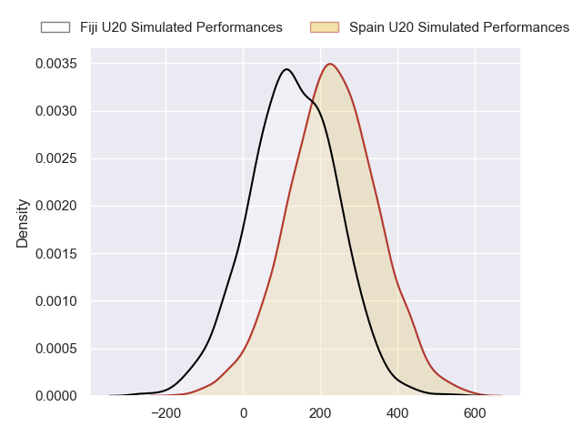
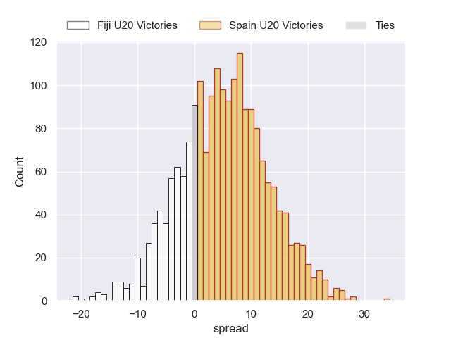
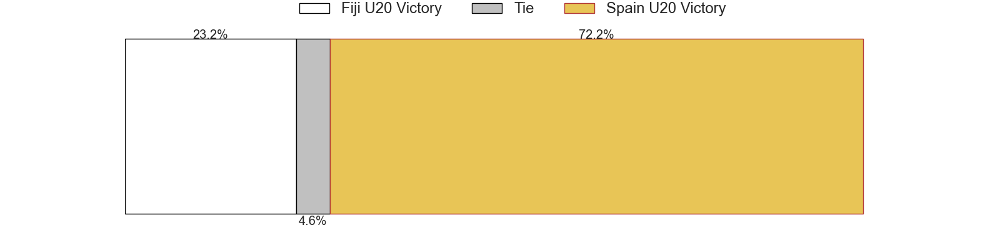

---  
layout: page  
title: Fiji U20 at Spain U20  
date: 2024-07-19 18:00:00 -0500  
categories: "World Rugby U20 Championship 2024" match projection  
---
# Fiji U20 at Spain U20

# Club Level Predictions

The first set of predictions treats a club as the smallest object, as the club develops its members, organizes a gameplan, and deploys its players as needed for each match. This club model has a prediction of 0.471, which translates to predicting Fiji U20 to win by -2.7.

Our Over/Under is 51.5 - and combined with the spread above, we have a predicted scoreline of 25 to 27

Each club has a rating and a rating deviation (similar to a Glicko rating), and expected performances can be generated. This allows for simulated matches and spreads like the ones below.
## Projected Performances - Club Model

## Projected Spreads - Club Model

## Projected Results - Club Model

# Player Level Predictions

Treating teams instead as an entity made up of the currently active players, I have ratings for each player in an altogether different system. These can be combined to form team ratings once teamsheets are announced, weighting starters a bit higher than the reserves. After the match is played, players can be weighted by their minutes on the field, allowing for an accurate measure of the team's composition. With these compiled team ratings, we can make predictions, measure inaccuracy, and update the individual player ratings.
## Prediction without Player Minutes: Spain U20 by 5.2

Spain U20 by 3.0 on a neutral pitch

## Projected Performances - Player Model

## Projected Spreads - Player Model

## Projected Results - Player Model

| Away Player             |   Away Percentile |   Number |   Home Percentile | Home Player          |
|:------------------------|------------------:|---------:|------------------:|:---------------------|
| Mataiasi Tuisireli      |            nan    |        1 |            nan    | Alberto Gómez        |
| Moses Armstrong-Ravula  |             28.14 |        2 |            nan    | Diego González       |
| Luke Nasau              |            nan    |        3 |            nan    | Hugo González        |
| Nalani May              |             30.21 |        4 |            nan    | Pablo Guirao         |
| Malakai Masi            |            nan    |        5 |             17.82 | Manex Ariceta        |
| Ratu Nemani Kurucake    |            nan    |        6 |            nan    | Nicolás Moleti       |
| Ronald Sharma           |             22.43 |        7 |            nan    | Jokin Zolezzi        |
| Simon Koroiyadi         |             22.82 |        8 |            nan    | Valentino Rizzo      |
| Samuela Ledua           |            nan    |        9 |            nan    | Javier López De Haro |
| Isikeli Rabitu          |             13.12 |       10 |            nan    | Gonzalo Otamendi     |
| Waisake Salabiau        |             25.25 |       11 |            nan    | Hugo Pichardie       |
| Ponipate Tuberi         |            nan    |       12 |            nan    | Yago Fernández       |
| Benjiman Naivalu        |            nan    |       13 |             67.6  | Alberto Carmona      |
| Aisea Nawai             |             30.76 |       14 |            nan    | Julien Burguillos    |
| Isikeli Basiyalo        |             22.55 |       15 |            nan    | Lucien Richardis     |
| Iowane Vakadrigi        |            nan    |       16 |            nan    | David Gallego        |
| Anare Caginavanua       |             24.44 |       17 |            nan    | Pau Massoni          |
| Breyton Legge           |             27.13 |       18 |            nan    | Aniol Franch         |
| Iliesa Erenavula        |             25.98 |       19 |            nan    | Martin Serrano       |
| Josua Gonewai           |            nan    |       20 |            nan    | Antonio Gámez        |
| Pauliasi Korobiau       |            nan    |       21 |            nan    | Nicolás Infer        |
| Josefa Ubitau           |            nan    |       22 |            nan    | Unax Zuriarrain      |
| Avakuki Niusalelekitoga |             25.25 |       23 |            nan    | Gabriel Rocaries     |

