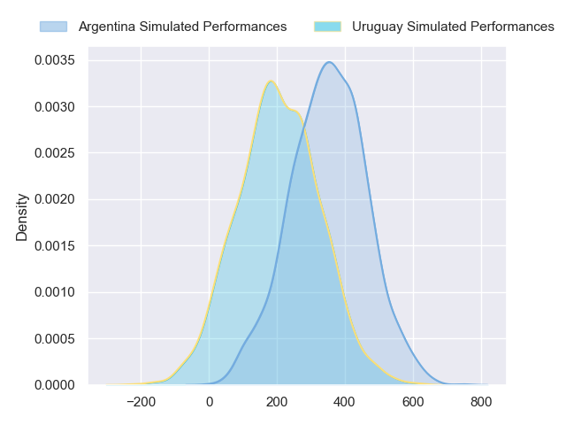
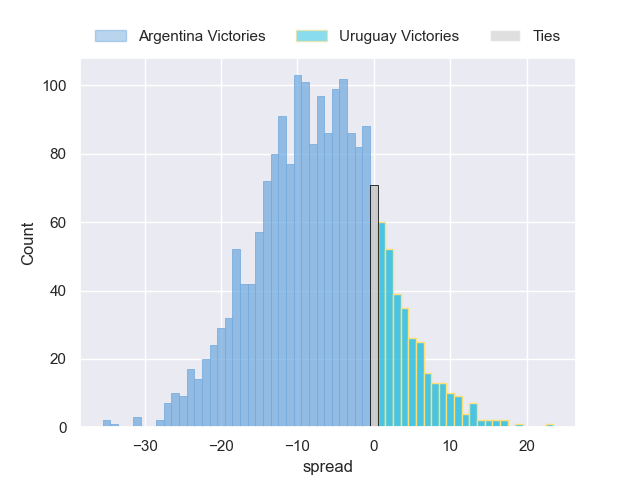

---  
layout: page  
title: Argentina at Uruguay  
date: 2024-07-19 18:00:00 -0500  
categories: "International Test Match 2024" match projection  
---
# Argentina at Uruguay

# Club Level Predictions

The first set of predictions treats a club as the smallest object, as the club develops its members, organizes a gameplan, and deploys its players as needed for each match. This club model has a prediction of 0.23, which translates to predicting Argentina to win by 10.6.

Each club has a rating and a rating deviation (similar to a Glicko rating), and expected performances can be generated. This allows for simulated matches and spreads like the ones below.
## Projected Performances - Club Model

## Projected Spreads - Club Model

## Projected Results - Club Model

# Player Level Predictions

Treating teams instead as an entity made up of the currently active players, I have ratings for each player in an altogether different system. These can be combined to form team ratings once teamsheets are announced, weighting starters a bit higher than the reserves. After the match is played, players can be weighted by their minutes on the field, allowing for an accurate measure of the team's composition. With these compiled team ratings, we can make predictions, measure inaccuracy, and update the individual player ratings.
## Prediction without Player Minutes: Argentina by 7.5

Argentina by 9.9 on a neutral pitch

## Projected Performances - Player Model

## Projected Spreads - Player Model

## Projected Results - Player Model

| Away Player           |   Away Percentile |   Number |   Home Percentile | Home Player          |
|:----------------------|------------------:|---------:|------------------:|:---------------------|
| Thomas Gallo          |             89.52 |        1 |              8.28 | Mateo Sanguinetti    |
| Ignacio Ruiz          |             89.32 |        2 |             21.2  | German Kessler       |
| Eduardo Bello         |              0.15 |        3 |             39.56 | Reinaldo Piussi      |
| Franco Molina         |             34.64 |        4 |             74.12 | Felipe Aliaga        |
| Pedro Rubiolo         |             13.84 |        5 |              3.07 | Manuel Leindekar     |
| Joaquin Moro          |            nan    |        6 |             84.23 | Manuel Ardao         |
| Marcos Kremer         |             85.24 |        7 |             49.45 | Santiago Civetta     |
| Joaquin Oviedo        |             77.93 |        8 |             34.59 | Manuel Diana         |
| Gonzalo Bertranou     |             59.41 |        9 |            nan    | Santiago Alvarez     |
| Tomas Albornoz        |             86.53 |       10 |             65.28 | Felipe Etcheverry    |
| Mateo Carreras        |             24.62 |       11 |              7.03 | Nicolas Freitas      |
| Jeronimo de la Fuente |             99.01 |       12 |              8.51 | Andres Vilaseca      |
| Santiago Chocobares   |             38.28 |       13 |             31.75 | Tomas Inciarte       |
| Ignacio Mendy         |             29.22 |       14 |            nan    | Juan Manuel Alonso   |
| Santiago Cordero      |             95.65 |       15 |            nan    | Ignacio Alvarez      |
| Ignacio Calles        |            nan    |       16 |             93.38 | Guillermo Pujadas    |
| Mayco Vivas           |              5.54 |       17 |             69.55 | Diego Arbelo         |
| Francisco Coria       |            nan    |       18 |             69.74 | Lucas Bianchi        |
| Matias Alemanno       |             75.23 |       19 |            nan    | Joaquin Suarez       |
| Pablo Matera          |             98.8  |       20 |             91.04 | Ignacio Peculo       |
| Gonzalo Garcia        |             22.75 |       21 |              0.2  | Diego Magno          |
| Santiago Carreras     |             81.4  |       22 |             69.28 | Carlos Deus          |
| Matias Orlando        |             19.29 |       23 |            nan    | Juan Bautista Hontou |

