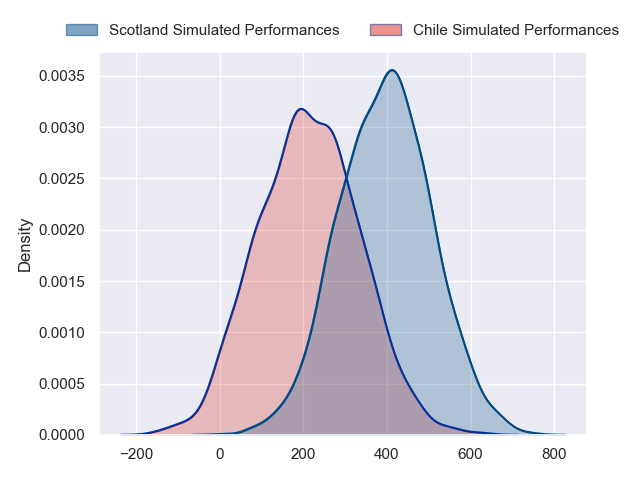
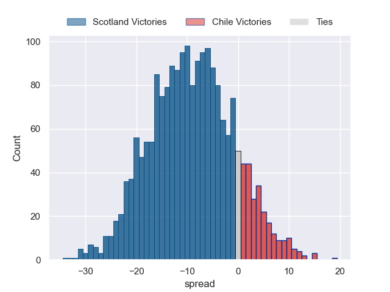
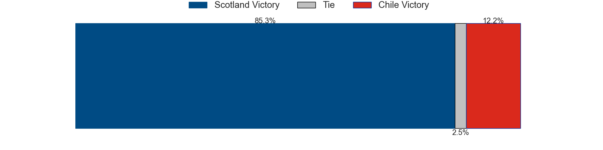

---  
layout: page  
title: Scotland at Chile  
date: 2024-07-20 18:00:00 -0500  
categories: "Tests Matchs 2023" match projection  
---
# Scotland at Chile

# Club Level Predictions

The first set of predictions treats a club as the smallest object, as the club develops its members, organizes a gameplan, and deploys its players as needed for each match. This club model has a prediction of 0.053, which translates to predicting Scotland to win by 21.6.

Our Over/Under is 47.5 - and combined with the spread above, we have a predicted scoreline of 34 to 13

Each club has a rating and a rating deviation (similar to a Glicko rating), and expected performances can be generated. This allows for simulated matches and spreads like the ones below.
## Projected Performances - Club Model

## Projected Spreads - Club Model

## Projected Results - Club Model

# Player Level Predictions

Treating teams instead as an entity made up of the currently active players, I have ratings for each player in an altogether different system. These can be combined to form team ratings once teamsheets are announced, weighting starters a bit higher than the reserves. After the match is played, players can be weighted by their minutes on the field, allowing for an accurate measure of the team's composition. With these compiled team ratings, we can make predictions, measure inaccuracy, and update the individual player ratings.
## Prediction without Player Minutes: Scotland by 9.3

Scotland by 11.6 on a neutral pitch

## Projected Performances - Player Model

## Projected Spreads - Player Model

## Projected Results - Player Model

| Away Player       |   Away Percentile |   Number |   Home Percentile | Home Player   |
|:------------------|------------------:|---------:|------------------:|:--------------|
| Nathan McBeth     |             49.28 |        1 |             40.85 |               |
| Dylan Richardson  |             71.28 |        2 |             40.85 |               |
| Will Hurd         |             61.05 |        3 |             40.85 |               |
| Alex Craig        |             36.13 |        4 |             40.85 |               |
| Ewan Johnson      |             67.5  |        5 |             40.85 |               |
| Gregor Brown      |             66.61 |        6 |             40.85 |               |
| Jamie Ritchie     |            100    |        7 |             40.85 |               |
| Josh Bayliss      |             26.24 |        8 |             40.85 |               |
| Gus Warr          |             55.65 |        9 |             40.85 |               |
| Ben Healy         |             80.08 |       10 |             40.85 |               |
| Arron Reed        |             91.97 |       11 |             40.85 |               |
| Sione Tuipulotu   |             83.98 |       12 |             40.85 |               |
| Kyle Steyn        |             99.28 |       13 |             40.85 |               |
| Jamie Dobie       |             84.58 |       14 |             40.85 |               |
| Kyle Rowe         |             72.73 |       15 |             40.85 |               |
| Patrick Harrison  |            nan    |       16 |             40.85 |               |
| Pierre Schoeman   |             92.1  |       17 |             40.85 |               |
| Javan Sebastian   |             63.78 |       18 |             40.85 |               |
| Max Williamson    |             58.29 |       19 |             40.85 |               |
| Rory Darge        |             91.79 |       20 |             40.85 |               |
| Adam Hastings     |             98.29 |       21 |             40.85 |               |
| Stafford McDowall |             91.2  |       22 |             40.85 |               |
| Matt Currie       |             81.5  |       23 |             40.85 |               |

