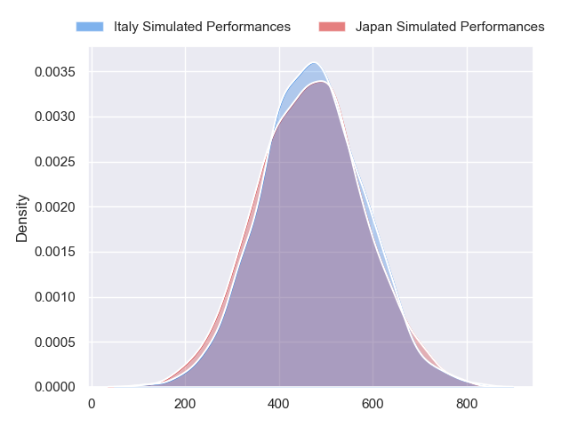
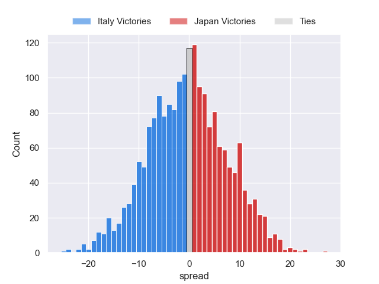

---  
layout: page  
title: Italy at Japan  
date: 2024-07-20 18:00:00 -0500  
categories: "International Test Match 2024" match projection  
---
# Italy at Japan

# Club Level Predictions

The first set of predictions treats a club as the smallest object, as the club develops its members, organizes a gameplan, and deploys its players as needed for each match. This club model has a prediction of 0.338, which translates to predicting Italy to win by 6.2.

Each club has a rating and a rating deviation (similar to a Glicko rating), and expected performances can be generated. This allows for simulated matches and spreads like the ones below.
## Projected Performances - Club Model

## Projected Spreads - Club Model

## Projected Results - Club Model

# Player Level Predictions

Treating teams instead as an entity made up of the currently active players, I have ratings for each player in an altogether different system. These can be combined to form team ratings once teamsheets are announced, weighting starters a bit higher than the reserves. After the match is played, players can be weighted by their minutes on the field, allowing for an accurate measure of the team's composition. With these compiled team ratings, we can make predictions, measure inaccuracy, and update the individual player ratings.
## Prediction without Player Minutes: Japan by 0.1

Italy by 2.7 on a neutral pitch

## Projected Performances - Player Model

## Projected Spreads - Player Model

## Projected Results - Player Model

| Away Player        |   Away Percentile |   Number |   Home Percentile | Home Player      |
|:-------------------|------------------:|---------:|------------------:|:-----------------|
| Danilo Fischetti   |             22.02 |        1 |             33.41 | Takayoshi Mohara |
| Giacomo Nicotera   |             98.95 |        2 |             54.89 | Mamoru Harada    |
| Marco Riccioni     |             62.03 |        3 |             56.57 | Shuhei Takeuchi  |
| Niccolo Cannone    |             68.53 |        4 |            nan    | Eishin Kuwano    |
| Andrea Zambonin    |             21.97 |        5 |             93.67 | Warner Dearns    |
| Ross Vintcent      |             71.97 |        6 |             71.37 | Amanaki Saumaki  |
| Michele Lamaro     |             97.05 |        7 |             97.39 | Michael Leitch   |
| Lorenzo Cannone    |             93.64 |        8 |             93.17 | Faulua Makisi    |
| Martin Page-Relo   |             79.87 |        9 |            nan    | Taiki Koyama     |
| Paolo Garbisi      |             84.82 |       10 |             98.86 | Rikiya Matsuda   |
| Jacopo Trulla      |              3.25 |       11 |             80.43 | Tomoki Osada     |
| Tommaso Menoncello |             91.1  |       12 |             51.53 | Samisoni Tua     |
| Juan Ignacio Brex  |             95.94 |       13 |             98.42 | Dylan Riley      |
| Louis Lynagh       |             58.43 |       14 |             73.49 | Jone Naikabula   |
| Ange Capuozzo      |             95.45 |       15 |             50.99 | Yoshitaka Yazaki |
| Gianmarco Lucchesi |             85.86 |       16 |             92.33 | Atsushi Sakate   |
| Mirco Spagnolo     |             78.66 |       17 |            nan    | Takato Okabe     |
| Simone Ferrari     |             96.13 |       18 |            nan    | Keijiro Tamefusa |
| Federico Ruzza     |             95.72 |       19 |             72.63 | Sanaila Waqa     |
| Manuel Zuliani     |             74.54 |       20 |             89.07 | Tevita Tatafu    |
| Alessandro Garbisi |             72.5  |       21 |            nan    | Shinobu Fujiwara |
| Leonardo Marin     |             67.55 |       22 |              6.07 | Seungsin Lee     |
| Marco Zanon        |             62.41 |       23 |             95.85 | Takuya Yamasawa  |

