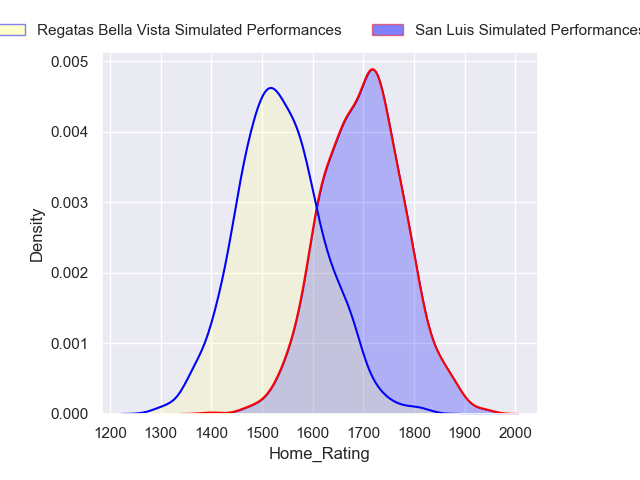
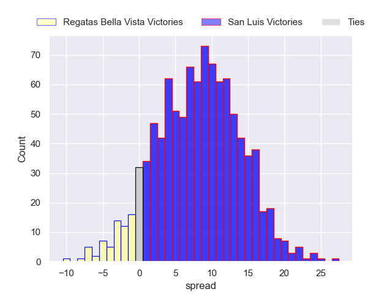
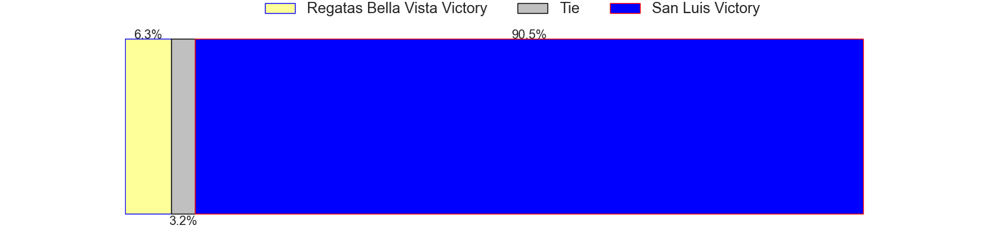
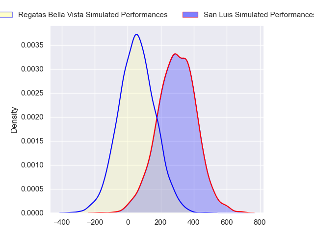
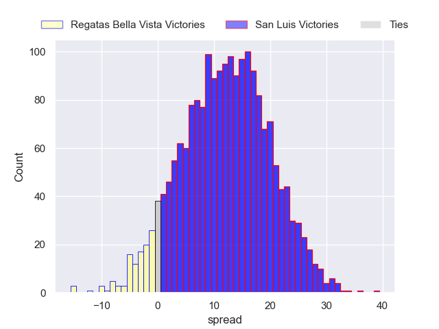
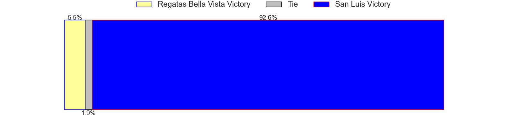

---  
layout: page  
title: Regatas Bella Vista at San Luis  
date: 2024-08-03 18:00:00 -0500  
categories: "URBA Top 13 2024" match projection  
---
# Regatas Bella Vista at San Luis

# Club Level Predictions

The first set of predictions treats a club as the smallest object, as the club develops its members, organizes a gameplan, and deploys its players as needed for each match. This club model has a prediction of 0.643, which translates to predicting San Luis to win by 8.1.

Our Over/Under is 57.5 - and combined with the spread above, we have a predicted scoreline of 25 to 33

Each club has a rating and a rating deviation (similar to a Glicko rating), and expected performances can be generated. This allows for simulated matches and spreads like the ones below.
## Projected Performances - Club Model

## Projected Spreads - Club Model

## Projected Results - Club Model

# Player Level Predictions

Treating teams instead as an entity made up of the currently active players, I have ratings for each player in an altogether different system. These can be combined to form team ratings once teamsheets are announced, weighting starters a bit higher than the reserves. After the match is played, players can be weighted by their minutes on the field, allowing for an accurate measure of the team's composition. With these compiled team ratings, we can make predictions, measure inaccuracy, and update the individual player ratings.
## Prediction without Player Minutes: San Luis by 12.4

San Luis by 8.0 on a neutral pitch

## Projected Performances - Player Model

## Projected Spreads - Player Model

## Projected Results - Player Model

| Away Player          |   Away Percentile |   Number |   Home Percentile | Home Player                |
|:---------------------|------------------:|---------:|------------------:|:---------------------------|
| Tomas Barbaccia      |             11.87 |        1 |             51.98 | Santiago Bonavento         |
| Marcos Camerlinckx   |            nan    |        2 |             48.17 | Agustin Fitzsimons Herrera |
| Juan Gobet           |             14.97 |        3 |             80.92 | Alexis Uvieda              |
| Tomas Sanguinetti    |             21.96 |        4 |             58.31 | Ramiro Bruni               |
| Bautista Lopez Manan |            nan    |        5 |             59.86 | Santiago Canal             |
| Marcos Ferro         |             32.77 |        6 |             64.41 | Franco Gnecco              |
| Lucas Gobet          |              8.83 |        7 |             44.69 | Facundo Alvarez Amado      |
| Felipe Camerlinckx   |             18.58 |        8 |             51.57 | Agustin Torello            |
| Marcos Joseph        |             14.02 |        9 |             71.79 | Juan Vaca                  |
| Mateo Camerlinckx    |             16.9  |       10 |             58.55 | Felipe Campodonico         |
| Enrique Camerlinckx  |             15.3  |       11 |             59.91 | Wilmer Ramirez             |
| Juan Corso           |             43.98 |       12 |             64.57 | Segundo Fresco             |
| Alejo Barrera        |             15.65 |       13 |             51.6  | Benjamin Marban            |
| Rafael Santana       |             24.52 |       14 |             45.71 | Eduardo Ruesta             |
| Cruz Camerlinckx     |             20.49 |       15 |             38.95 | Valentino Quattrocchi      |
| Away Team 16         |            nan    |       16 |            nan    | Home Team 16               |
| Away Team 17         |            nan    |       17 |            nan    | Home Team 17               |
| Away Team 18         |            nan    |       18 |            nan    | Home Team 18               |
| Away Team 19         |            nan    |       19 |            nan    | Home Team 19               |
| Away Team 20         |            nan    |       20 |            nan    | Home Team 20               |
| Away Team 21         |            nan    |       21 |            nan    | Home Team 21               |
| Away Team 22         |            nan    |       22 |            nan    | Home Team 22               |
| Away Team 23         |            nan    |       23 |            nan    | Home Team 23               |

