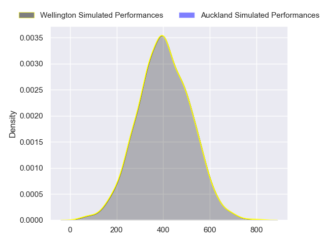
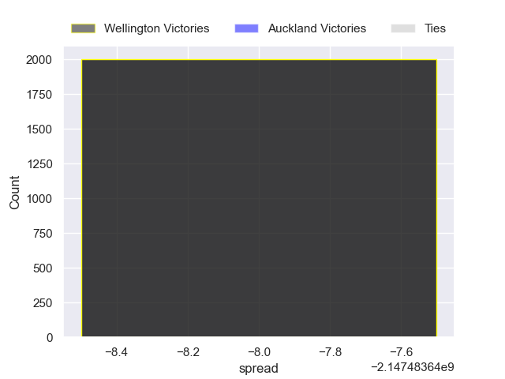

---  
layout: page  
title: Wellington at Auckland  
date: 2024-08-09 18:00:00 -0500  
categories: "NPC 2024" match projection  
---
# Wellington at Auckland

# Club Level Predictions

The first set of predictions treats a club as the smallest object, as the club develops its members, organizes a gameplan, and deploys its players as needed for each match. This club model has a prediction of 0.346, which translates to predicting Wellington to win by 2.5.

Our Over/Under is 46.5 - and combined with the spread above, we have a predicted scoreline of 25 to 22

Each club has a rating and a rating deviation (similar to a Glicko rating), and expected performances can be generated. This allows for simulated matches and spreads like the ones below.
## Projected Performances - Club Model

## Projected Spreads - Club Model

## Projected Results - Club Model

# Player Level Predictions

Treating teams instead as an entity made up of the currently active players, I have ratings for each player in an altogether different system. These can be combined to form team ratings once teamsheets are announced, weighting starters a bit higher than the reserves. After the match is played, players can be weighted by their minutes on the field, allowing for an accurate measure of the team's composition. With these compiled team ratings, we can make predictions, measure inaccuracy, and update the individual player ratings.
## Prediction without Player Minutes: Wellington by 0.3

Wellington by 3.2 on a neutral pitch

## Projected Performances - Player Model

## Projected Spreads - Player Model

## Projected Results - Player Model

| Away Player           |   Away Percentile |   Number |   Home Percentile | Home Player            |
|:----------------------|------------------:|---------:|------------------:|:-----------------------|
| Xavier Numia          |             98.13 |        1 |             47.62 | Josh Fusitu'a          |
| Penieli Poasa         |            nan    |        2 |             86.31 | Soane Vikena           |
| Siale Lauaki          |             56.9  |        3 |             83.4  | Marcel Renata          |
| Hugo Plummer          |             71.36 |        4 |             86.31 | Josh Beehre            |
| Filo Paulo            |            nan    |        5 |             79.9  | Tuaina Taii Tualima    |
| Brad Shields          |             91.26 |        6 |             69.45 | Adrian Choat           |
| Du'Plessis Kirifi     |             94.55 |        7 |             72.74 | Anton Segner           |
| Peter Lakai           |             95.3  |        8 |             98.68 | Akira Ioane            |
| Kyle Preston          |            nan    |        9 |             26.17 | Taufa Funaki           |
| Jackson Garden-Bachop |            nan    |       10 |            nan    | Alex Harford           |
| Pepesana Patafilo     |             68.85 |       11 |            nan    | Nigel Ah Wong          |
| Julian Savea          |             98.04 |       12 |             26.06 | Tanielu Tele'a         |
| Peter Umaga-Jensen    |             31.31 |       13 |             85.79 | AJ Lam                 |
| Riley Higgins         |             89.19 |       14 |            nan    | Caleb Tangitau         |
| Tjay Clarke           |            nan    |       15 |            nan    | Lolagi Visinia         |
| Leni Apisai           |            nan    |       16 |            nan    | Sama Malolo            |
| Yota Kamimori         |            nan    |       17 |             31.88 | Jordan Lay             |
| PJ Sheck              |             87.76 |       18 |             97.82 | Angus Ta'avao          |
| Akira Ieremia         |            nan    |       19 |             82.04 | Michael Curry          |
| Dominic Ropeti        |            nan    |       20 |             34.95 | Ola Tauelangi          |
| Mitch Mcleod          |            nan    |       21 |            nan    | Kemara Hauiti-Parapara |
| Callum Harkin         |            nan    |       22 |             78.98 | Zarn Sullivan          |
| Matt Proctor          |             74.56 |       23 |             40.68 | Xavi Taele             |

