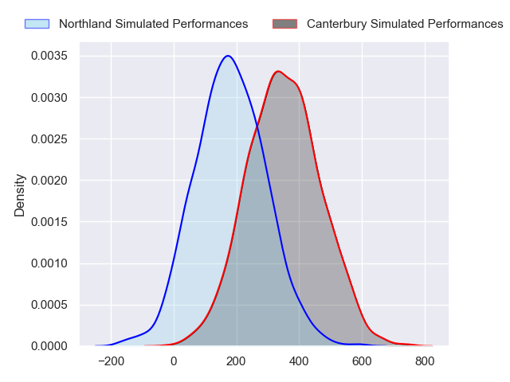
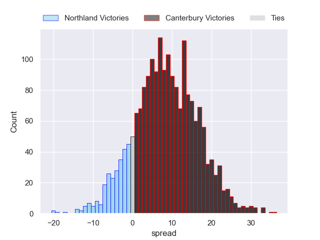
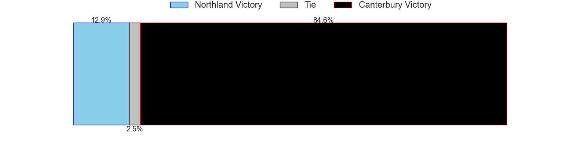

---  
layout: page  
title: Northland at Canterbury  
date: 2024-08-09 18:00:00 -0500  
categories: "NPC 2024" match projection  
---
# Northland at Canterbury

# Club Level Predictions

The first set of predictions treats a club as the smallest object, as the club develops its members, organizes a gameplan, and deploys its players as needed for each match. This club model has a prediction of 0.808, which translates to predicting Canterbury to win by 13.7.

Each club has a rating and a rating deviation (similar to a Glicko rating), and expected performances can be generated. This allows for simulated matches and spreads like the ones below.
## Projected Performances - Club Model

## Projected Spreads - Club Model

## Projected Results - Club Model

# Player Level Predictions

Treating teams instead as an entity made up of the currently active players, I have ratings for each player in an altogether different system. These can be combined to form team ratings once teamsheets are announced, weighting starters a bit higher than the reserves. After the match is played, players can be weighted by their minutes on the field, allowing for an accurate measure of the team's composition. With these compiled team ratings, we can make predictions, measure inaccuracy, and update the individual player ratings.
## Prediction without Player Minutes: Canterbury by 8.6

Canterbury by 5.5 on a neutral pitch

## Projected Performances - Player Model

## Projected Spreads - Player Model

## Projected Results - Player Model

| Away Player            |   Away Percentile |   Number |   Home Percentile | Home Player        |
|:-----------------------|------------------:|---------:|------------------:|:-------------------|
| Esile Fono             |            nan    |        1 |            nan    | Finlay Brewis      |
| Matt Moulds            |            nan    |        2 |             89.49 | Brodie McAlister   |
| Chris Apoua            |            nan    |        3 |            nan    | Seb Calder         |
| Allan Craig            |             11.26 |        4 |             18.93 | Jamie Hannah       |
| Sam Caird              |            nan    |        5 |             36.7  | Tahlor Cahill      |
| Simon Parker           |             62.03 |        6 |             79.98 | Billy Harmon       |
| Saimoni Uluinakauvadra |            nan    |        7 |             67.29 | Tom Christie       |
| Rob Rush               |            nan    |        8 |             86.19 | Cullen Grace       |
| Lisati Milo-Harris     |            nan    |        9 |             90.5  | Mitchell Drummond  |
| Rivez Reihana          |             43.86 |       10 |             78.48 | Rameka Poihipi     |
| Heremaia Murray        |             25.35 |       11 |             62.82 | Ngatungane Punivai |
| Tevita Latu            |            nan    |       12 |             74.25 | Dallas McLeod      |
| Corey Evans            |             79.2  |       13 |            nan    | Braydon Ennor      |
| Quinton Nichols        |            nan    |       14 |            nan    | Isaac Hutchinson   |
| Jordan Trainor         |            nan    |       15 |             17.96 | Chay Fihaki        |
| Jordan Hutchings       |            nan    |       16 |            nan    | Ben Funnell        |
| Isi Tu'Ungafasi        |            nan    |       17 |             17.3  | Dan Lienert-Brown  |
| Remsy Lemisio          |            nan    |       18 |             46.92 | Samu Tawake        |
| Liam Hallam-Eames      |            nan    |       19 |             13.98 | Zach Gallagher     |
| Rory Woods             |            nan    |       20 |             29.04 | Dom Gardiner       |
| Sam Nock               |             80    |       21 |             92.33 | Willi Heinz        |
| Daniel Hawkins         |            nan    |       22 |            nan    | James White        |
| Nathan Salmon          |            nan    |       23 |             22.25 | Jone Rova          |

