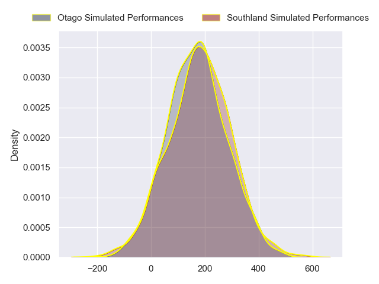
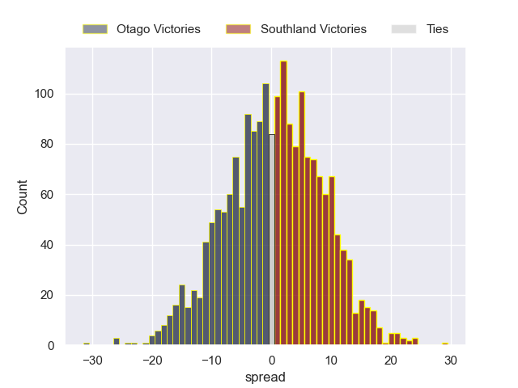

---  
layout: page  
title: Otago at Southland  
date: 2024-08-09 18:00:00 -0500  
categories: "NPC 2024" match projection  
---
# Otago at Southland

# Club Level Predictions

The first set of predictions treats a club as the smallest object, as the club develops its members, organizes a gameplan, and deploys its players as needed for each match. This club model has a prediction of 0.469, which translates to predicting Otago to win by 1.0.

Each club has a rating and a rating deviation (similar to a Glicko rating), and expected performances can be generated. This allows for simulated matches and spreads like the ones below.
## Projected Performances - Club Model

## Projected Spreads - Club Model

## Projected Results - Club Model

# Player Level Predictions

Treating teams instead as an entity made up of the currently active players, I have ratings for each player in an altogether different system. These can be combined to form team ratings once teamsheets are announced, weighting starters a bit higher than the reserves. After the match is played, players can be weighted by their minutes on the field, allowing for an accurate measure of the team's composition. With these compiled team ratings, we can make predictions, measure inaccuracy, and update the individual player ratings.
## Prediction without Player Minutes: Southland by 0.6

Otago by 2.5 on a neutral pitch

## Projected Performances - Player Model

## Projected Spreads - Player Model

## Projected Results - Player Model

| Away Player          |   Away Percentile |   Number |   Home Percentile | Home Player           |
|:---------------------|------------------:|---------:|------------------:|:----------------------|
| George Bower         |              6.86 |        1 |            nan    | Jack Sexton           |
| Henry Bell           |             43.63 |        2 |             45.7  | Jack Taylor           |
| Saula Ma'u           |             14.96 |        3 |            nan    | Morgan Mitchell       |
| Will Stodart         |            nan    |        4 |             92.52 | Mitchell Dunshea      |
| Fabian Holland       |             84.08 |        5 |            nan    | Josh Bekhuis          |
| Sam Fischli          |            nan    |        6 |            nan    | Blair Ryall           |
| Harry Taylor         |            nan    |        7 |             21.15 | Sean Withy            |
| Christian Lio-Willie |             57.53 |        8 |             25.31 | Dylan Nel             |
| James Arscott        |              6.5  |        9 |            nan    | Connor Collins        |
| Cameron Millar       |             69.01 |       10 |            nan    | Byron Smith           |
| Jona Nareki          |             86.08 |       11 |             13.46 | Michael Manson        |
| Sam Gilbert          |             31.41 |       12 |             12.05 | Matt Whaanga          |
| Josh Timu            |            nan    |       13 |            nan    | Isaac Te Tamaki       |
| Josh Whaanga         |            nan    |       14 |              2.86 | Viliami Fine          |
| Finn Hurley          |             15.51 |       15 |             17.35 | Rory Van Vugt         |
| Liam Coltman         |             88.54 |       16 |             30.57 | Nic Souchon           |
| Abraham Pole         |              9.66 |       17 |            nan    | Hunter Fahey          |
| Rohan Wingham        |            nan    |       18 |            nan    | Hamdahn Tuipulotu     |
| Ale Aho              |            nan    |       19 |              7.11 | Shneil Singh          |
| Lucas Casey          |            nan    |       20 |            nan    | Semisi Tupou Ta'Eiloa |
| Nathan Hastie        |            nan    |       21 |            nan    | Lachie Albert         |
| Ajay Faleafaga       |             42.66 |       22 |             52.52 | Jason Robertson       |
| Kyan Rangitutia      |            nan    |       23 |            nan    | Charlie Powell        |

