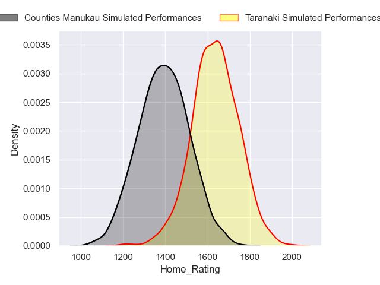
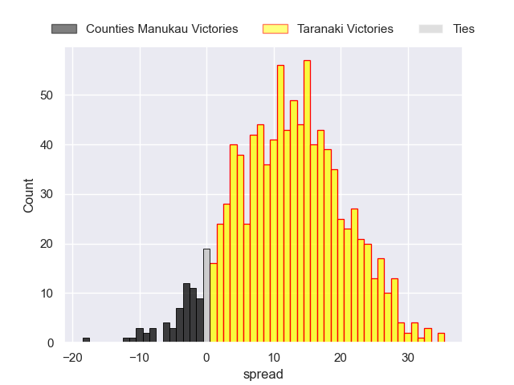
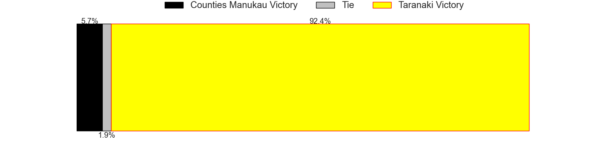
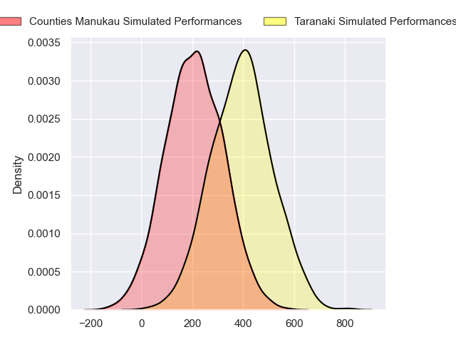
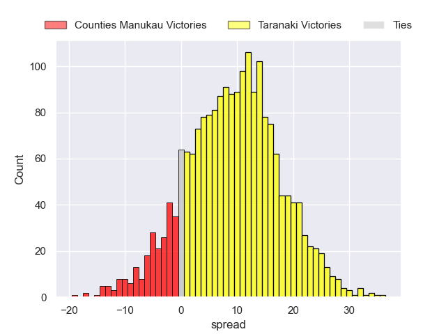
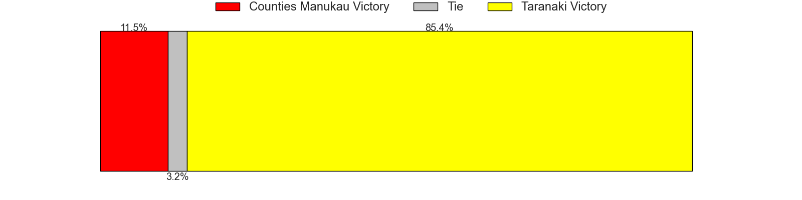

---  
layout: page  
title: Counties Manukau at Taranaki  
date: 2024-08-09 18:00:00 -0500  
categories: "NPC 2024" match projection  
---
# Counties Manukau at Taranaki

# Club Level Predictions

The first set of predictions treats a club as the smallest object, as the club develops its members, organizes a gameplan, and deploys its players as needed for each match. This club model has a prediction of 0.727, which translates to predicting Taranaki to win by 12.2.

Our Over/Under is 53.5 - and combined with the spread above, we have a predicted scoreline of 21 to 33

Each club has a rating and a rating deviation (similar to a Glicko rating), and expected performances can be generated. This allows for simulated matches and spreads like the ones below.
## Projected Performances - Club Model

## Projected Spreads - Club Model

## Projected Results - Club Model

# Player Level Predictions

Treating teams instead as an entity made up of the currently active players, I have ratings for each player in an altogether different system. These can be combined to form team ratings once teamsheets are announced, weighting starters a bit higher than the reserves. After the match is played, players can be weighted by their minutes on the field, allowing for an accurate measure of the team's composition. With these compiled team ratings, we can make predictions, measure inaccuracy, and update the individual player ratings.
## Prediction without Player Minutes: Taranaki by 9.5

Taranaki by 6.4 on a neutral pitch

## Projected Performances - Player Model

## Projected Spreads - Player Model

## Projected Results - Player Model

| Away Player   |   Away Percentile |   Number |   Home Percentile | Home Player                   |
|:--------------|------------------:|---------:|------------------:|:------------------------------|
|               |             48.74 |        1 |             27.59 | Jared Proffit                 |
|               |             48.74 |        2 |             92.36 | Ricky Riccitelli              |
|               |             48.74 |        3 |             42.24 | Reuben O'Neill                |
|               |             48.74 |        4 |            nan    | Fiti Sa                       |
|               |             48.74 |        5 |             91.84 | Tom Franklin                  |
|               |             48.74 |        6 |            nan    | Scott Jury                    |
|               |             48.74 |        7 |            nan    | Michael Loft                  |
|               |             48.74 |        8 |             56.77 | Kaylum Boshier                |
|               |             48.74 |        9 |            nan    | Adam Lennox                   |
|               |             48.74 |       10 |             76.06 | Josh Jacomb                   |
|               |             48.74 |       11 |             97.88 | Kini Naholo                   |
|               |             48.74 |       12 |            nan    | Meihana Grindlay              |
|               |             48.74 |       13 |            nan    | Josh Setu                     |
|               |             48.74 |       14 |            nan    | Vereniki Tikoisolomone        |
|               |             48.74 |       15 |             97.76 | Jacob Ratumaitavuki-Kneepkens |
|               |             48.74 |       16 |             84.39 | Bradley Slater                |
|               |             48.74 |       17 |            nan    | Mitch O'Neill                 |
|               |             48.74 |       18 |            nan    | Michael Bent                  |
|               |             48.74 |       19 |            nan    | Jackson Morgan                |
|               |             48.74 |       20 |            nan    | Hemopo Cunningham             |
|               |             48.74 |       21 |            nan    | Leone Nawai                   |
|               |             48.74 |       22 |            nan    | Ethan Reti                    |
|               |             48.74 |       23 |            nan    | Obey Samate                   |

