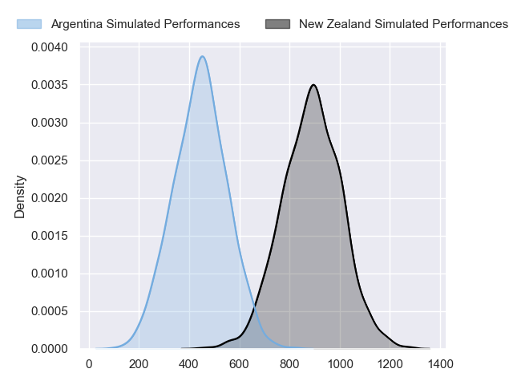
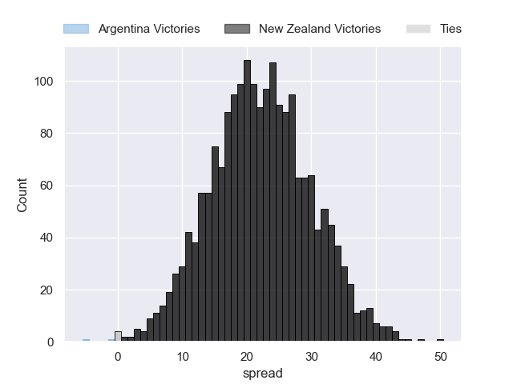

---  
layout: page  
title: Argentina at New Zealand  
date: 2024-08-10 18:00:00 -0500  
categories: "Rugby Championship 2024" match projection  
---
# Argentina at New Zealand

# Club Level Predictions

The first set of predictions treats a club as the smallest object, as the club develops its members, organizes a gameplan, and deploys its players as needed for each match. This club model has a prediction of 0.744, which translates to predicting New Zealand to win by 12.1.

Our Over/Under is 55.5 - and combined with the spread above, we have a predicted scoreline of 22 to 34

Each club has a rating and a rating deviation (similar to a Glicko rating), and expected performances can be generated. This allows for simulated matches and spreads like the ones below.
## Projected Performances - Club Model

## Projected Spreads - Club Model

## Projected Results - Club Model

# Player Level Predictions

Treating teams instead as an entity made up of the currently active players, I have ratings for each player in an altogether different system. These can be combined to form team ratings once teamsheets are announced, weighting starters a bit higher than the reserves. After the match is played, players can be weighted by their minutes on the field, allowing for an accurate measure of the team's composition. With these compiled team ratings, we can make predictions, measure inaccuracy, and update the individual player ratings.
## Prediction without Player Minutes: New Zealand by 22.6

New Zealand by 19.0 on a neutral pitch

## Projected Performances - Player Model

## Projected Spreads - Player Model

## Projected Results - Player Model

| Away Player          |   Away Percentile |   Number |   Home Percentile | Home Player         |
|:---------------------|------------------:|---------:|------------------:|:--------------------|
| Thomas Gallo         |             89.79 |        1 |             63.6  | Ethan de Groot      |
| Ignacio Ruiz         |             90.29 |        2 |             99.04 | Codie Taylor        |
| Eduardo Bello        |              0.31 |        3 |             92.05 | Tyrel Lomax         |
| Franco Molina        |             48.74 |        4 |             96.21 | Tupou Vaa'i         |
| Pedro Rubiolo        |             18.25 |        5 |             64.27 | Sam Darry           |
| Pablo Matera         |             98.5  |        6 |             99.25 | Ethan Blackadder    |
| Marcos Kremer        |             88.44 |        7 |             99.44 | Dalton Papalii      |
| Juan Martin Gonzalez |             95.11 |        8 |             99.58 | Ardie Savea         |
| Gonzalo Bertranou    |             64.17 |        9 |             97.17 | TJ Perenara         |
| Santiago Carreras    |             78.47 |       10 |             98.79 | Damian McKenzie     |
| Mateo Carreras       |             32.07 |       11 |             88.26 | Mark Tele'a         |
| Santiago Chocobares  |             46.65 |       12 |             96.19 | Jordie Barrett      |
| Lucio Cinti          |             61.28 |       13 |             97.12 | Anton Lienert-Brown |
| Matias Moroni        |             98.46 |       14 |             82.03 | Sevu Reece          |
| Juan Cruz Mallia     |             99.17 |       15 |            100    | Beauden Barrett     |
| Agustin Creevy       |             94.75 |       16 |             95.86 | Asafo Aumua         |
| Mayco Vivas          |              5.38 |       17 |             99.61 | Ofa Tu'ungafasi     |
| Joel Sclavi          |             88.15 |       18 |              1.56 | Fletcher Newell     |
| Efraín Elías         |             46.41 |       19 |             78.93 | Josh Lord           |
| Tomas Lavanini       |             94.17 |       20 |             66.53 | Wallace Sititi      |
| Joaquin Oviedo       |             87.45 |       21 |             85.83 | Cortez Ratima       |
| Lautaro Bazan Velez  |             48.67 |       22 |             89.8  | Rieko Ioane         |
| Tomas Albornoz       |             86.72 |       23 |             98.62 | Will Jordan         |

