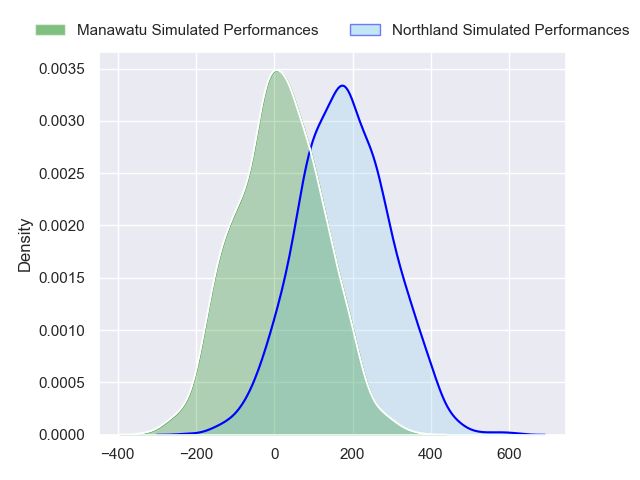
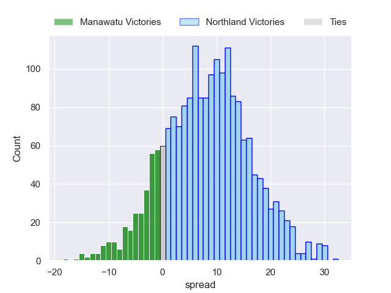
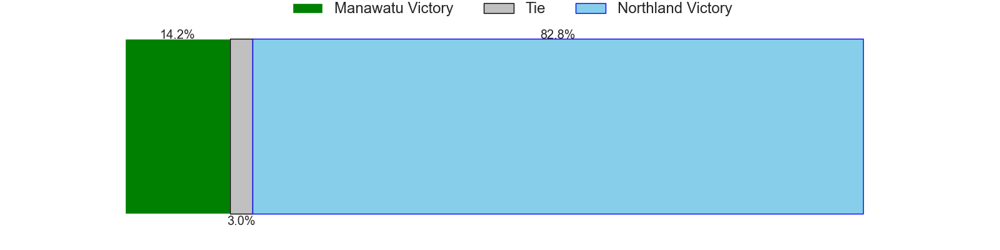

---  
layout: page  
title: Manawatu at Northland  
date: 2024-08-16 18:00:00 -0500  
categories: "National Provence Championship 2024" match projection  
---
# Manawatu at Northland

# Club Level Predictions

The first set of predictions treats a club as the smallest object, as the club develops its members, organizes a gameplan, and deploys its players as needed for each match. This club model has a prediction of 0.867, which translates to predicting Northland to win by 17.4.

Each club has a rating and a rating deviation (similar to a Glicko rating), and expected performances can be generated. This allows for simulated matches and spreads like the ones below.
## Projected Performances - Club Model

## Projected Spreads - Club Model

## Projected Results - Club Model

# Player Level Predictions

Treating teams instead as an entity made up of the currently active players, I have ratings for each player in an altogether different system. These can be combined to form team ratings once teamsheets are announced, weighting starters a bit higher than the reserves. After the match is played, players can be weighted by their minutes on the field, allowing for an accurate measure of the team's composition. With these compiled team ratings, we can make predictions, measure inaccuracy, and update the individual player ratings.
## Prediction without Player Minutes: Northland by 8.4

Northland by 5.3 on a neutral pitch

## Projected Performances - Player Model

## Projected Spreads - Player Model

## Projected Results - Player Model

| Away Player        |   Away Percentile |   Number |   Home Percentile | Home Player            |
|:-------------------|------------------:|---------:|------------------:|:-----------------------|
| Joe Gavigan        |             20.66 |        1 |            nan    | Rob Cobb               |
| Raymond Tuputupu   |             16.26 |        2 |            nan    | Matt Moulds            |
| Flyn Yates         |              0.39 |        3 |            nan    | Chris Apoua            |
| Stan van den Hoven |              0.89 |        4 |              3.05 | Liam Hallam-Eames      |
| Lachlan Shaw       |             33.17 |        5 |            nan    | Sam Caird              |
| TK Howden          |              0.19 |        6 |            nan    | Rory Woods             |
| Johan Momsen       |             20.48 |        7 |            nan    | Saimoni Uluinakauvadra |
| Julian Goerke      |            nan    |        8 |            nan    | Simon Parker           |
| Jordi Viljoen      |             17.83 |        9 |             79.46 | Sam Nock               |
| Brett Cameron      |              6.75 |       10 |            nan    | Rivez Reihana          |
| Kyle Brown         |             25    |       11 |            nan    | Heremaia Murray        |
| James Tofa         |              1.15 |       12 |            nan    | Tevita Latu            |
| Drew Wild          |             26.83 |       13 |            nan    | Corey Evans            |
| Ataata Moeakiola   |            nan    |       14 |            nan    | Quinton Nichols        |
| Reece MacDonald    |             51.23 |       15 |            nan    | Jordan Trainor         |
| Vernon Bason       |            nan    |       16 |            nan    | Richie Asiata          |
| George Blake       |            nan    |       17 |            nan    | Jarred Adams           |
| Misinale Epenisa   |             28.86 |       18 |            nan    | Remsy Lemisio          |
| Josh Taula         |            nan    |       19 |            nan    | Allan Craig            |
| Slade McDowall     |            nan    |       20 |            nan    | Terrell Peita          |
| Logan Love         |            nan    |       21 |            nan    | Lisati Milo-Harris     |
| Sam Coles          |             26.13 |       22 |            nan    | Daniel Hawkins         |
| Taniela Filimone   |             83.33 |       23 |            nan    | Nathan Salmon          |

