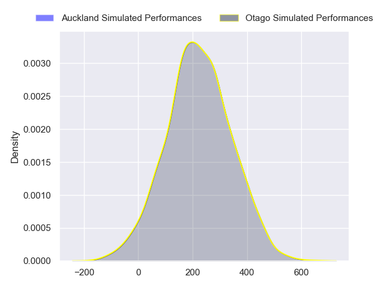
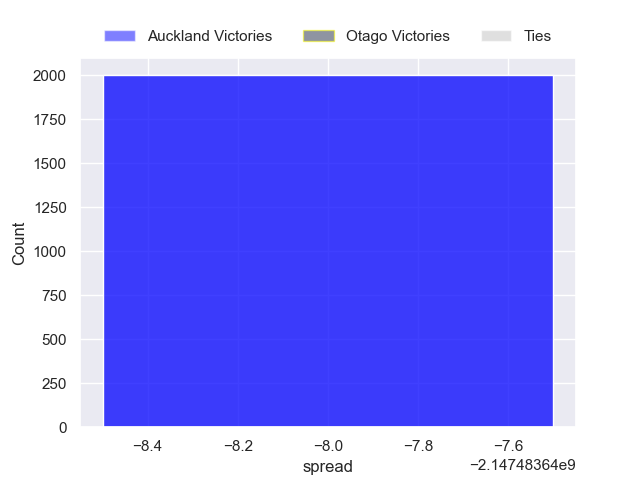

---  
layout: page  
title: Auckland at Otago  
date: 2024-08-16 18:00:00 -0500  
categories: "National Provence Championship 2024" match projection  
---
# Auckland at Otago

# Club Level Predictions

The first set of predictions treats a club as the smallest object, as the club develops its members, organizes a gameplan, and deploys its players as needed for each match. This club model has a prediction of 0.277, which translates to predicting Auckland to win by 5.1.

Our Over/Under is 52.5 - and combined with the spread above, we have a predicted scoreline of 29 to 24

Each club has a rating and a rating deviation (similar to a Glicko rating), and expected performances can be generated. This allows for simulated matches and spreads like the ones below.
## Projected Performances - Club Model

## Projected Spreads - Club Model

## Projected Results - Club Model

# Player Level Predictions

Treating teams instead as an entity made up of the currently active players, I have ratings for each player in an altogether different system. These can be combined to form team ratings once teamsheets are announced, weighting starters a bit higher than the reserves. After the match is played, players can be weighted by their minutes on the field, allowing for an accurate measure of the team's composition. With these compiled team ratings, we can make predictions, measure inaccuracy, and update the individual player ratings.
## Prediction without Player Minutes: Auckland by 7.6

Auckland by 10.7 on a neutral pitch

## Projected Performances - Player Model

## Projected Spreads - Player Model

## Projected Results - Player Model

| Away Player            |   Away Percentile |   Number |   Home Percentile | Home Player         |
|:-----------------------|------------------:|---------:|------------------:|:--------------------|
| Josh Fusitu'a          |            nan    |        1 |              8.68 | Abraham Pole        |
| Soane Vikena           |            nan    |        2 |             88.96 | Liam Coltman        |
| Marcel Renata          |            nan    |        3 |            nan    | Saula Ma'u          |
| Josh Beehre            |            nan    |        4 |            nan    | Sam Fischli         |
| Michael Curry          |             82.48 |        5 |            nan    | Fabian Holland      |
| Adrian Choat           |            nan    |        6 |             76.95 | Oliver Haig         |
| Anton Segner           |            nan    |        7 |            nan    | Harry Taylor        |
| Akira Ioane            |            nan    |        8 |            nan    | Will Stodart        |
| Taufa Funaki           |            nan    |        9 |              6.09 | James Arscott       |
| Christian Leali'ifano  |             77.14 |       10 |            nan    | Cameron Millar      |
| Nigel Ah Wong          |            nan    |       11 |            nan    | Kyan Rangitutia     |
| Tanielu Tele'a         |            nan    |       12 |            nan    | Sam Gilbert         |
| AJ Lam                 |            nan    |       13 |            nan    | Thomas Umaga-Jensen |
| Lolagi Visinia         |            nan    |       14 |            nan    | Josh Whaanga        |
| Xavier Tito-Harris     |            nan    |       15 |            nan    | Finn Hurley         |
| Sama Malolo            |            nan    |       16 |            nan    | Henry Bell          |
| Jordan Lay             |             31.23 |       17 |            nan    | Benjamin Lopas      |
| Angus Ta'avao          |             97.87 |       18 |            nan    | Rohan Wingham       |
| Edward Annandale       |            nan    |       19 |            nan    | Ale Aho             |
| Vaiolini Ekuasi        |             27.94 |       20 |            nan    | Lui Naeata          |
| Kemara Hauiti-Parapara |             80.54 |       21 |            nan    | Nathan Hastie       |
| Xavi Taele             |            nan    |       22 |            nan    | Levi Harmon         |
| Caleb Tangitau         |            nan    |       23 |             52.98 | Hudson Creighton    |

