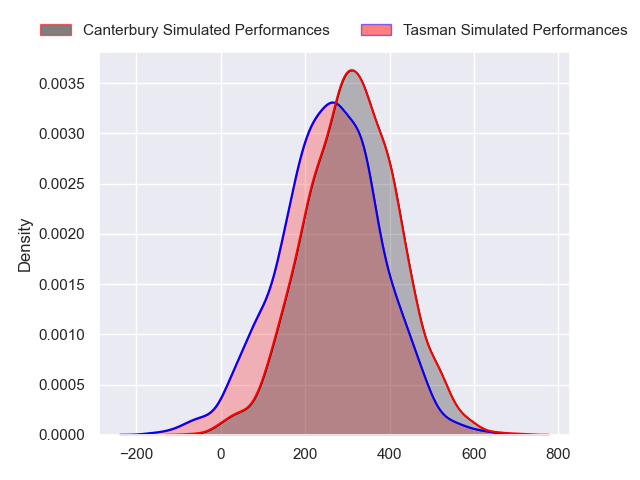
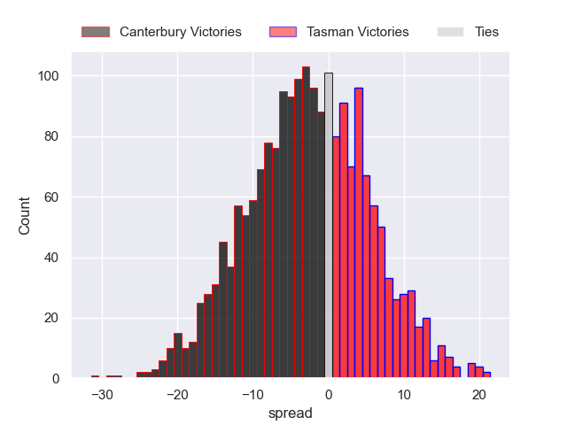

---  
layout: page  
title: Canterbury at Tasman  
date: 2024-08-16 18:00:00 -0500  
categories: "National Provence Championship 2024" match projection  
---
# Canterbury at Tasman

# Club Level Predictions

The first set of predictions treats a club as the smallest object, as the club develops its members, organizes a gameplan, and deploys its players as needed for each match. This club model has a prediction of 0.582, which translates to predicting Tasman to win by 2.7.

Each club has a rating and a rating deviation (similar to a Glicko rating), and expected performances can be generated. This allows for simulated matches and spreads like the ones below.
## Projected Performances - Club Model

## Projected Spreads - Club Model

## Projected Results - Club Model

# Player Level Predictions

Treating teams instead as an entity made up of the currently active players, I have ratings for each player in an altogether different system. These can be combined to form team ratings once teamsheets are announced, weighting starters a bit higher than the reserves. After the match is played, players can be weighted by their minutes on the field, allowing for an accurate measure of the team's composition. With these compiled team ratings, we can make predictions, measure inaccuracy, and update the individual player ratings.
## Prediction without Player Minutes: Canterbury by 2.5

Canterbury by 5.5 on a neutral pitch

## Projected Performances - Player Model

## Projected Spreads - Player Model

## Projected Results - Player Model

| Away Player          |   Away Percentile |   Number |   Home Percentile | Home Player             |
|:---------------------|------------------:|---------:|------------------:|:------------------------|
| Finlay Brewis        |            nan    |        1 |             24.37 | Ryan Coxon              |
| Brodie McAlister     |            nan    |        2 |              5.2  | Samiuela Moli           |
| Seb Calder           |            nan    |        3 |             29.1  | Sam Matenga             |
| Jamie Hannah         |            nan    |        4 |             95.18 | Quinten Strange         |
| Zach Gallagher       |             14.47 |        5 |             68.9  | Te Ahiwaru Cirikidaveta |
| Billy Harmon         |            nan    |        6 |             34.52 | Max Hicks               |
| Tom Christie         |            nan    |        7 |             82.12 | Sione Havili Talitui    |
| Cullen Grace         |            nan    |        8 |             76.89 | Fletcher Anderson       |
| Willi Heinz          |             92.36 |        9 |             83.19 | Finlay Christie         |
| Rameka Poihipi       |            nan    |       10 |             27.4  | William Havili          |
| Ngatungane Punivai   |            nan    |       11 |             57.96 | Jack Gray               |
| Dallas McLeod        |            nan    |       12 |             52.52 | William Butler          |
| Braydon Ennor        |            nan    |       13 |             67.71 | Levi Aumua              |
| Issac Hutchinson     |            nan    |       14 |             43.16 | Timoci Tavatavanawai    |
| Chay Fihaki          |            nan    |       15 |             30.66 | Macca Springer          |
| Ben Funnell          |             95.77 |       16 |             96.1  | Quentin MacDonald       |
| Daniel Lienert-Brown |            nan    |       17 |            nan    | Lavengamonu Moli        |
| Jaiden Christian     |            nan    |       18 |             64.67 | Isaac Salmon            |
| Dom Gardiner         |             28.37 |       19 |            nan    | Hunter Leppien          |
| Corey Kellow         |             65.48 |       20 |            nan    | Braden Stewart          |
| Joel Lam             |            nan    |       21 |             31.41 | Louie Chapman           |
| James White          |            nan    |       22 |            nan    | Campbell Parata         |
| Jone Rova            |             22.75 |       23 |             24.69 | Kyren Taumoefolau       |

