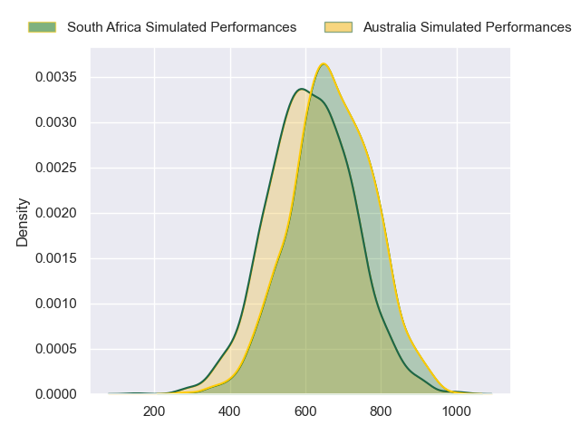
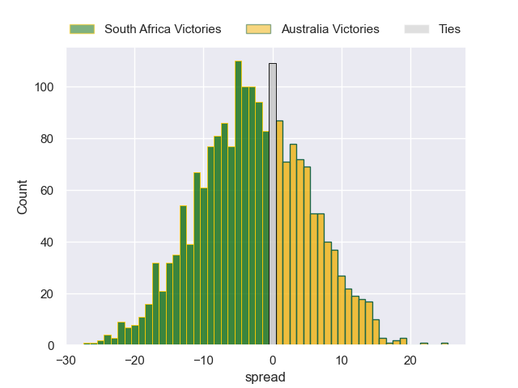

---  
layout: page  
title: South Africa at Australia  
date: 2024-08-17 18:00:00 -0500  
categories: "Rugby Championship 2024" match projection  
---
# South Africa at Australia

# Club Level Predictions

The first set of predictions treats a club as the smallest object, as the club develops its members, organizes a gameplan, and deploys its players as needed for each match. This club model has a prediction of 0.163, which translates to predicting South Africa to win by 10.9.

Our Over/Under is 52.5 - and combined with the spread above, we have a predicted scoreline of 31 to 21

Each club has a rating and a rating deviation (similar to a Glicko rating), and expected performances can be generated. This allows for simulated matches and spreads like the ones below.
## Projected Performances - Club Model

## Projected Spreads - Club Model

## Projected Results - Club Model

# Player Level Predictions

Treating teams instead as an entity made up of the currently active players, I have ratings for each player in an altogether different system. These can be combined to form team ratings once teamsheets are announced, weighting starters a bit higher than the reserves. After the match is played, players can be weighted by their minutes on the field, allowing for an accurate measure of the team's composition. With these compiled team ratings, we can make predictions, measure inaccuracy, and update the individual player ratings.
## Prediction without Player Minutes: South Africa by 3.2

South Africa by 7.1 on a neutral pitch

## Projected Performances - Player Model

## Projected Spreads - Player Model

## Projected Results - Player Model

| Away Player               |   Away Percentile |   Number |   Home Percentile | Home Player          |
|:--------------------------|------------------:|---------:|------------------:|:---------------------|
| Jan-Hendrik Wessels       |             29.02 |        1 |             89.91 | Angus Bell           |
| Johan Grobbelaar          |             95.93 |        2 |             78.54 | Josh Nasser          |
| Thomas du Toit            |             97.48 |        3 |             98.19 | Allan Alaalatoa      |
| Salmaan Moerat            |             79.13 |        4 |             94.19 | Angus Blyth          |
| Ruan Nortje               |             87.2  |        5 |             11.61 | Lukhan Salakaia-Loto |
| Marco van Staden          |             90.77 |        6 |             98.37 | Rob Valetini         |
| Pieter-Steph du Toit      |             95.08 |        7 |              7.98 | Carlo Tizzano        |
| Elrigh Louw               |             89.71 |        8 |             70.8  | Harry Wilson         |
| Morne van den Berg        |             93.21 |        9 |             99.32 | Nic White            |
| Sacha Feinberg-Mngomezulu |             69.33 |       10 |             89.37 | Noah Lolesio         |
| Makazole Mapimpi          |             99.72 |       11 |             96.91 | Marika Koroibete     |
| Lukhanyo Am               |             83.96 |       12 |             83.33 | Hunter Paisami       |
| Jesse Kriel               |             98.43 |       13 |             79.25 | Len Ikitau           |
| Cheslin Kolbe             |             99.81 |       14 |             68.35 | Andrew Kellaway      |
| Aphelele Fassi            |             91.56 |       15 |             88.27 | Tom Wright           |
| Malcolm Marx              |            100    |       16 |             84.72 | Billy Pollard        |
| Ox Nche                   |             99.76 |       17 |             96.53 | James Slipper        |
| Vincent Koch              |             68.53 |       18 |             79.97 | Zane Nonggorr        |
| Eben Etzebeth             |             99.21 |       19 |             82.09 | Tom Hooper           |
| Kwagga Smith              |             85.29 |       20 |             72.64 | Seru Uru             |
| Grant Williams            |             70.12 |       21 |             84.72 | Tate McDermott       |
| Manie Libbok              |             85.28 |       22 |             55.62 | Ben Donaldson        |
| Handre Pollard            |             87.32 |       23 |             54.12 | Max Jorgensen        |

