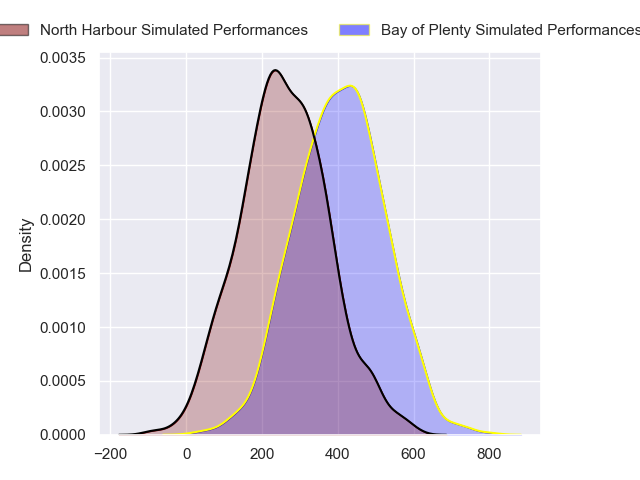
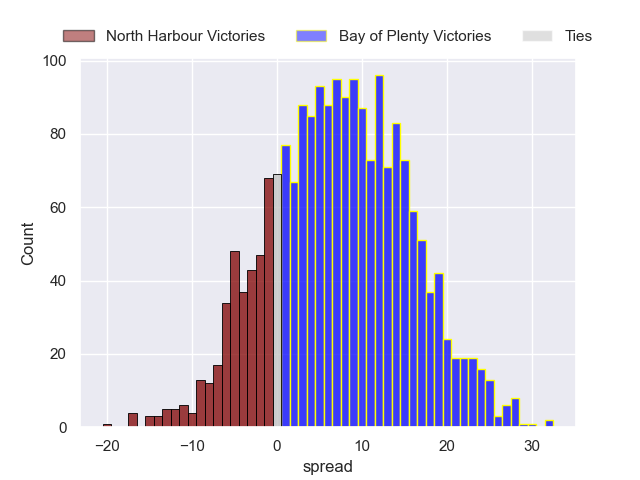
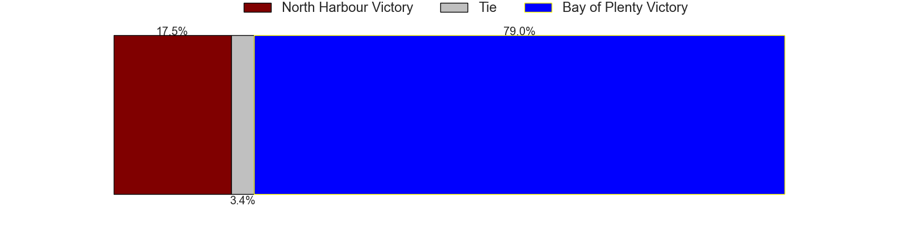

---  
layout: page  
title: North Harbour at Bay of Plenty  
date: 2024-08-17 18:00:00 -0500  
categories: "National Provence Championship 2024" match projection  
---
# North Harbour at Bay of Plenty

# Club Level Predictions

The first set of predictions treats a club as the smallest object, as the club develops its members, organizes a gameplan, and deploys its players as needed for each match. This club model has a prediction of 0.758, which translates to predicting Bay of Plenty to win by 10.4.

Each club has a rating and a rating deviation (similar to a Glicko rating), and expected performances can be generated. This allows for simulated matches and spreads like the ones below.
## Projected Performances - Club Model

## Projected Spreads - Club Model

## Projected Results - Club Model

# Player Level Predictions

Treating teams instead as an entity made up of the currently active players, I have ratings for each player in an altogether different system. These can be combined to form team ratings once teamsheets are announced, weighting starters a bit higher than the reserves. After the match is played, players can be weighted by their minutes on the field, allowing for an accurate measure of the team's composition. With these compiled team ratings, we can make predictions, measure inaccuracy, and update the individual player ratings.
## Prediction without Player Minutes: Bay of Plenty by 7.2

Bay of Plenty by 4.0 on a neutral pitch

## Projected Performances - Player Model

## Projected Spreads - Player Model

## Projected Results - Player Model

| Away Player       |   Away Percentile |   Number |   Home Percentile | Home Player            |
|:------------------|------------------:|---------:|------------------:|:-----------------------|
| Tevita Mafile’o   |            nan    |        1 |            nan    | Haereiti Hetet         |
| Shilo Klein       |            nan    |        2 |            nan    | Kurt Eklund            |
| Sione Mafile’o    |            nan    |        3 |            nan    | Benet Kumeroa          |
| Mahonri Ngakuru   |             34.25 |        4 |            nan    | Naitoa Ah Kuoi         |
| Cam Christie      |            nan    |        5 |            nan    | Justin Sangster        |
| Cameron Suafoa    |            nan    |        6 |            nan    | Jacob Norris           |
| Karl Ruzich       |            nan    |        7 |            nan    | Joe Johnston           |
| Wallace Sititi    |             66.6  |        8 |            nan    | Nikora Broughton       |
| Bryn Hall         |            nan    |        9 |            nan    | Te Toiroa Tahuriorangi |
| Tane Edmed        |            nan    |       10 |            nan    | Lucas Cashmore         |
| Sofai Maka        |            nan    |       11 |            nan    | Codemeru Vai           |
| James Little      |            nan    |       12 |            nan    | Seamus Bardoul         |
| Tom Barham        |            nan    |       13 |            nan    | Uilisi Halaholo        |
| Kade Banks        |            nan    |       14 |            nan    | Emoni Narawa           |
| Shaun Stevenson   |            nan    |       15 |            nan    | Cole Forbes            |
| Bryn Gordon       |            nan    |       16 |            nan    | Taine Kolose           |
| Fatongia Paea     |            nan    |       17 |             28.71 | Josh Bartlett          |
| Sam Davies        |            nan    |       18 |            nan    | Filipe Vakasiuola      |
| James Fiebig      |            nan    |       19 |            nan    | Aisake Vakasiuola      |
| Tristyn Cook      |            nan    |       20 |            nan    | Kalin Felise           |
| Jed Melvin        |             77.79 |       21 |            nan    | Flynn Henderson        |
| Aisea Halo        |             18.34 |       22 |            nan    | Junior Matautia        |
| Tima Fainga'anuku |            nan    |       23 |            nan    | Frank Vaenuku          |

