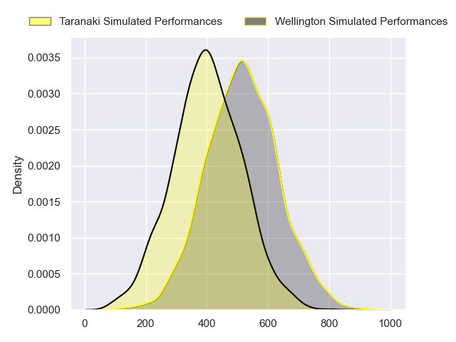
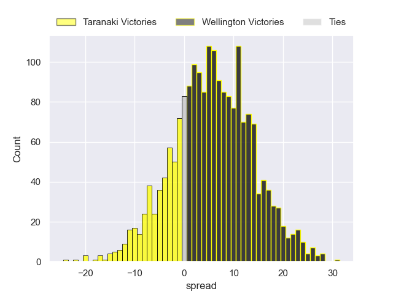
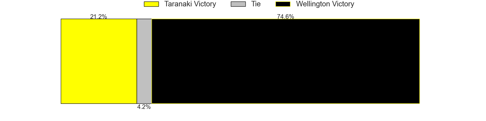

---  
layout: page  
title: Taranaki at Wellington  
date: 2024-08-17 18:00:00 -0500  
categories: "National Provence Championship 2024" match projection  
---
# Taranaki at Wellington

# Club Level Predictions

The first set of predictions treats a club as the smallest object, as the club develops its members, organizes a gameplan, and deploys its players as needed for each match. This club model has a prediction of 0.75, which translates to predicting Wellington to win by 9.8.

Each club has a rating and a rating deviation (similar to a Glicko rating), and expected performances can be generated. This allows for simulated matches and spreads like the ones below.
## Projected Performances - Club Model

## Projected Spreads - Club Model

## Projected Results - Club Model

# Player Level Predictions

Treating teams instead as an entity made up of the currently active players, I have ratings for each player in an altogether different system. These can be combined to form team ratings once teamsheets are announced, weighting starters a bit higher than the reserves. After the match is played, players can be weighted by their minutes on the field, allowing for an accurate measure of the team's composition. With these compiled team ratings, we can make predictions, measure inaccuracy, and update the individual player ratings.
## Prediction without Player Minutes: Wellington by 5.8

Wellington by 2.7 on a neutral pitch

## Projected Performances - Player Model

## Projected Spreads - Player Model

## Projected Results - Player Model

| Away Player                   |   Away Percentile |   Number |   Home Percentile | Home Player           |
|:------------------------------|------------------:|---------:|------------------:|:----------------------|
| Jared Proffit                 |            nan    |        1 |            nan    | Xavier Numia          |
| Ricky Riccitelli              |            nan    |        2 |            nan    | Penieli Poasa         |
| Michael Bent                  |             99.13 |        3 |             89.35 | PJ Sheck              |
| Fiti Sa                       |            nan    |        4 |            nan    | Hugo Plummer          |
| Tom Franklin                  |            nan    |        5 |            nan    | Filo Paulo            |
| Scott Jury                    |            nan    |        6 |            nan    | Brad Shields          |
| Michael Loft                  |            nan    |        7 |            nan    | Du'Plessis Kirifi     |
| Hemopo Cunningham             |             72.34 |        8 |            nan    | Peter Lakai           |
| Adam Lennox                   |            nan    |        9 |            nan    | Kyle Preston          |
| Josh Jacomb                   |            nan    |       10 |            nan    | Jackson Garden-Bachop |
| Kini Naholo                   |            nan    |       11 |            nan    | Pepesana Patafilo     |
| Meihana Grindlay              |            nan    |       12 |            nan    | Peter Umaga-Jensen    |
| Josh Setu                     |            nan    |       13 |             97.38 | Billy Proctor         |
| Vereniki Tikoisolomone        |            nan    |       14 |            nan    | Julian Savea          |
| Jacob Ratumaitavuki-Kneepkens |            nan    |       15 |             96.49 | Ruben Love            |
| Bradley Slater                |             85.06 |       16 |              1.46 | Leni Apisai           |
| Perry Lawrence                |            nan    |       17 |            nan    | Yota Kamimori         |
| Mitch O'Neill                 |            nan    |       18 |            nan    | Siale Lauaki          |
| Jackson Morgan                |            nan    |       19 |             88.68 | Caleb Delany          |
| AJ Lemalu                     |            nan    |       20 |            nan    | Dominic Ropeti        |
| Leone Nawai                   |            nan    |       21 |            nan    | Sione Halalilo        |
| Ethan Reti                    |            nan    |       22 |            nan    | Callum Harkin         |
| Jayson Potroz                 |            nan    |       23 |            nan    | Tjay Clarke           |

