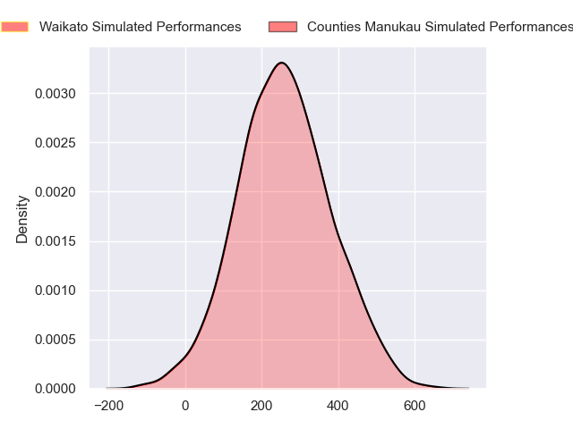
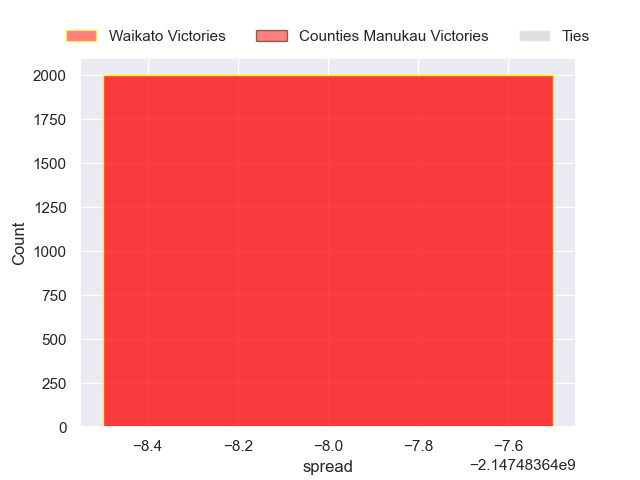

---  
layout: page  
title: Waikato at Counties Manukau  
date: 2024-08-18 18:00:00 -0500  
categories: "National Provence Championship 2024" match projection  
---
# Waikato at Counties Manukau

# Club Level Predictions

The first set of predictions treats a club as the smallest object, as the club develops its members, organizes a gameplan, and deploys its players as needed for each match. This club model has a prediction of 0.364, which translates to predicting Waikato to win by 1.5.

Our Over/Under is 73.5 - and combined with the spread above, we have a predicted scoreline of 38 to 36

Each club has a rating and a rating deviation (similar to a Glicko rating), and expected performances can be generated. This allows for simulated matches and spreads like the ones below.
## Projected Performances - Club Model

## Projected Spreads - Club Model

## Projected Results - Club Model

# Player Level Predictions

Treating teams instead as an entity made up of the currently active players, I have ratings for each player in an altogether different system. These can be combined to form team ratings once teamsheets are announced, weighting starters a bit higher than the reserves. After the match is played, players can be weighted by their minutes on the field, allowing for an accurate measure of the team's composition. With these compiled team ratings, we can make predictions, measure inaccuracy, and update the individual player ratings.
## Prediction without Player Minutes: Waikato by 5.2

Waikato by 8.2 on a neutral pitch

## Projected Performances - Player Model

## Projected Spreads - Player Model

## Projected Results - Player Model

| Away Player            |   Away Percentile |   Number |   Home Percentile | Home Player          |
|:-----------------------|------------------:|---------:|------------------:|:---------------------|
| Ollie Norris           |             84.15 |        1 |               nan | Kauvaka Kaivelata    |
| Manaaki Boyle-Tiatia   |             21.63 |        2 |               nan | Zuriel Togiatama     |
| George Dyer            |             82.1  |        3 |               nan | Suetena Asomua       |
| James Tucker           |             88.19 |        4 |               nan | William Furniss      |
| Laghlan McWhannell     |             96.16 |        5 |               nan | James Thompson       |
| Malachi Wrampling-Alec |             28.94 |        6 |               nan | Alamanda Motuga      |
| Oli Mathis             |             22.12 |        7 |               nan | Adam Brash           |
| Patrick McCurran       |             24.58 |        8 |               nan | Hoskins Sotutu       |
| Xavier Roe             |             33.11 |        9 |               nan | Jonathan Taumateine  |
| D'Angelo Leuila        |            nan    |       10 |               nan | AJ Alatimu           |
| Gideon Wrampling       |             59.27 |       11 |               nan | Josh Gray            |
| Quinn Tupaea           |             88.89 |       12 |               nan | Gibson Popoali'i     |
| Bailyn Sullivan        |             17.3  |       13 |               nan | Tevita Ofa           |
| Newton Tudreu          |             59.18 |       14 |               nan | Blake Makiri         |
| Joshua Moorby          |             75.72 |       15 |               nan | Simon-Peter Toleafoa |
| Pita Anae Ah-Sue       |             93.17 |       16 |               nan | Ioane Moananu        |
| Ayden Johnstone        |             95.9  |       17 |               nan | Sateki Latu          |
| Solomone Tukuafu       |            nan    |       18 |               nan | Lionel Evans         |
| Tai Cribb              |            nan    |       19 |               nan | Leo Ngatai-Tafau     |
| Andrew Smith           |            nan    |       20 |               nan | Cameron Church       |
| Quintony Ngatai        |            nan    |       21 |               nan | Liam Daniela         |
| Taha Kemara            |             10.84 |       22 |               nan | Riley Hohepa         |
| Austin Anderson        |            nan    |       23 |               nan | Kalione Hala         |

