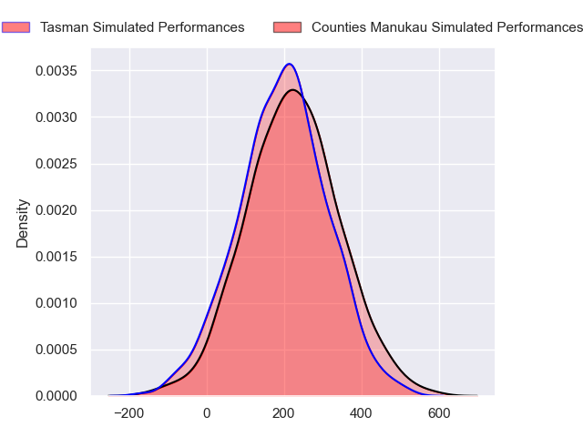
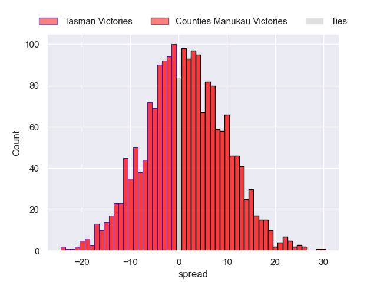
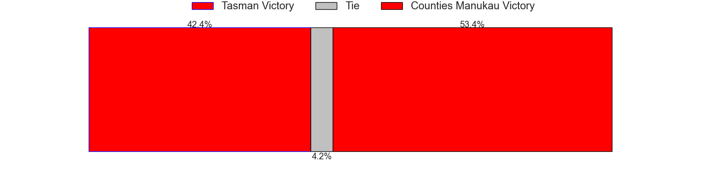

---  
layout: page  
title: Tasman at Counties Manukau  
date: 2024-08-23 18:00:00 -0500  
categories: "National Provence Championship 2024" match projection  
---
# Tasman at Counties Manukau

# Club Level Predictions

The first set of predictions treats a club as the smallest object, as the club develops its members, organizes a gameplan, and deploys its players as needed for each match. This club model has a prediction of 0.347, which translates to predicting Tasman to win by 5.8.

Each club has a rating and a rating deviation (similar to a Glicko rating), and expected performances can be generated. This allows for simulated matches and spreads like the ones below.
## Projected Performances - Club Model

## Projected Spreads - Club Model

## Projected Results - Club Model

# Player Level Predictions

Treating teams instead as an entity made up of the currently active players, I have ratings for each player in an altogether different system. These can be combined to form team ratings once teamsheets are announced, weighting starters a bit higher than the reserves. After the match is played, players can be weighted by their minutes on the field, allowing for an accurate measure of the team's composition. With these compiled team ratings, we can make predictions, measure inaccuracy, and update the individual player ratings.
## Prediction without Player Minutes: Counties Manukau by 1.4

Tasman by 1.5 on a neutral pitch

## Projected Performances - Player Model

## Projected Spreads - Player Model

## Projected Results - Player Model

| Away Player             |   Away Percentile |   Number |   Home Percentile | Home Player          |
|:------------------------|------------------:|---------:|------------------:|:---------------------|
| Ryan Coxon              |            nan    |        1 |            nan    | Kauvaka Kaivelata    |
| Quentin MacDonald       |            nan    |        2 |            nan    | Zuriel Togiatama     |
| Quinn Harrison-Jones    |            nan    |        3 |            nan    | Keran van Staden     |
| Quinten Strange         |            nan    |        4 |            nan    | William Furniss      |
| Antonio Shalfoon        |             14.89 |        5 |            nan    | James Thompson       |
| Fletcher Anderson       |            nan    |        6 |            nan    | Leo Ngatai-Tafau     |
| Braden Stewart          |            nan    |        7 |            nan    | Alamanda Motuga      |
| Te Ahiwaru Cirikidaveta |             66.96 |        8 |            nan    | Adam Brash           |
| Louie Chapman           |             31.75 |        9 |            nan    | Jonathan Taumateine  |
| William Havili          |            nan    |       10 |             69.26 | AJ Alatimu           |
| Kyren Taumoefolau       |             25.73 |       11 |            nan    | Josh Gray            |
| William Butler          |            nan    |       12 |            nan    | Riley Hohepa         |
| Levi Aumua              |            nan    |       13 |            nan    | Tevita Ofa           |
| Timoci Tavatavanawai    |            nan    |       14 |            nan    | Blake Makiri         |
| Macca Springer          |            nan    |       15 |            nan    | Kalione Hala         |
| Samiuela Moli           |            nan    |       16 |            nan    | Ian West-Stevens     |
| Lavengamonu Moli        |            nan    |       17 |            nan    | Sateki Latu          |
| Sione Mafi              |            nan    |       18 |            nan    | Suetena Asomua       |
| Hunter Leppien          |            nan    |       19 |             25.57 | Jadin Kingi          |
| Viliami Napa'a          |            nan    |       20 |            nan    | Cameron Church       |
| Mason Lund              |            nan    |       21 |            nan    | Liam Daniela         |
| Campbell Parata         |            nan    |       22 |            nan    | Gibson Popoali'i     |
| Jack Gray               |            nan    |       23 |            nan    | Simon-Peter Toleafoa |

