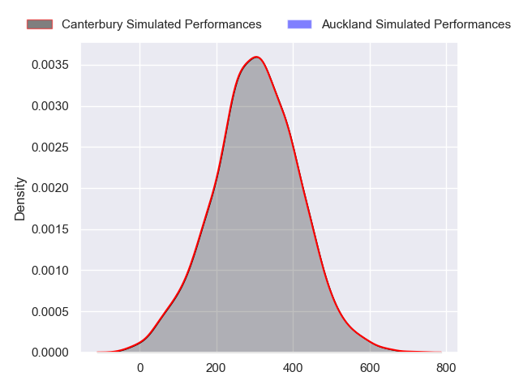
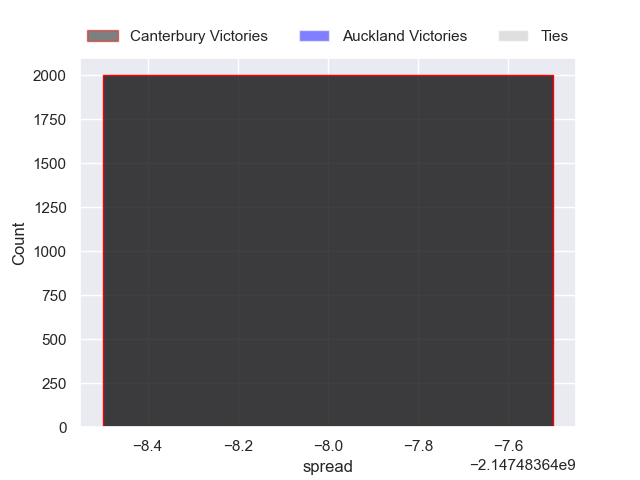

---  
layout: page  
title: Canterbury at Auckland  
date: 2024-08-24 18:00:00 -0500  
categories: "National Provence Championship 2024" match projection  
---
# Canterbury at Auckland

# Club Level Predictions

The first set of predictions treats a club as the smallest object, as the club develops its members, organizes a gameplan, and deploys its players as needed for each match. This club model has a prediction of 0.481, which translates to predicting Canterbury to win by -2.4.

Our Over/Under is 60.5 - and combined with the spread above, we have a predicted scoreline of 29 to 31

Each club has a rating and a rating deviation (similar to a Glicko rating), and expected performances can be generated. This allows for simulated matches and spreads like the ones below.
## Projected Performances - Club Model

## Projected Spreads - Club Model

## Projected Results - Club Model

# Player Level Predictions

Treating teams instead as an entity made up of the currently active players, I have ratings for each player in an altogether different system. These can be combined to form team ratings once teamsheets are announced, weighting starters a bit higher than the reserves. After the match is played, players can be weighted by their minutes on the field, allowing for an accurate measure of the team's composition. With these compiled team ratings, we can make predictions, measure inaccuracy, and update the individual player ratings.
## Prediction without Player Minutes: Auckland by 6.9

Auckland by 3.9 on a neutral pitch

## Projected Performances - Player Model

## Projected Spreads - Player Model

## Projected Results - Player Model

| Away Player          |   Away Percentile |   Number |   Home Percentile | Home Player            |
|:---------------------|------------------:|---------:|------------------:|:-----------------------|
| Finlay Brewis        |            nan    |        1 |            nan    | Josh Fusitu'a          |
| Brodie McAlister     |            nan    |        2 |            nan    | Mills Sanerivi         |
| Seb Calder           |            nan    |        3 |             98.26 | Angus Ta'avao          |
| Jamie Hannah         |            nan    |        4 |            nan    | Josh Beehre            |
| Dom Gardiner         |             26.51 |        5 |            nan    | Tuaina Taii Tualima    |
| Billy Harmon         |            nan    |        6 |            nan    | Adrian Choat           |
| Corey Kellow         |             65.9  |        7 |            nan    | Anton Segner           |
| Cullen Grace         |            nan    |        8 |            nan    | Akira Ioane            |
| Willi Heinz          |            nan    |        9 |             79.63 | Kemara Hauiti-Parapara |
| James White          |            nan    |       10 |            nan    | Christian Leali'ifano  |
| Ngatungane Punivai   |            nan    |       11 |            nan    | Nigel Ah Wong          |
| Jone Rova            |             22.21 |       12 |            nan    | Tanielu Tele'a         |
| Braydon Ennor        |            nan    |       13 |            nan    | Xavi Taele             |
| Issac Hutchinson     |            nan    |       14 |            nan    | Lolagi Visinia         |
| Chay Fihaki          |            nan    |       15 |            nan    | Xavier Tito-Harris     |
| James Mullan         |            nan    |       16 |            nan    | Soane Vikena           |
| Daniel Lienert-Brown |            nan    |       17 |            nan    | Tito Tuipulotu         |
| Gus Brown            |            nan    |       18 |            nan    | Marcel Renata          |
| Tahlor Cahill        |            nan    |       19 |            nan    | Michael Curry          |
| Tom Christie         |            nan    |       20 |             24.95 | Vaiolini Ekuasi        |
| Nic Shearer          |            nan    |       21 |            nan    | Sam Howling            |
| Ryan Crotty          |             98.23 |       22 |            nan    | Rico Simpson           |
| Kurtis MacDonald     |            nan    |       23 |             52.97 | Tomas Aoake            |

