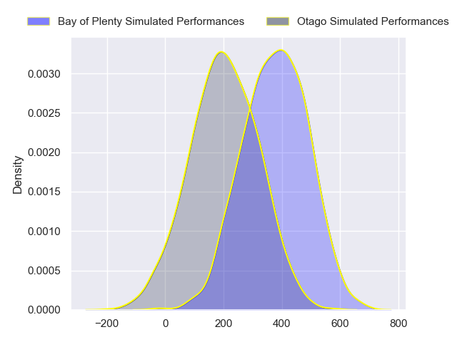
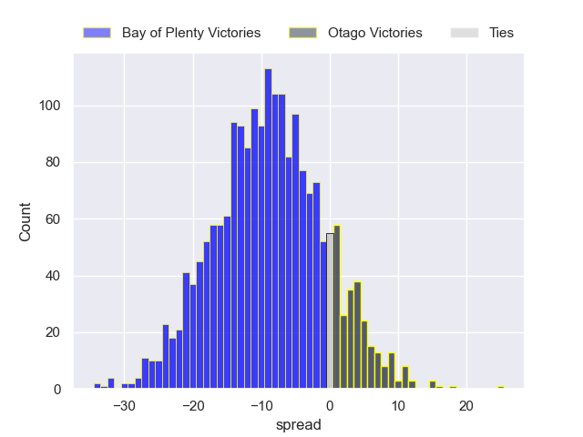
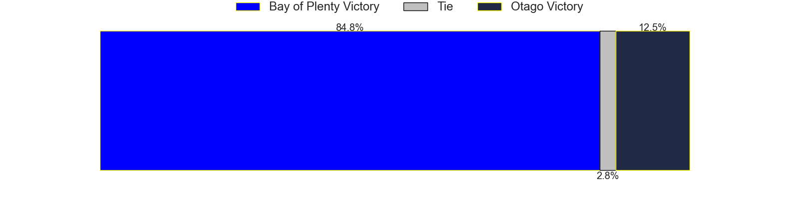

---  
layout: page  
title: Bay of Plenty at Otago  
date: 2024-08-24 18:00:00 -0500  
categories: "National Provence Championship 2024" match projection  
---
# Bay of Plenty at Otago

# Club Level Predictions

The first set of predictions treats a club as the smallest object, as the club develops its members, organizes a gameplan, and deploys its players as needed for each match. This club model has a prediction of 0.389, which translates to predicting Bay of Plenty to win by 4.0.

Each club has a rating and a rating deviation (similar to a Glicko rating), and expected performances can be generated. This allows for simulated matches and spreads like the ones below.
## Projected Performances - Club Model

## Projected Spreads - Club Model

## Projected Results - Club Model

# Player Level Predictions

Treating teams instead as an entity made up of the currently active players, I have ratings for each player in an altogether different system. These can be combined to form team ratings once teamsheets are announced, weighting starters a bit higher than the reserves. After the match is played, players can be weighted by their minutes on the field, allowing for an accurate measure of the team's composition. With these compiled team ratings, we can make predictions, measure inaccuracy, and update the individual player ratings.
## Prediction without Player Minutes: Bay of Plenty by 9.2

Bay of Plenty by 12.3 on a neutral pitch

## Projected Performances - Player Model

## Projected Spreads - Player Model

## Projected Results - Player Model

| Away Player            |   Away Percentile |   Number |   Home Percentile | Home Player          |
|:-----------------------|------------------:|---------:|------------------:|:---------------------|
| Aidan Ross             |            nan    |        1 |            nan    | Abraham Pole         |
| Kurt Eklund            |            nan    |        2 |            nan    | Liam Coltman         |
| Benet Kumeroa          |            nan    |        3 |            nan    | Saula Ma'u           |
| Naitoa Ah Kuoi         |            nan    |        4 |            nan    | Sam Fischli          |
| Justin Sangster        |            nan    |        5 |            nan    | Fabian Holland       |
| Jacob Norris           |            nan    |        6 |            nan    | Oliver Haig          |
| Joe Johnston           |            nan    |        7 |            nan    | Harry Taylor         |
| Nikora Broughton       |            nan    |        8 |            nan    | Will Stodart         |
| Te Toiroa Tahuriorangi |            nan    |        9 |            nan    | James Arscott        |
| Kaleb Trask            |            nan    |       10 |            nan    | Cameron Millar       |
| Codemeru Vai           |            nan    |       11 |             52.87 | Hudson Creighton     |
| Uilisi Halaholo        |            nan    |       12 |            nan    | Sam Gilbert          |
| Emoni Narawa           |            nan    |       13 |            nan    | Thomas Umaga-Jensen  |
| Leroy Carter           |            nan    |       14 |            nan    | Josh Whaanga         |
| Cole Forbes            |            nan    |       15 |            nan    | Finn Hurley          |
| Taine Kolose           |            nan    |       16 |            nan    | Henry Bell           |
| Josh Bartlett          |             28.52 |       17 |            nan    | George Bower         |
| Filipe Vakasiuola      |            nan    |       18 |            nan    | Rohan Wingham        |
| Semisi Paea            |             66.86 |       19 |            nan    | Lui Naeata           |
| Kalin Felise           |            nan    |       20 |             51.14 | Christian Lio-Willie |
| Flynn Henderson        |            nan    |       21 |            nan    | Nathan Hastie        |
| Lucas Cashmore         |            nan    |       22 |            nan    | Levi Harmon          |
| Reon Paul              |            nan    |       23 |            nan    | Kyan Rangitutia      |

