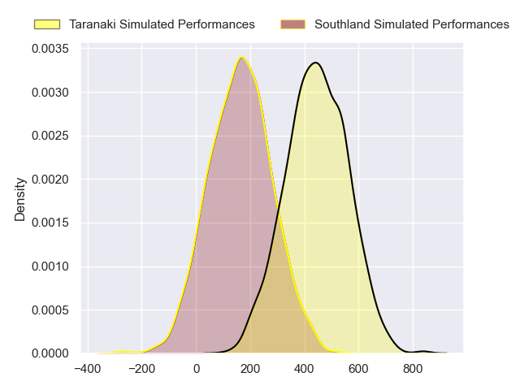
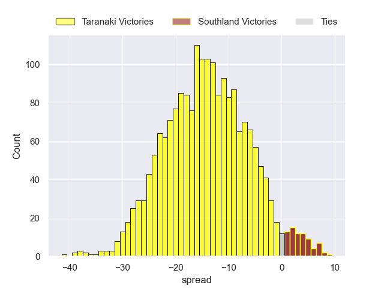
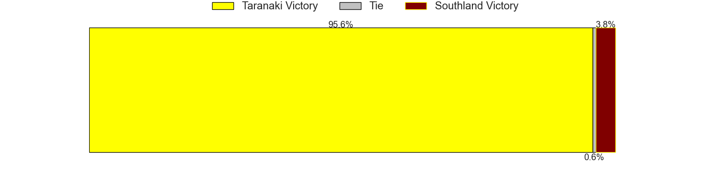

---  
layout: page  
title: Taranaki at Southland  
date: 2024-08-24 18:00:00 -0500  
categories: "National Provence Championship 2024" match projection  
---
# Taranaki at Southland

# Club Level Predictions

The first set of predictions treats a club as the smallest object, as the club develops its members, organizes a gameplan, and deploys its players as needed for each match. This club model has a prediction of 0.171, which translates to predicting Taranaki to win by 10.5.

Our Over/Under is 66.5 - and combined with the spread above, we have a predicted scoreline of 39 to 28

Each club has a rating and a rating deviation (similar to a Glicko rating), and expected performances can be generated. This allows for simulated matches and spreads like the ones below.
## Projected Performances - Club Model

## Projected Spreads - Club Model

## Projected Results - Club Model

# Player Level Predictions

Treating teams instead as an entity made up of the currently active players, I have ratings for each player in an altogether different system. These can be combined to form team ratings once teamsheets are announced, weighting starters a bit higher than the reserves. After the match is played, players can be weighted by their minutes on the field, allowing for an accurate measure of the team's composition. With these compiled team ratings, we can make predictions, measure inaccuracy, and update the individual player ratings.
## Prediction without Player Minutes: Taranaki by 14.3

Taranaki by 17.4 on a neutral pitch

## Projected Performances - Player Model

## Projected Spreads - Player Model

## Projected Results - Player Model

| Away Player                   |   Away Percentile |   Number |   Home Percentile | Home Player           |
|:------------------------------|------------------:|---------:|------------------:|:----------------------|
| Jared Proffit                 |            nan    |        1 |            nan    | Jack Sexton           |
| Ricky Riccitelli              |            nan    |        2 |            nan    | Jack Taylor           |
| Michael Bent                  |            nan    |        3 |            nan    | Hamdahn Tuipulotu     |
| Fiti Sa                       |            nan    |        4 |            nan    | Mitchell Dunshea      |
| Tom Franklin                  |            nan    |        5 |            nan    | Josh Bekhuis          |
| Scott Jury                    |            nan    |        6 |            nan    | Sean Withy            |
| Michael Loft                  |            nan    |        7 |            nan    | Dylan Nel             |
| Kaylum Boshier                |            nan    |        8 |            nan    | Semisi Tupou Ta'eiloa |
| Adam Lennox                   |            nan    |        9 |            nan    | Lachie Albert         |
| Josh Jacomb                   |            nan    |       10 |            nan    | Byron Smith           |
| Kini Naholo                   |            nan    |       11 |            nan    | Rory van Vugt         |
| Daniel Rona                   |             88.74 |       12 |            nan    | Isaac Te Tamaki       |
| Meihana Grindlay              |            nan    |       13 |            nan    | Charlie Powell        |
| Vereniki Tikoisolomone        |            nan    |       14 |            nan    | Viliami Fine          |
| Jacob Ratumaitavuki-Kneepkens |            nan    |       15 |             22.54 | Jake Strachan         |
| Bradley Slater                |             86.75 |       16 |            nan    | Jacob Payne           |
| Perry Lawrence                |            nan    |       17 |            nan    | Sean Paranihi         |
| Mitch O'Neill                 |            nan    |       18 |            nan    | Morgan Mitchell       |
| Jackson Morgan                |            nan    |       19 |            nan    | Shneil Singh          |
| Arese Poliko                  |            nan    |       20 |            nan    | Daniel Maiava         |
| Leone Nawai                   |            nan    |       21 |            nan    | Jay Renton            |
| Jayson Potroz                 |             91.39 |       22 |              0.82 | Jason Robertson       |
| Josh Setu                     |            nan    |       23 |            nan    | Faletoi Peni          |

