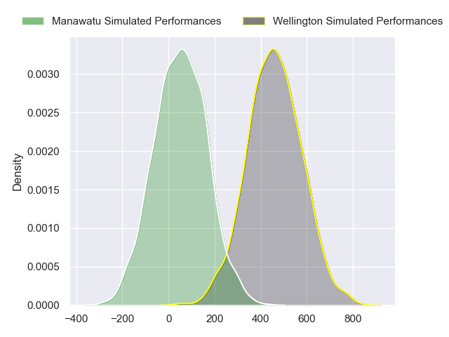
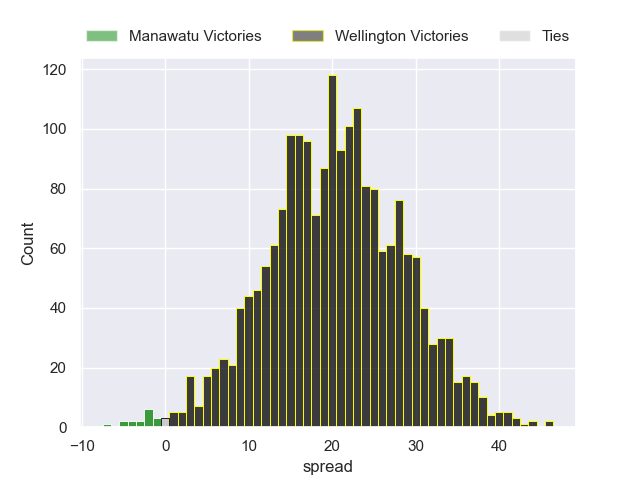
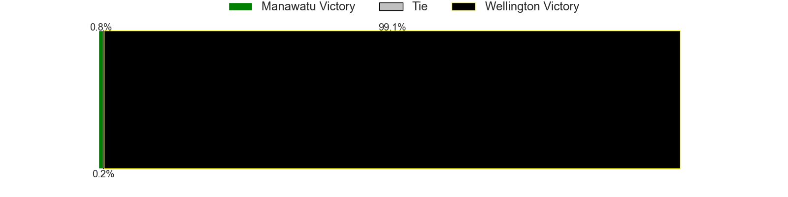

---  
layout: page  
title: Manawatu at Wellington  
date: 2024-08-24 18:00:00 -0500  
categories: "National Provence Championship 2024" match projection  
---
# Manawatu at Wellington

# Club Level Predictions

The first set of predictions treats a club as the smallest object, as the club develops its members, organizes a gameplan, and deploys its players as needed for each match. This club model has a prediction of 0.974, which translates to predicting Wellington to win by 33.2.

Each club has a rating and a rating deviation (similar to a Glicko rating), and expected performances can be generated. This allows for simulated matches and spreads like the ones below.
## Projected Performances - Club Model

## Projected Spreads - Club Model

## Projected Results - Club Model

# Player Level Predictions

Treating teams instead as an entity made up of the currently active players, I have ratings for each player in an altogether different system. These can be combined to form team ratings once teamsheets are announced, weighting starters a bit higher than the reserves. After the match is played, players can be weighted by their minutes on the field, allowing for an accurate measure of the team's composition. With these compiled team ratings, we can make predictions, measure inaccuracy, and update the individual player ratings.
## Prediction without Player Minutes: Wellington by 20.7

Wellington by 17.6 on a neutral pitch

## Projected Performances - Player Model

## Projected Spreads - Player Model

## Projected Results - Player Model

| Away Player        |   Away Percentile |   Number |   Home Percentile | Home Player           |
|:-------------------|------------------:|---------:|------------------:|:----------------------|
| Joe Gavigan        |            nan    |        1 |            nan    | Xavier Numia          |
| Raymond Tuputupu   |            nan    |        2 |            nan    | Penieli Poasa         |
| Flyn Yates         |            nan    |        3 |            nan    | PJ Sheck              |
| Johan Momsen       |            nan    |        4 |            nan    | Hugo Plummer          |
| Lachlan Shaw       |            nan    |        5 |             89.15 | Caleb Delany          |
| TK Howden          |            nan    |        6 |            nan    | Dominic Ropeti        |
| Slade McDowall     |             39.19 |        7 |            nan    | Du'Plessis Kirifi     |
| Tyler Laubscher    |            nan    |        8 |            nan    | Peter Lakai           |
| Jordi Viljoen      |            nan    |        9 |            nan    | Kyle Preston          |
| Reece MacDonald    |            nan    |       10 |            nan    | Jackson Garden-Bachop |
| Pena Va'a          |             33.55 |       11 |            nan    | Tjay Clarke           |
| James Tofa         |            nan    |       12 |            nan    | Julian Savea          |
| Kyle Brown         |            nan    |       13 |            nan    | Riley Higgins         |
| Taniela Filimone   |             83.46 |       14 |            nan    | Pepesana Patafilo     |
| Drew Wild          |            nan    |       15 |            nan    | Callum Harkin         |
| Vernon Bason       |            nan    |       16 |              1.29 | Leni Apisai           |
| George Blake       |            nan    |       17 |            nan    | Kazuki Kato           |
| Misinale Epenisa   |             29.78 |       18 |            nan    | Siale Lauaki          |
| Stan van den Hoven |            nan    |       19 |            nan    | Filo Paulo            |
| Julian Goerke      |            nan    |       20 |            nan    | Brad Shields          |
| Luke Campbell      |            nan    |       21 |            nan    | Nui Muriwai           |
| Liam O'Connor      |            nan    |       22 |            nan    | Peter Umaga-Jensen    |
| Jason Emery        |              5.21 |       23 |            nan    | Stanley Solomon       |

