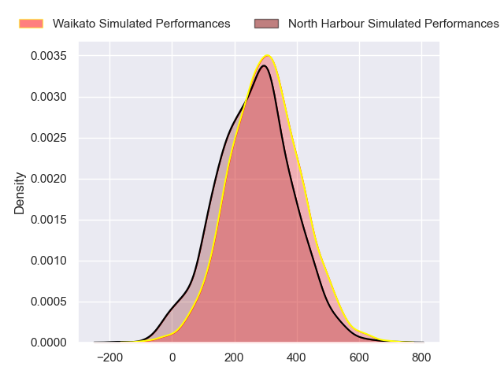
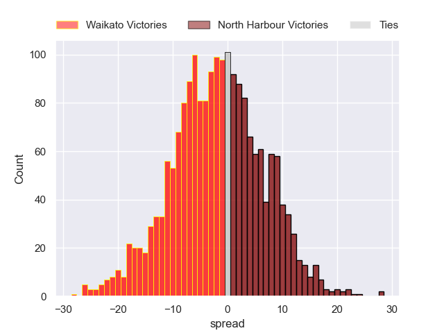

---  
layout: page  
title: Waikato at North Harbour  
date: 2024-08-25 18:00:00 -0500  
categories: "National Provence Championship 2024" match projection  
---
# Waikato at North Harbour

# Club Level Predictions

The first set of predictions treats a club as the smallest object, as the club develops its members, organizes a gameplan, and deploys its players as needed for each match. This club model has a prediction of 0.439, which translates to predicting Waikato to win by -1.2.

Our Over/Under is 55.5 - and combined with the spread above, we have a predicted scoreline of 27 to 28

Each club has a rating and a rating deviation (similar to a Glicko rating), and expected performances can be generated. This allows for simulated matches and spreads like the ones below.
## Projected Performances - Club Model

## Projected Spreads - Club Model

## Projected Results - Club Model

# Player Level Predictions

Treating teams instead as an entity made up of the currently active players, I have ratings for each player in an altogether different system. These can be combined to form team ratings once teamsheets are announced, weighting starters a bit higher than the reserves. After the match is played, players can be weighted by their minutes on the field, allowing for an accurate measure of the team's composition. With these compiled team ratings, we can make predictions, measure inaccuracy, and update the individual player ratings.
## Prediction without Player Minutes: Waikato by 1.5

Waikato by 4.5 on a neutral pitch

## Projected Performances - Player Model

## Projected Spreads - Player Model

## Projected Results - Player Model

| Away Player            |   Away Percentile |   Number |   Home Percentile | Home Player     |
|:-----------------------|------------------:|---------:|------------------:|:----------------|
| Ayden Johnstone        |             97.24 |        1 |            nan    | Tevita Mafile’o |
| Manaaki Boyle-Tiatia   |             31.83 |        2 |            nan    | Shilo Klein     |
| George Dyer            |             83.1  |        3 |            nan    | Sione Mafile’o  |
| Tai Cribb              |             53.85 |        4 |            nan    | Mahonri Ngakuru |
| Laghlan McWhannell     |             95.66 |        5 |            nan    | Cam Christie    |
| Malachi Wrampling-Alec |             37.08 |        6 |            nan    | Tristyn Cook    |
| Senita Lauaki          |             50.53 |        7 |             79.92 | Jed Melvin      |
| Patrick McCurran       |             20.79 |        8 |              2.08 | Lotu Inisi      |
| Xavier Roe             |             47.03 |        9 |            nan    | Bryn Hall       |
| Taha Kemara            |              6.35 |       10 |            nan    | Tane Edmed      |
| Gideon Wrampling       |             59.67 |       11 |            nan    | Sofai Maka      |
| Quinn Tupaea           |             89.89 |       12 |              2.79 | Fine Inisi      |
| Bailyn Sullivan        |             15.33 |       13 |            nan    | Tom Barham      |
| Dan Sinkinson          |             44.52 |       14 |            nan    | Kade Banks      |
| Austin Anderson        |             39.21 |       15 |            nan    | Shaun Stevenson |
| Pita Anae Ah-Sue       |             93.21 |       16 |            nan    | Bryn Gordon     |
| Mason Tupaea           |            nan    |       17 |             60.98 | Fatongia Paea   |
| Solomone Tukuafu       |            nan    |       18 |            nan    | Sam Davies      |
| Ollie Norris           |             83.57 |       19 |            nan    | James Fiebig    |
| Andrew Smith           |            nan    |       20 |            nan    | Karl Ruzich     |
| Quintony Ngatai        |            nan    |       21 |             15.79 | Aisea Halo      |
| Aaron Cruden           |             93.03 |       22 |            nan    | Oscar Koller    |
| Newton Tudreu          |             61.43 |       23 |             68.4  | Moses Leo       |

