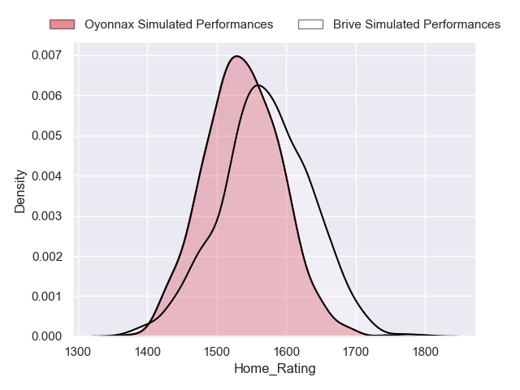
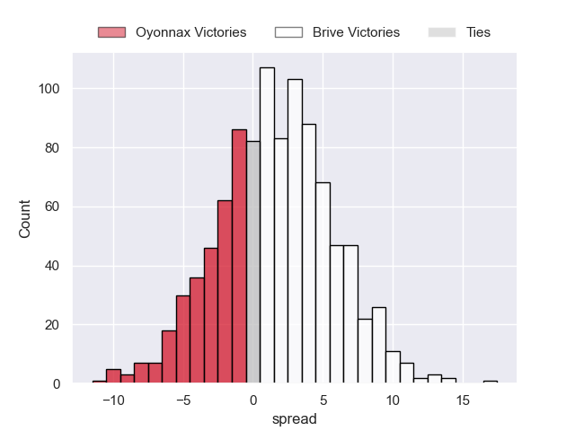
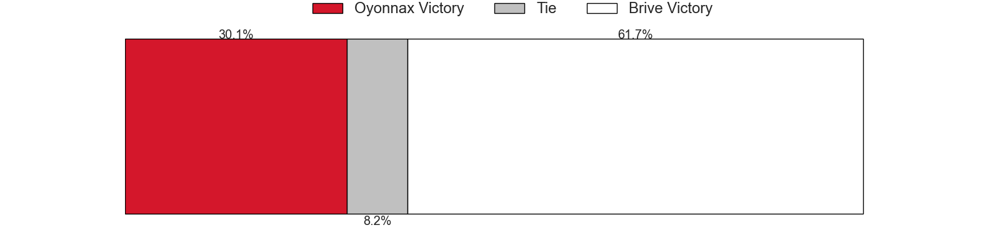
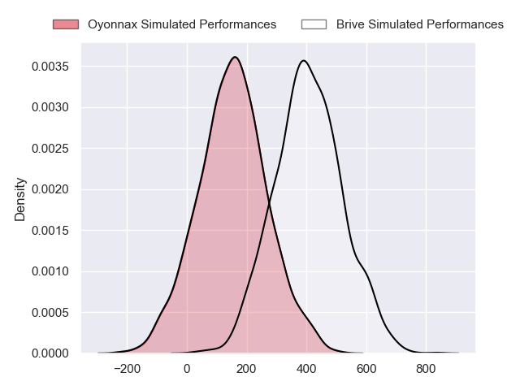
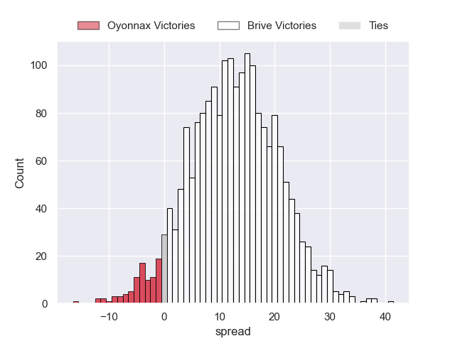
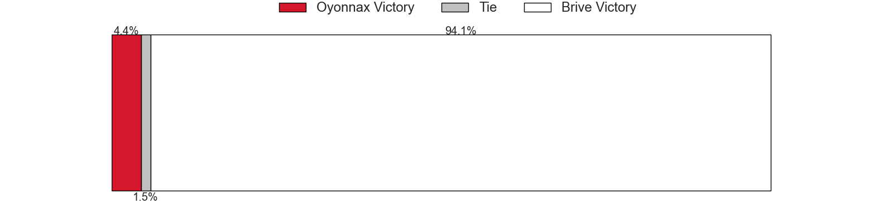

---  
layout: page  
title: Oyonnax at Brive  
date: 2024-08-29 18:00:00 -0500  
categories: "Pro D2 2024" match projection  
---
# Oyonnax at Brive

# Club Level Predictions

The first set of predictions treats a club as the smallest object, as the club develops its members, organizes a gameplan, and deploys its players as needed for each match. This club model has a prediction of 0.449, which translates to predicting Oyonnax to win by -1.6.

Our Over/Under is 41.5 - and combined with the spread above, we have a predicted scoreline of 20 to 22

Each club has a rating and a rating deviation (similar to a Glicko rating), and expected performances can be generated. This allows for simulated matches and spreads like the ones below.
## Projected Performances - Club Model

## Projected Spreads - Club Model

## Projected Results - Club Model

# Player Level Predictions

Treating teams instead as an entity made up of the currently active players, I have ratings for each player in an altogether different system. These can be combined to form team ratings once teamsheets are announced, weighting starters a bit higher than the reserves. After the match is played, players can be weighted by their minutes on the field, allowing for an accurate measure of the team's composition. With these compiled team ratings, we can make predictions, measure inaccuracy, and update the individual player ratings.
## Prediction without Player Minutes: Brive by 12.8

Brive by 4.9 on a neutral pitch

## Projected Performances - Player Model

## Projected Spreads - Player Model

## Projected Results - Player Model

| Away Player       |   Away Percentile |   Number |   Home Percentile | Home Player               |
|:------------------|------------------:|---------:|------------------:|:--------------------------|
| Antoine Abraham   |             60.23 |        1 |             56.04 | Simon-Pierre Chauvac      |
| Peniami Narisia   |             86.46 |        2 |            nan    | Lucas Da Silva            |
| Ali Oz            |             18.76 |        3 |            nan    | Marcel Van Der Merwe      |
| Phoenix Battye    |             97.52 |        4 |             97.94 | Courtney Lawes            |
| Hugo Fabregue     |             65.28 |        5 |            nan    | Sitaleki Timani           |
| Kevin Lebreton    |             54.75 |        6 |            nan    | Retief Marais             |
| Hugo Hermet       |              3.72 |        7 |            nan    | Ross Moriarty             |
| Loic Godener      |              3.98 |        8 |            nan    | Taniela Sadrugu           |
| Vasil Lobzhanidze |              9.64 |        9 |             58.86 | Léo Carbonneau            |
| Zack Holmes       |             75.88 |       10 |             89    | Curwin Bosch              |
| Karim Qadiri      |            nan    |       11 |            nan    | Erwan Dridi               |
| Lucas Mensa       |             70.22 |       12 |            nan    | Sam Johnson               |
| Chris Farrell     |              9.71 |       13 |            nan    | Timilai Rokoduru          |
| Maxime Salles     |             42.71 |       14 |             53.96 | Mathis Ferté              |
| Justin Bouraux    |             10.37 |       15 |            nan    | Nic Krone (2)             |
| Teddy Durand      |             10.93 |       16 |            nan    | Benjamin Boudou           |
| Oli Kebble        |             96.3  |       17 |            nan    | Nathan Fraissenon         |
| Manuel Leindekar  |              2.28 |       18 |              3.27 | Konstantin Mikautadze     |
| Antoine Miquel    |             75.32 |       19 |            nan    | Asier Usarraga Latierro   |
| Yvan David        |            nan    |       20 |            nan    | Sasha Gué                 |
| Rory Grice        |             64.84 |       21 |            nan    | Hugo Verdu                |
| Eddie Sawailau    |            nan    |       22 |            nan    | Stuart Olding             |
| Paulo Tafili      |             42.11 |       23 |            nan    | Francisco Coria Marchetti |

