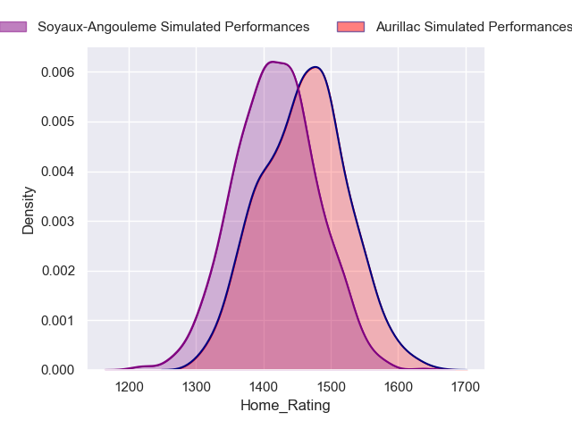
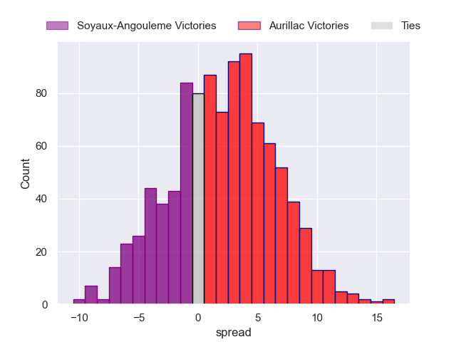
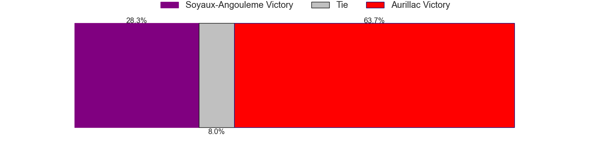
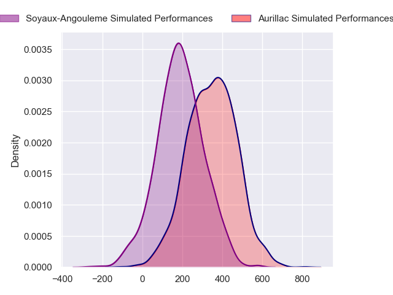
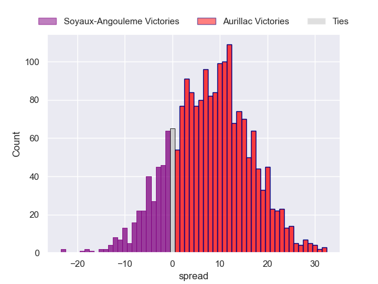
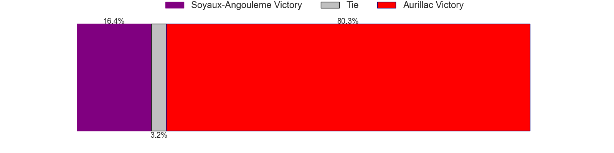

---  
layout: page  
title: Soyaux-Angouleme at Aurillac  
date: 2024-08-30 18:00:00 -0500  
categories: "Pro D2 2024" match projection  
---
# Soyaux-Angouleme at Aurillac

# Club Level Predictions

The first set of predictions treats a club as the smallest object, as the club develops its members, organizes a gameplan, and deploys its players as needed for each match. This club model has a prediction of 0.463, which translates to predicting Soyaux-Angouleme to win by -2.1.

Our Over/Under is 32.5 - and combined with the spread above, we have a predicted scoreline of 15 to 18

Each club has a rating and a rating deviation (similar to a Glicko rating), and expected performances can be generated. This allows for simulated matches and spreads like the ones below.
## Projected Performances - Club Model

## Projected Spreads - Club Model

## Projected Results - Club Model

# Player Level Predictions

Treating teams instead as an entity made up of the currently active players, I have ratings for each player in an altogether different system. These can be combined to form team ratings once teamsheets are announced, weighting starters a bit higher than the reserves. After the match is played, players can be weighted by their minutes on the field, allowing for an accurate measure of the team's composition. With these compiled team ratings, we can make predictions, measure inaccuracy, and update the individual player ratings.
## Prediction without Player Minutes: Aurillac by 8.2

Aurillac by 0.3 on a neutral pitch

## Projected Performances - Player Model

## Projected Spreads - Player Model

## Projected Results - Player Model

| Away Player        |   Away Percentile |   Number |   Home Percentile | Home Player           |
|:-------------------|------------------:|---------:|------------------:|:----------------------|
| Sami Zouhaïr       |            nan    |        1 |            nan    | Robbie Rodgers        |
| Rayne Barka        |            nan    |        2 |            nan    | Luka Nioradze         |
| Yassin Boutemanni  |            nan    |        3 |            nan    | Giorgi Kartvelishvili |
| Ian Kitwanga       |            nan    |        4 |            nan    | Martial Rolland       |
| Maxence Lemardelet |            nan    |        5 |            nan    | Abongile Nonkontwana  |
| Hubert Texier      |            nan    |        6 |            nan    | Eoghan Masterson      |
| Clément Sentubéry  |            nan    |        7 |            nan    | Hugo Huurman          |
| Alex Masibaka (2)  |            nan    |        8 |            nan    | Didier Tison          |
| Lucas Zamora       |            nan    |        9 |            nan    | David Delarue         |
| Ben Botica         |            nan    |       10 |             57.68 | Tedo Abzhandadze      |
| Jonny May          |             59.55 |       11 |            nan    | Simeli Yabaki         |
| George Tilsley     |            nan    |       12 |            nan    | Ofa Manuofetoa        |
| Ledua Mau          |            nan    |       13 |            nan    | Karl Martin           |
| Matthys Gratien    |            nan    |       14 |            nan    | Dachi Papunashvili    |
| Rémi Brosset       |            nan    |       15 |            nan    | Ugo Seunes            |
| Motu Matu'U        |            nan    |       16 |            nan    | Ronan Loughnane       |
| Vivien Devisme     |             74.15 |       17 |            nan    | Irakli Mchedlidze     |
| Enzo Morand-Bruyat |            nan    |       18 |            nan    | Mehdi Slamani         |
| Matthew Dalton     |            nan    |       19 |             71.63 | Koen Bloemen          |
| Samuel Nollet      |            nan    |       20 |             32.42 | Tim De Jong           |
| Adrien Bau         |            nan    |       21 |             64.89 | Mikheil Alania        |
| Arthur Proult      |            nan    |       22 |            nan    | Lucas Oudard          |
| Omar Dahir         |            nan    |       23 |            nan    | Valentin Welsch       |

