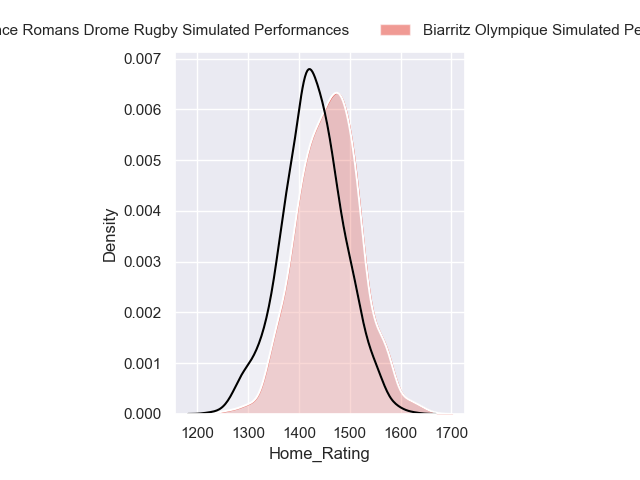
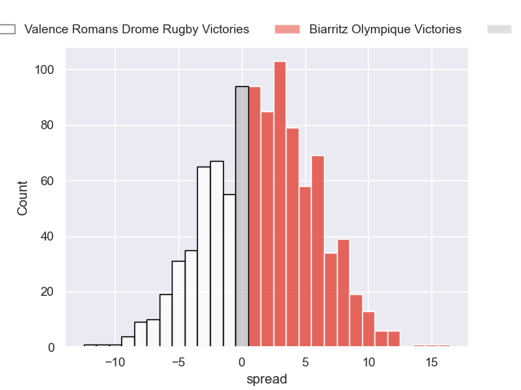
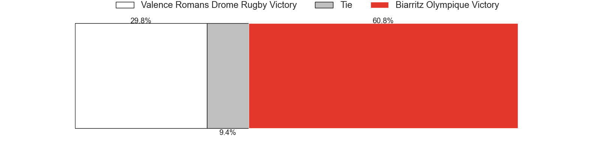
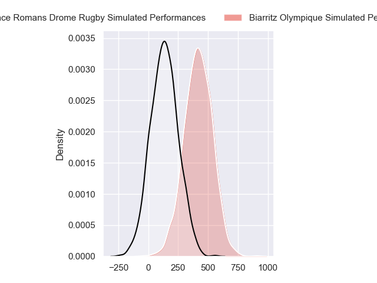
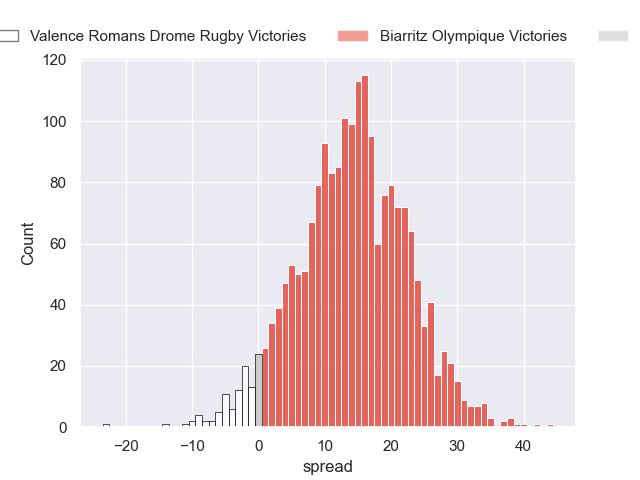
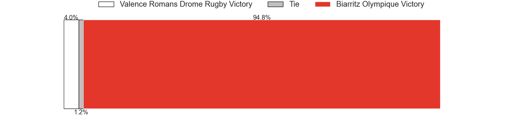

---  
layout: page  
title: Valence Romans Drome Rugby at Biarritz Olympique  
date: 2024-08-30 18:00:00 -0500  
categories: "Pro D2 2024" match projection  
---
# Valence Romans Drome Rugby at Biarritz Olympique

# Club Level Predictions

The first set of predictions treats a club as the smallest object, as the club develops its members, organizes a gameplan, and deploys its players as needed for each match. This club model has a prediction of 0.451, which translates to predicting Valence Romans Drome Rugby to win by -1.6.

Our Over/Under is 37.5 - and combined with the spread above, we have a predicted scoreline of 18 to 20

Each club has a rating and a rating deviation (similar to a Glicko rating), and expected performances can be generated. This allows for simulated matches and spreads like the ones below.
## Projected Performances - Club Model

## Projected Spreads - Club Model

## Projected Results - Club Model

# Player Level Predictions

Treating teams instead as an entity made up of the currently active players, I have ratings for each player in an altogether different system. These can be combined to form team ratings once teamsheets are announced, weighting starters a bit higher than the reserves. After the match is played, players can be weighted by their minutes on the field, allowing for an accurate measure of the team's composition. With these compiled team ratings, we can make predictions, measure inaccuracy, and update the individual player ratings.
## Prediction without Player Minutes: Biarritz Olympique by 14.3

Biarritz Olympique by 5.3 on a neutral pitch

## Projected Performances - Player Model

## Projected Spreads - Player Model

## Projected Results - Player Model

| Away Player         |   Away Percentile |   Number |   Home Percentile | Home Player         |
|:--------------------|------------------:|---------:|------------------:|:--------------------|
| Anthony Aléo        |            nan    |        1 |            nan    | Alexandre Plantier  |
| Cyril Deligny       |            nan    |        2 |            nan    | Clément Martinez    |
| Gareth Milasinovich |            nan    |        3 |            nan    | Nikoloz Narmania    |
| Ryan Mccauley       |            nan    |        4 |            nan    | Charlie Matthews    |
| Yassine Maamry      |            nan    |        5 |             78.11 | Piula Fa'asalele    |
| Axel Bruchet        |            nan    |        6 |            nan    | Simon Augry         |
| Matthieu Vachon     |            nan    |        7 |            nan    | Thomas Hébert       |
| Ilia Spanderashvili |             14.62 |        8 |             62    | Masivesi Dakuwaqa   |
| Thomas Lhuséro      |            nan    |        9 |             60.83 | Kerman Aurrekoetxea |
| Lucas Méret         |            nan    |       10 |             49.69 | Thomas Dolhagaray   |
| Thomas Roziere      |             12.37 |       11 |            nan    | Gervais Cordin      |
| Louis Marrou        |            nan    |       12 |            nan    | Nathan Van De Ven   |
| Anatole Pauvert     |            nan    |       13 |             94.13 | Mathieu Acebes      |
| Owen Lane           |              2.27 |       14 |            nan    | Arthur Bonneval     |
| Joris De Moura      |             38.83 |       15 |            nan    | Kylian Jaminet      |
| Dorian Marco-Pena   |            nan    |       16 |             58.43 | Yohan Beheregaray   |
| Julien Royer        |            nan    |       17 |            nan    | François Mur        |
| Thembelani Bholi    |            nan    |       18 |              1.99 | Adrian Motoc        |
| Éloi Massot         |            nan    |       19 |             90.48 | Cornell du Preez    |
| Tim Menzel          |            nan    |       20 |            nan    | Pierre Pagès        |
| Ben Neiceru         |            nan    |       21 |            nan    | Edgar Retière       |
| Adam Vargas         |            nan    |       22 |            nan    | Tyler Morgan        |
| Kévin Goze          |            nan    |       23 |            nan    | Giorgi Nutsubidze   |

