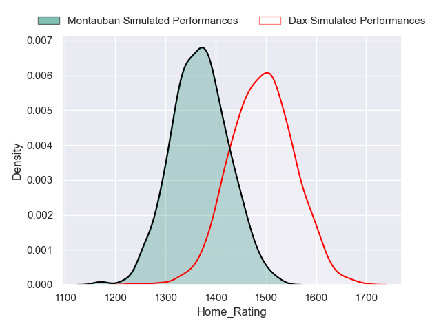
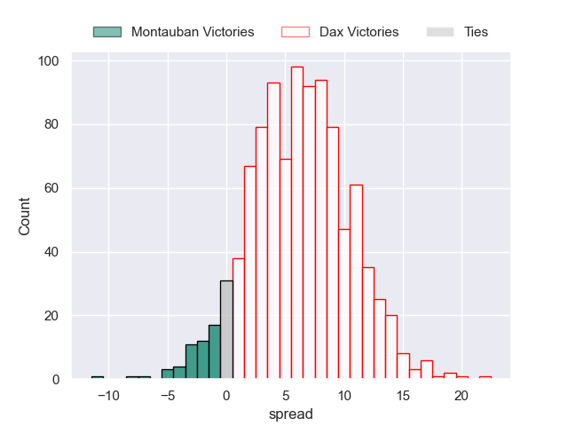
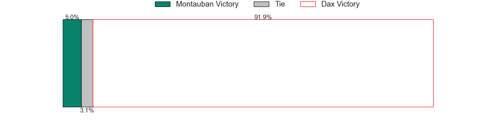
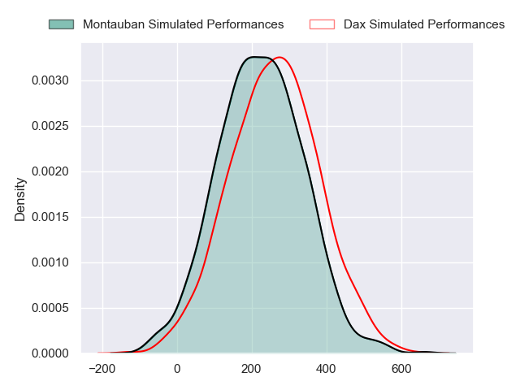
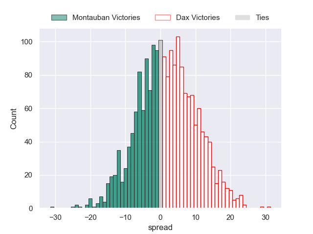
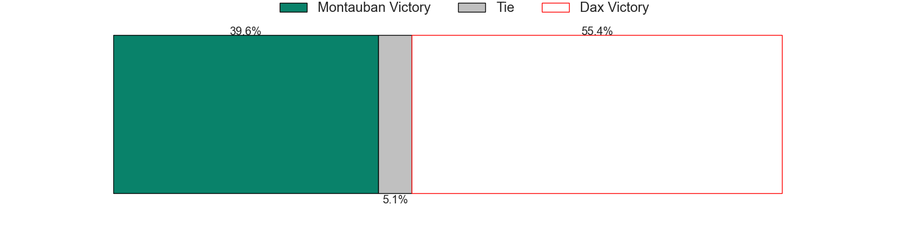

---  
layout: page  
title: Montauban at Dax  
date: 2024-08-30 18:00:00 -0500  
categories: "Pro D2 2024" match projection  
---
# Montauban at Dax

# Club Level Predictions

The first set of predictions treats a club as the smallest object, as the club develops its members, organizes a gameplan, and deploys its players as needed for each match. This club model has a prediction of 0.584, which translates to predicting Dax to win by 6.2.

Our Over/Under is 40.5 - and combined with the spread above, we have a predicted scoreline of 17 to 24

Each club has a rating and a rating deviation (similar to a Glicko rating), and expected performances can be generated. This allows for simulated matches and spreads like the ones below.
## Projected Performances - Club Model

## Projected Spreads - Club Model

## Projected Results - Club Model

# Player Level Predictions

Treating teams instead as an entity made up of the currently active players, I have ratings for each player in an altogether different system. These can be combined to form team ratings once teamsheets are announced, weighting starters a bit higher than the reserves. After the match is played, players can be weighted by their minutes on the field, allowing for an accurate measure of the team's composition. With these compiled team ratings, we can make predictions, measure inaccuracy, and update the individual player ratings.
## Prediction without Player Minutes: Dax by 2.1

Montauban by 5.4 on a neutral pitch

## Projected Performances - Player Model

## Projected Spreads - Player Model

## Projected Results - Player Model

| Away Player       |   Away Percentile |   Number |   Home Percentile | Home Player           |
|:------------------|------------------:|---------:|------------------:|:----------------------|
| Léo Aouf          |            nan    |        1 |             17.38 | David Lolohea         |
| Ru-Hann Greyling  |            nan    |        2 |            nan    | Iban Hiriart-Urruty   |
| Facundo Pomponio  |            nan    |        3 |              6.63 | Diogo Hasse Ferreira  |
| Tjiuee Uanivi     |             17.08 |        4 |             48.09 | Brice Ferrer          |
| Victor Moreaux    |            nan    |        5 |            nan    | Jean-Baptiste Singer  |
| Sikhumbuzo Notshe |             79.83 |        6 |            nan    | Arnaud Aletti         |
| Kyllian Ringuet   |            nan    |        7 |            nan    | Paul Arnaud Ausset    |
| Tyrone Viiga      |            nan    |        8 |            nan    | Ratu Nacika           |
| Yoan Cottin       |            nan    |        9 |            nan    | Sylvère Réteau        |
| Thomas Fortunel   |            nan    |       10 |            nan    | Romuald Séguy         |
| Paul Vallée       |            nan    |       11 |            nan    | Jope Naseara (2)      |
| Jt Jackson        |            nan    |       12 |              0.21 | Jale Vatubua          |
| Yvan Reilhac      |            nan    |       13 |            nan    | Benjamin Puntous      |
| Stephane Ahmed    |             92.61 |       14 |            nan    | Maxime Oltmann        |
| Baptiste Mouchous |            nan    |       15 |            nan    | Théo Duprat           |
| Kévin Firmin      |            nan    |       16 |            nan    | Louis Barrère         |
| Malino Vanaï      |            nan    |       17 |            nan    | Louis Mary            |
| Lewis Bean        |            nan    |       18 |            nan    | Etienne Loiret        |
| Karl Wilkins      |            nan    |       19 |            nan    | Jean-Baptiste Barrère |
| Hugo Zabalza      |            nan    |       20 |            nan    | Paul Ravier           |
| Jérôme Bosviel    |            nan    |       21 |            nan    | Hugo Cerisier         |
| Simon Renda       |            nan    |       22 |             40.13 | Noah Nene             |
| Mirian Burduli    |            nan    |       23 |            nan    | Nephi Leatigaga       |

