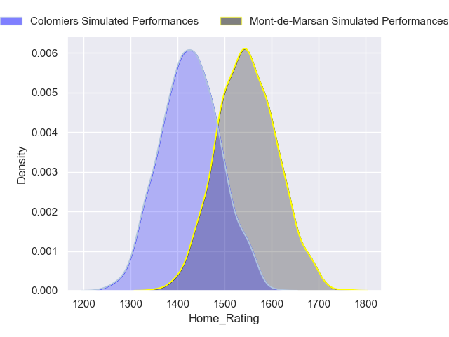
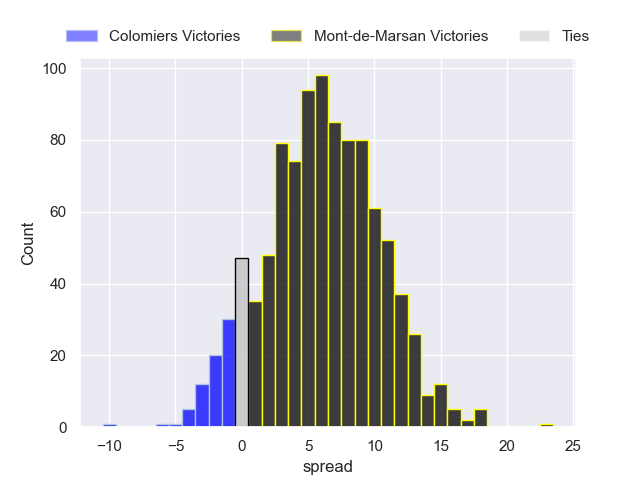
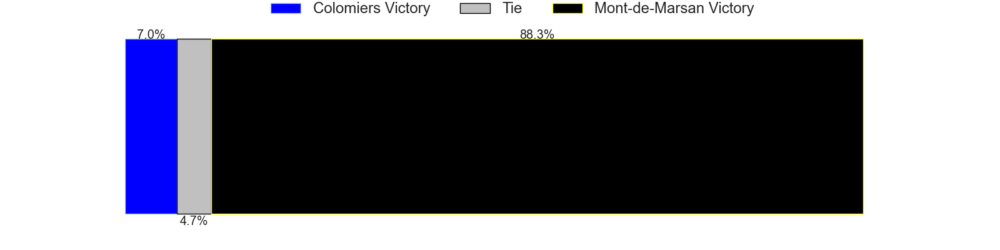
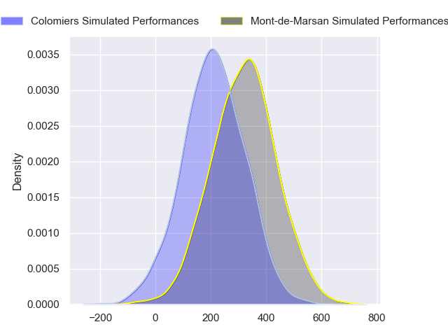
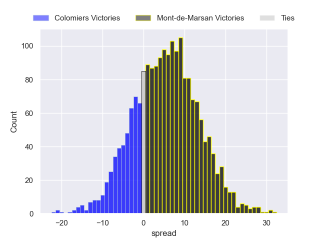
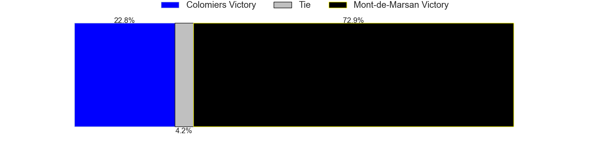

---  
layout: page  
title: Colomiers at Mont-de-Marsan  
date: 2024-08-30 18:00:00 -0500  
categories: "Pro D2 2024" match projection  
---
# Colomiers at Mont-de-Marsan

# Club Level Predictions

The first set of predictions treats a club as the smallest object, as the club develops its members, organizes a gameplan, and deploys its players as needed for each match. This club model has a prediction of 0.577, which translates to predicting Mont-de-Marsan to win by 6.0.

Our Over/Under is 41.5 - and combined with the spread above, we have a predicted scoreline of 18 to 24

Each club has a rating and a rating deviation (similar to a Glicko rating), and expected performances can be generated. This allows for simulated matches and spreads like the ones below.
## Projected Performances - Club Model

## Projected Spreads - Club Model

## Projected Results - Club Model

# Player Level Predictions

Treating teams instead as an entity made up of the currently active players, I have ratings for each player in an altogether different system. These can be combined to form team ratings once teamsheets are announced, weighting starters a bit higher than the reserves. After the match is played, players can be weighted by their minutes on the field, allowing for an accurate measure of the team's composition. With these compiled team ratings, we can make predictions, measure inaccuracy, and update the individual player ratings.
## Prediction without Player Minutes: Mont-de-Marsan by 5.8

Colomiers by 2.1 on a neutral pitch

## Projected Performances - Player Model

## Projected Spreads - Player Model

## Projected Results - Player Model

| Away Player        |   Away Percentile |   Number |   Home Percentile | Home Player          |
|:-------------------|------------------:|---------:|------------------:|:---------------------|
| Guillaume Tartas   |            nan    |        1 |            nan    | Thomas Bultel        |
| Thomas Larrieu     |            nan    |        2 |            nan    | Florian Dufour       |
| Michaël Simutoga   |            nan    |        3 |              3.8  | Anthony Alves        |
| Jean Thomas        |            nan    |        4 |            nan    | Nicolas Garrault     |
| Janse Roux         |            nan    |        5 |            nan    | Myles Edwards        |
| Anthony Coletta    |            nan    |        6 |            nan    | Aurélien Lafforgue   |
| Aldric Lescure     |            nan    |        7 |            nan    | Waël Ponpon          |
| Caleb Timu         |            nan    |        8 |            nan    | Michael Faleafa      |
| Ugo Séguéla        |            nan    |        9 |            nan    | Nicolas Darquier     |
| Joaquin De La Vega |            nan    |       10 |             43.42 | Willie Du Plessis    |
| Rodrigo Marta      |             89.87 |       11 |            nan    | Semi Lagivala (2)    |
| Baptiste Serrano   |            nan    |       12 |            nan    | Gatien Massé         |
| Enzo Salles        |            nan    |       13 |            nan    | Jules Even           |
| Valentin Saurs     |            nan    |       14 |             28.3  | Alexandre de Nardi   |
| Ugo Pacome         |            nan    |       15 |             57.44 | Simao Bento          |
| Pablo Dimcheff     |            nan    |       16 |             46.64 | Luka Begic           |
| Hugo Pirlet        |             63.95 |       17 |            nan    | Luka Goginava        |
| Louis Descoux      |            nan    |       18 |            nan    | Aston Fortuin        |
| Grégoire Bazin     |            nan    |       19 |            nan    | Raphaël Robic        |
| Ray Nu'U           |            nan    |       20 |            nan    | Christophe Loustalot |
| Arthur Diaz        |            nan    |       21 |            nan    | Joris Pialot         |
| Max Auriac         |            nan    |       22 |            nan    | Nacani Wakaya        |
| Robin Bellemand    |            nan    |       23 |            nan    | Mattéo Lalanne       |

