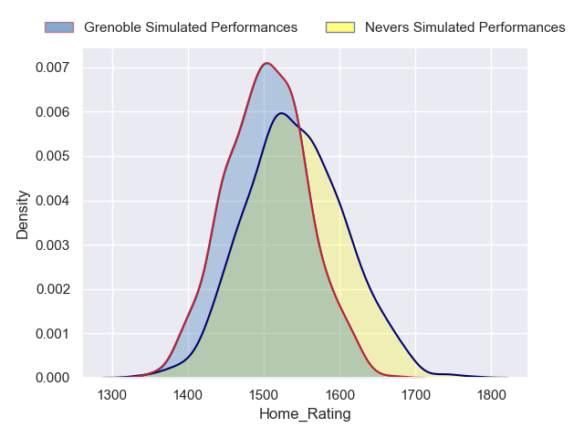
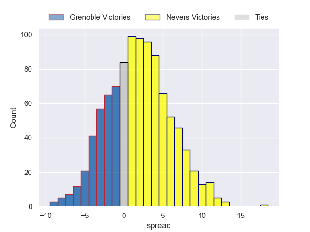
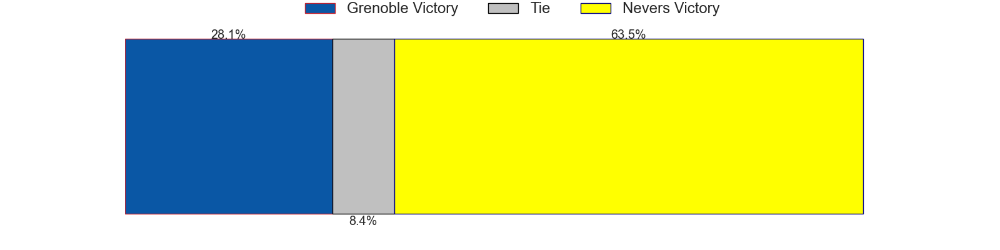
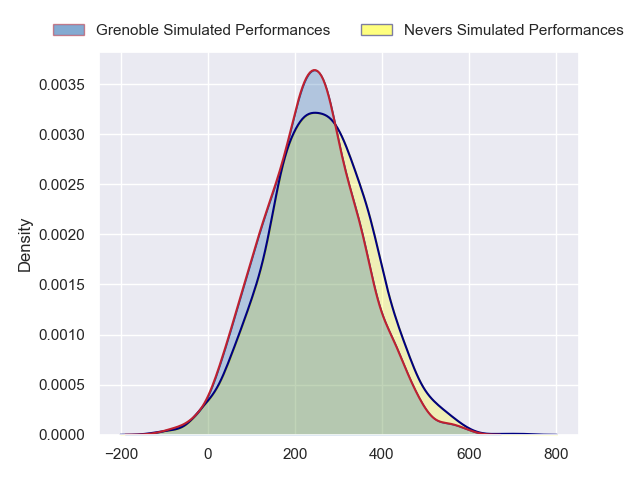
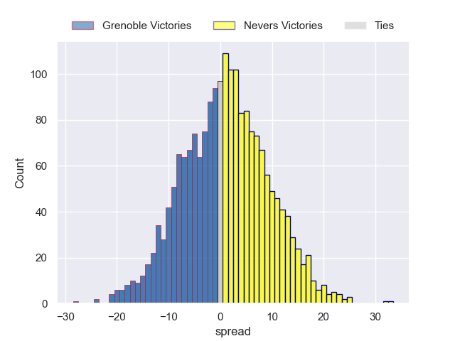
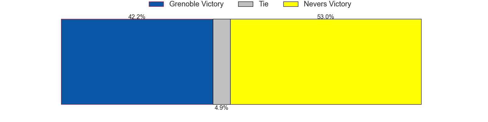

---  
layout: page  
title: Grenoble at Nevers  
date: 2024-08-30 18:00:00 -0500  
categories: "Pro D2 2024" match projection  
---
# Grenoble at Nevers

# Club Level Predictions

The first set of predictions treats a club as the smallest object, as the club develops its members, organizes a gameplan, and deploys its players as needed for each match. This club model has a prediction of 0.461, which translates to predicting Grenoble to win by -1.9.

Our Over/Under is 44.5 - and combined with the spread above, we have a predicted scoreline of 21 to 23

Each club has a rating and a rating deviation (similar to a Glicko rating), and expected performances can be generated. This allows for simulated matches and spreads like the ones below.
## Projected Performances - Club Model

## Projected Spreads - Club Model

## Projected Results - Club Model

# Player Level Predictions

Treating teams instead as an entity made up of the currently active players, I have ratings for each player in an altogether different system. These can be combined to form team ratings once teamsheets are announced, weighting starters a bit higher than the reserves. After the match is played, players can be weighted by their minutes on the field, allowing for an accurate measure of the team's composition. With these compiled team ratings, we can make predictions, measure inaccuracy, and update the individual player ratings.
## Prediction without Player Minutes: Nevers by 1.3

Grenoble by 2.5 on a neutral pitch

## Projected Performances - Player Model

## Projected Spreads - Player Model

## Projected Results - Player Model

| Away Player        |   Away Percentile |   Number |   Home Percentile | Home Player                |
|:-------------------|------------------:|---------:|------------------:|:---------------------------|
| Tommy Raynaud      |             84.16 |        1 |            nan    | Tornike Mataradze          |
| Lilian Rossi       |            nan    |        2 |            nan    | Jonathan Maïau             |
| Johannes Jonker    |             66.53 |        3 |            nan    | Cleopas Kundiona           |
| Pierce Phillips    |            nan    |        4 |             52.04 | Ugo Vignolles              |
| Brandon Nansen     |            nan    |        5 |            nan    | Chris Gabriel              |
| Jose Madeira       |             92.74 |        6 |            nan    | Luka Plataret              |
| Victor Guillaumond |            nan    |        7 |            nan    | Hugues Bastide             |
| Thibaut Martel     |            nan    |        8 |            nan    | Kévin Noah                 |
| Barnabé Couilloud  |            nan    |        9 |            nan    | Hugo Bouyssou              |
| Sam Davies         |            nan    |       10 |            nan    | Shaun Reynolds             |
| Wilfried Hulleu    |            nan    |       11 |            nan    | Arthur Mathiron            |
| Julien Heriteau    |             76.29 |       12 |            nan    | Rudy Derrieux              |
| Romain Fusier      |            nan    |       13 |            nan    | Atu Manu                   |
| Gerswin Mouton     |             42.05 |       14 |            nan    | Gabin Rocher               |
| Julien Farnoux     |            nan    |       15 |            nan    | Dylan Jaminet              |
| Mathis Sarragallet |            nan    |       16 |            nan    | Jean-Maxence Jules-Rosette |
| Zack Gauthier      |            nan    |       17 |            nan    | Aitor Kitutu               |
| Thomas Lainault    |            nan    |       18 |            nan    | Maka Polutélé              |
| Pio Muarua         |            nan    |       19 |            nan    | Julien Kazubek             |
| Max Clément        |            nan    |       20 |            nan    | Nicolas Ragoevi            |
| Marc Palmier       |            nan    |       21 |            nan    | Simon Tarel                |
| Hugo Trouilloud    |            nan    |       22 |            nan    | Yohan Le Bourhis           |
| Cody Thomas        |            nan    |       23 |            nan    | Aselo Ikahehegi            |

