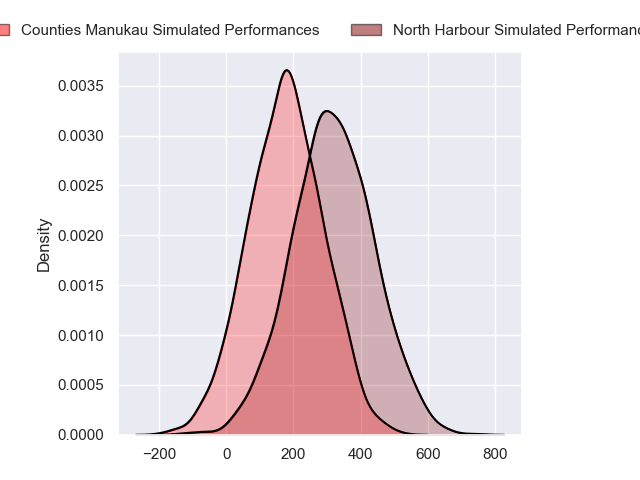
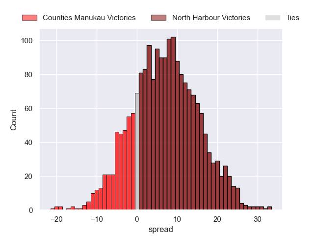
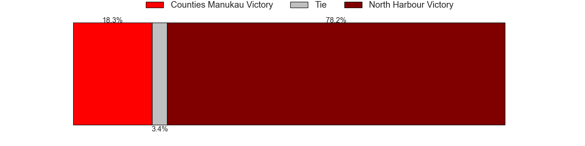

---  
layout: page  
title: Counties Manukau at North Harbour  
date: 2024-08-30 18:00:00 -0500  
categories: "NPC 2024" match projection  
---
# Counties Manukau at North Harbour

# Club Level Predictions

The first set of predictions treats a club as the smallest object, as the club develops its members, organizes a gameplan, and deploys its players as needed for each match. This club model has a prediction of 0.749, which translates to predicting North Harbour to win by 10.1.

Each club has a rating and a rating deviation (similar to a Glicko rating), and expected performances can be generated. This allows for simulated matches and spreads like the ones below.
## Projected Performances - Club Model

## Projected Spreads - Club Model

## Projected Results - Club Model

# Player Level Predictions

Treating teams instead as an entity made up of the currently active players, I have ratings for each player in an altogether different system. These can be combined to form team ratings once teamsheets are announced, weighting starters a bit higher than the reserves. After the match is played, players can be weighted by their minutes on the field, allowing for an accurate measure of the team's composition. With these compiled team ratings, we can make predictions, measure inaccuracy, and update the individual player ratings.
## Prediction without Player Minutes: North Harbour by 7.5

North Harbour by 4.4 on a neutral pitch

## Projected Performances - Player Model

## Projected Spreads - Player Model

## Projected Results - Player Model

| Away Player          |   Away Percentile |   Number |   Home Percentile | Home Player       |
|:---------------------|------------------:|---------:|------------------:|:------------------|
| Kauvaka Kaivelata    |            nan    |        1 |             91.27 | Tevita Mafileo    |
| Zuriel Togiatama     |            nan    |        2 |            nan    | Shilo Klein       |
| Keran van Staden     |            nan    |        3 |             30.56 | Sione Mafileo     |
| William Furniss      |            nan    |        4 |            nan    | Mahonri Ngakuru   |
| James Thompson       |            nan    |        5 |            nan    | Cam Christie      |
| Leo Ngatai-Tafau     |            nan    |        6 |            nan    | Tristyn Cook      |
| Cameron Church       |            nan    |        7 |            nan    | Jed Melvin        |
| Adam Brash           |            nan    |        8 |            nan    | Cameron Suafoa    |
| Jonathan Taumateine  |            nan    |        9 |            nan    | Bryn Hall         |
| AJ Alatimu           |             70.56 |       10 |            nan    | Tane Edmed        |
| Josh Gray            |            nan    |       11 |            nan    | Sofai Maka        |
| Riley Hohepa         |            nan    |       12 |            nan    | Tom Barham        |
| Tevita Ofa           |            nan    |       13 |            nan    | Moses Leo         |
| Blake Makiri         |            nan    |       14 |            nan    | Kade Banks        |
| Etene Nanai-Seturo   |             78.98 |       15 |            nan    | Shaun Stevenson   |
| Ian West-Stevens     |            nan    |       16 |            nan    | Bryn Gordon       |
| Ezekiel Lindenmuth   |             26.03 |       17 |             21.83 | Fatongia Paea     |
| Suetena Asomua       |            nan    |       18 |            nan    | Sam Davies        |
| Jadin Kingi          |            nan    |       19 |            nan    | James Fiebig      |
| Alamanda Motuga      |            nan    |       20 |            nan    | Karl Ruzich       |
| Liam Daniela         |            nan    |       21 |            nan    | Siaosi Nginingini |
| Gibson Popoali'i     |            nan    |       22 |             10.65 | Oscar Koller      |
| Simon-Peter Toleafoa |            nan    |       23 |            nan    | Tima Fainga'Anuku |

